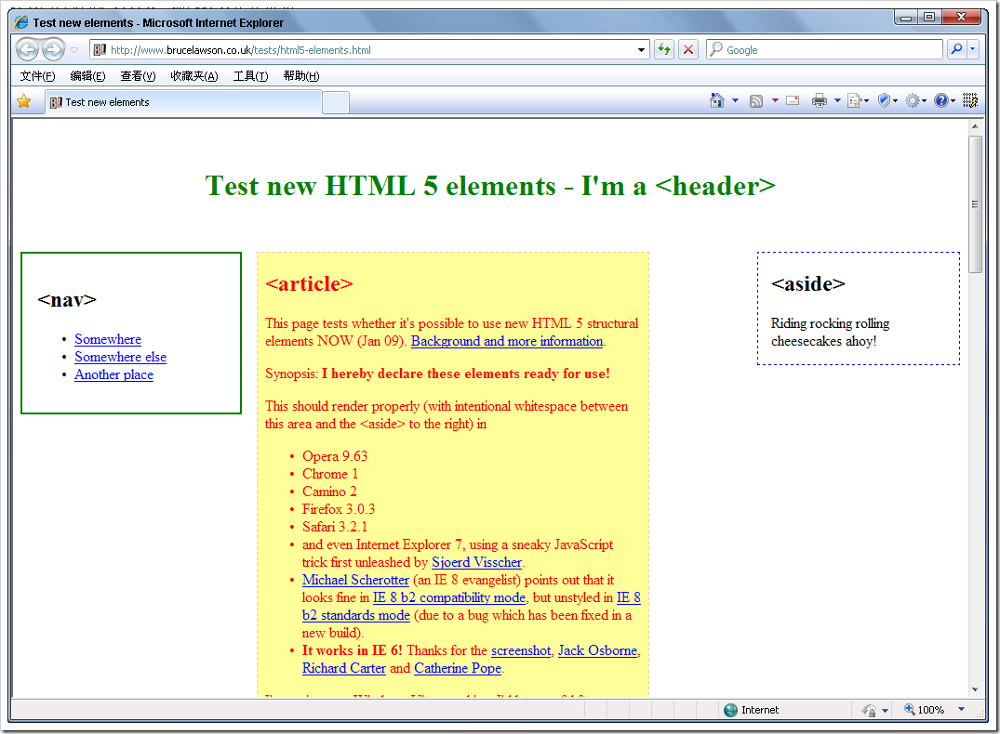
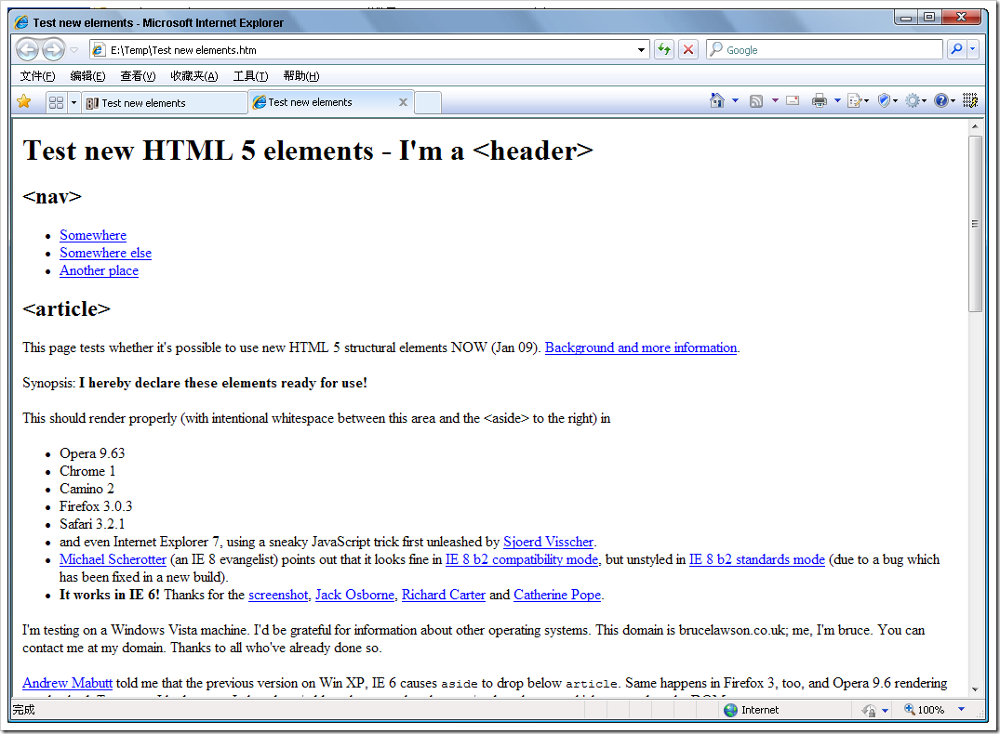
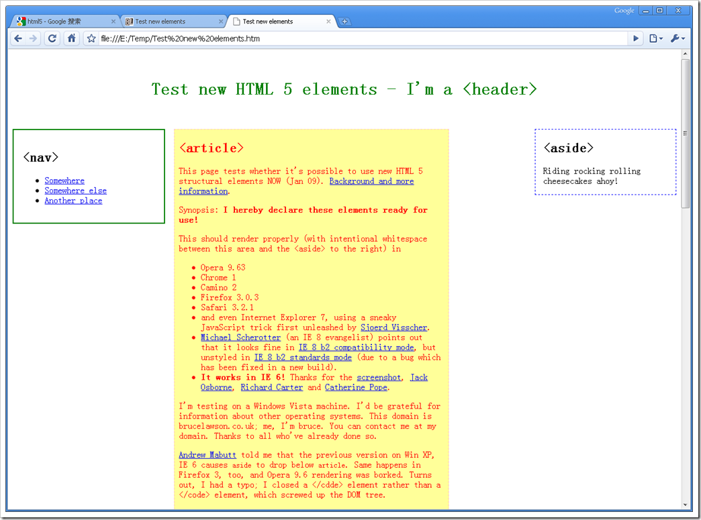

# HTML 5 参考手册 
> 原文发表于 2009-06-01, 地址: http://www.cnblogs.com/chenxizhang/archive/2009/06/01/1493349.html 

详细资料请参考：<http://dev.w3.org/html5/spec/Overview.html> 有关学习资料请参考：<http://www.w3school.com.cn/html5/index.asp> W3C 在 1 月 22 日发布了最新的 HTML 5 工作草案。HTML 5 工作组包括 AOL, Apple, Google, IBM, Microsoft, Mozilla, Nokia, Opera 以及数百个其他的开发商。HTML 5 中的一些新特性：嵌入音频、视频、图片的函数、客户端数据存储，以及交互式文档。其他特性包括新的页面元素，比如 <header>, <section>, <footer>, 以及 <figure>。 通过制定如何处理所有 HTML 元素以及如何从错误中恢复的精确规则，HTML 5 改进了互操作性，并减少了开发成本。   这个标准当然是需要浏览器的支持的。Web开发平台的一次革命应该很快就会到来。   IE、Firefox、Safari、Chrome，Opera合计占整个浏览器市场的几乎96％。   目前而言，据说除了IE之外，其他四家都开始推出了针对HTML 5的支持版本。   相关的报道 ### Opera：HTML 5使得Flash变得可有可无

<http://news.mydrivers.com/1/135/135601.htm> ### 微软：精简HTML 5规范

<http://news.newhua.com/news1/program_net/2008/429/0842995135B0JJDCED4K7DF1681JEA086HHD0ECEJIBC6B294HDJH1K.html> ### Google宣布Web已经胜利 HTML 5将Web大大推进

 <http://www.itbear.com.cn/ZiXun/2009-05/18511.html>

 让JavaScript拯救HTML5的离线存储

 <http://www.blueidea.com/tech/web/2009/6694.asp>

 #### 谷歌Google研发HTML5的离线应用---Pre，Android和Iphone

<http://cn.engadget.com/2009/02/18/google-html5-pre-android-iphone/> ### HTML 5力图将互联网带入成熟应用平台

<http://homepage.yesky.com/226/8314726.shtml>   一个演示了一些新元素渲染的页面【需要最新浏览器支持】 <http://www.brucelawson.co.uk/tests/html5-elements.html>   注意观察一下源文件 <!-- Dirty JavaScript hack to make IE able to apply CSS to elements that it doesn't usually know about, plus miscellaneous IE rules --> <!--[if IE]>   <![endif]—>   看起来确实IE还不支持(我用的是IE 8）。有这一段，在IE里面显示的效果如下  拿掉这一段，则显示如下

  

 这就是我们常说的，它不支持该标记导致的。

 在最新版的谷歌浏览器中，可以正确地解析

 

