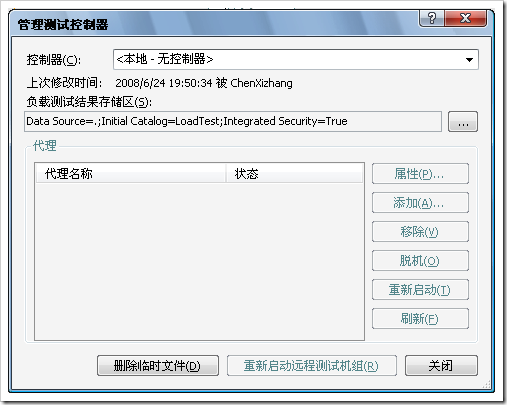

# VSTS负载测试——如何：使用 SQL 创建结果存储区 
> 原文发表于 2009-06-01, 地址: http://www.cnblogs.com/chenxizhang/archive/2009/06/01/1493939.html 

原文参见:<http://msdn.microsoft.com/zh-cn/library/ms182600(VS.80).aspx> 负载测试的结果存储在一个 SQL 数据库中。这个 SQL 数据库就称为“负载测试结果存储区”。这个数据库既可以是本地的（通常使用 SQL Express），也可以是远程的（使用任何 SQL 版本）。创建数据库架构之后，您就可以将负载测试结果保存到该数据库中。 .gif)注意 这只适用于负载测试。有关保存其他测试类型的信息，请参见 [保存和发布测试结果](http://msdn.microsoft.com/zh-cn/library/ms182498(VS.80).aspx)。 一种选择是在运行 SQL Express 的本地服务器上创建数据库表。对于本地的负载测试结果存储区，您只需运行一次脚本即可将其用作所有负载测试的全局设置。 对于控制器而言，安装程序会创建一个默认的 SQL Express 本地实例和负载测试结果存储区，并将其配置为由控制器使用。对于任何不使用远程测试机组 (Rig) 的安装程序，将在第一次运行负载测试时创建数据库。如果您希望使用功能更为强大的 SQL Server 上的数据库，则需要单独配置一个不同的结果存储区。您可以在以后挖掘由其他用户挖掘的数据。有关更多信息，请参见[如何：在 Rig 上运行测试](http://msdn.microsoft.com/zh-cn/library/ms182638(VS.80).aspx)。 ##### 设置运行 SQL Express 的计算机

 1. 打开 Visual Studio 命令提示。键入以下文本： **cd n:\Program Files\Microsoft Visual Studio 8\Common7\IDE**

 
>  **【如果是VS2008，则为C:\Program Files\Microsoft Visual Studio 9.0\Common7\IDE】**
> 
> 

 1. 在上面的文件夹中键入以下文本： **SQLCMD /S localhost\sqlexpress /i** **loadtestresultsrepository.sql** .gif)警告 参数区分大小写。必须键入大写的 S 和小写的 i。 也可以选择将数据库安装到任何现有的 SQL 服务器上。例如，如果您有一个名为 **ContosoServer1** 的 SQL 服务器，则可以使用以下命令： **SQLCMD /S ContosoServer1 -i loadtestresultsrepository.sql** .gif)警告 参数区分大小写。必须键入大写的 S 和小写的 i。 可能还需要指定用户名和密码，以便可以连接到 **ContosoServer1**。在这种情况下，应使用下面的命令： **SQLCMD /S ContosoServer1 -U <用户名> -P <密码> -i loadtestresultsrepository.sql** .gif)警告 参数区分大小写。必须键入大写的 S、U 和 P，以及小写的 i。

 - 在“测试”菜单上，单击“管理测试控制器”。将显示“管理测试控制器”对话框。

- 在“负载测试结果连接字符串”中，单击浏览按钮 (…) 以显示“连接属性”对话框。 .gif)注意 如果更改某个控制器的连接字符串，则必须选择相应的控制器。

 - 在“服务器名称”中，键入 **localhost\sqlexpress** 或您在第 2 步中使用的服务器的名称（例如 **ContosoServer1**）。

- 在“登录到服务器”下，选择“使用 Windows 身份验证”。

- 在“连接到数据库”下，选择“选择或输入一个数据库名”。从下拉列表框中选择“LoadTest”。

- 单击“确定”。

- 在“管理测试控制器”对话框中单击“关闭”。

 

