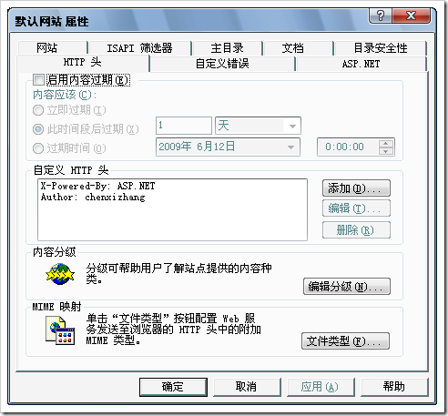
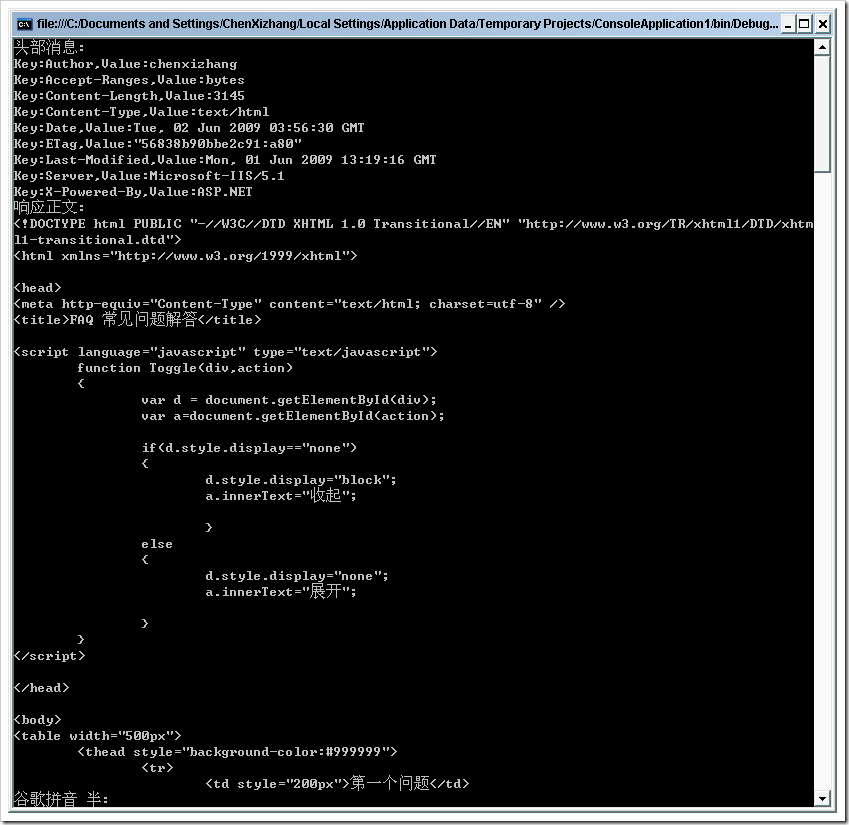

# 解读web服务器的http头 
> 原文发表于 2009-06-02, 地址: http://www.cnblogs.com/chenxizhang/archive/2009/06/02/1494380.html 

我们有的朋友发现IIS服务器的网站属性中有一个特殊的页面“http头”（如下），并且对此非常不解。

  

 好吧，我来解释一下：这个头其实就是说服务器端发送给浏览器的一些特殊消息。（有时候是一些附加消息），浏览器可能可以根据这些消息进行相应的处理。

 首先，我们来看看如果仅仅是一些附加消息，例如我上面添加到一个Author的消息，值为chenxizhang.

 因为author这个信息，浏览器并不认识，所以在页面上是没有任何的显示的。但如果是我们自己的程序，通过编程的方式去请求某个页面，那么就可以读取这个Header,然后可能据此进行一些处理。

 /// 
  
/// 同步读取网路资源，获取响应  
/// 
  
/// <returns></returns>  
static void GetResponse()  
{  
    HttpWebRequest request = (HttpWebRequest)HttpWebRequest.Create("<http://localhost/faq.htm");>  
    request.Credentials = CredentialCache.DefaultNetworkCredentials;     HttpWebResponse response = request.GetResponse() as HttpWebResponse;     Console.WriteLine("头部消息:");  
    for (int i = 0; i < response.Headers.Count; ++i)  
    {  
        Console.WriteLine("Key:{0},Value:{1}", response.Headers.Keys[i], response.Headers[i]);  
    }     StreamReader reader = new StreamReader(response.GetResponseStream());  
    Console.WriteLine("响应正文:");  
    Console.WriteLine(reader.ReadToEnd()); } 那么，代码如果运行起来之后，得到的效果就如下   

 这是通过代码读取Response的Headers的做法。假如，我们需要在提交Request的时候，也添加Headers，是否可以呢？

 request.Headers.Add("Test", "chenxizhang");//这是添加请求中的头部消息，与响应的那个是一样的

  

 然后，我们在服务器页面中是否可以解析传过来的头部消息呢？

 for (int i = 0; i < Request.Headers.Count; i++)  
{  
    Response.Write(string.Format("Key:{0},Value{1} ", Request.Headers.Keys[i], Request.Headers[i]));  
}  

 同时，我们在服务器页面中是否还可以动态地添加Response的Header呢？

 Response.AddHeader("Test", "chenxizhang");

  

 了解了上面的知识之后，你可能还有一个疑惑：除了传递这些附加信息之外，头部消息是否还有其他的用途？例如它能不能指示浏览器做某个操作？

 我们来看一个文件下载的例子

 public static void ToExcel(Control control,string filename)  
{  
    HttpContext.Current.Response.Clear();  
    **HttpContext.Current.Response.AddHeader("content-disposition", "attachment;filename=" + filename + ".xls");**    HttpContext.Current.Response.Charset = "utf-8";  
**HttpContext.Current.Response.ContentType = "application/vnd.ms-excel";**      StringWriter stringWrite = new StringWriter();  
    HtmlTextWriter htmlWrite = new HtmlTextWriter(stringWrite);     control.RenderControl(htmlWrite);     HttpContext.Current.Response.Write(stringWrite.ToString());  
    HttpContext.Current.Response.End();  
} 为了让浏览器弹出那个文件下载的对话框，我们需要添加一个content-dispostion的头部消息。   此外，头部消息还可以用来解析身份验证和授权。   【附录】异步调用HttpWebRequest的方法 /// 
  
/// 异步读取网络资源，获取响应

 ///作者：陈希章  
/// 
  
static void GetResponseAsync()  
{ 

     HttpWebRequest request = (HttpWebRequest)HttpWebRequest.Create("<http://localhost./faq.htm");>  
    request.Credentials = CredentialCache.DefaultNetworkCredentials;  
    request.BeginGetResponse(new AsyncCallback(ShowResponseResult),request); } static void ShowResponseResult(IAsyncResult ar)  
{   
    //收到了结果，进行显示     HttpWebRequest request = ar.AsyncState as HttpWebRequest;  
    StreamReader reader = new StreamReader(request.EndGetResponse(ar).GetResponseStream());  
    Console.WriteLine(reader.ReadToEnd());  
} 

