# 解读内容过期 
> 原文发表于 2009-06-02, 地址: http://www.cnblogs.com/chenxizhang/archive/2009/06/02/1494620.html 

 

 第一种情况：请求的资源为静态资源，例如htm，html文件（这里称为静态资源也许不合适，统称为IIS本身能自己处理的资源吧）。同时，我们启用内容过期, 而且设置了立即过期。

 [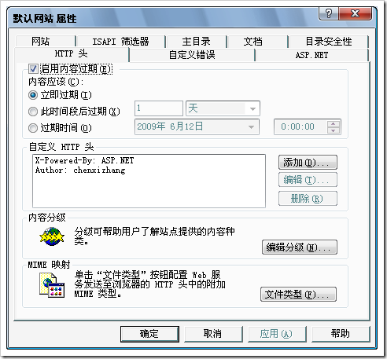](http://images.cnblogs.com/cnblogs_com/chenxizhang/WindowsLiveWriter/7057d4e11e70_D735/image_4.png) 

 此时，每次请求都会向服务器申请下载最新版本。浏览器不做缓存处理。注意观察下面的状态都是200.看右下角的Cache信息是：no-cache。这种方式可以保证客户端看到的永远是最新版本，也就是说如果服务器端进行了更新，一定能被客户端看到。

 [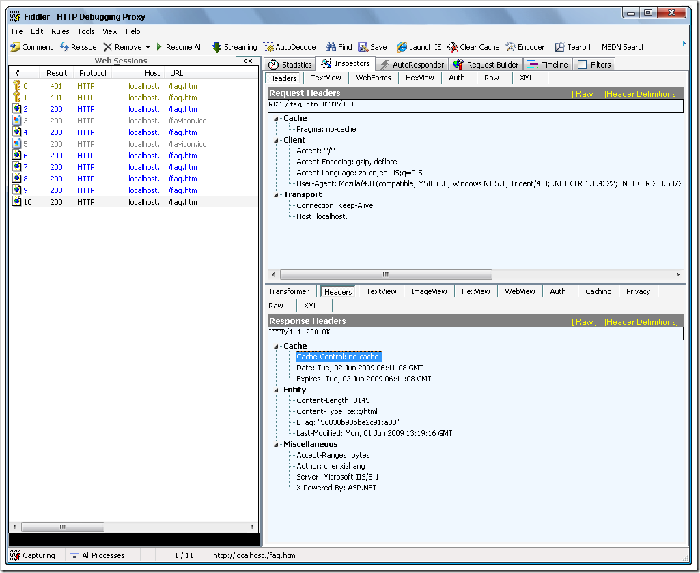](http://images.cnblogs.com/cnblogs_com/chenxizhang/WindowsLiveWriter/7057d4e11e70_D735/image_6.png) 

  

 第二种情况：请求的资源为静态资源，然后启用了内容过期。并且我们设置了过期时间（绝对过期和相对过期）

 [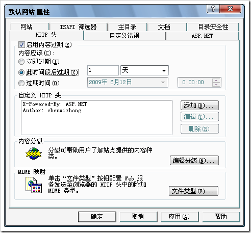](http://images.cnblogs.com/cnblogs_com/chenxizhang/WindowsLiveWriter/7057d4e11e70_D735/image_8.png) [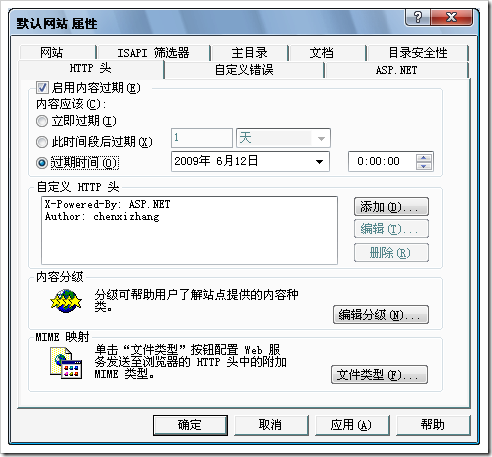](http://images.cnblogs.com/cnblogs_com/chenxizhang/WindowsLiveWriter/7057d4e11e70_D735/image_10.png) 

 那么这种情况下，浏览器缓存将其作用。注意，第一次的状态是200，同时cache-control为86400，也就是一天。就是说这个网页会有一天的缓存。所以，你看后面的状态都是304.

 304表示没有检测到变化，所以使用缓存中的文件。

 [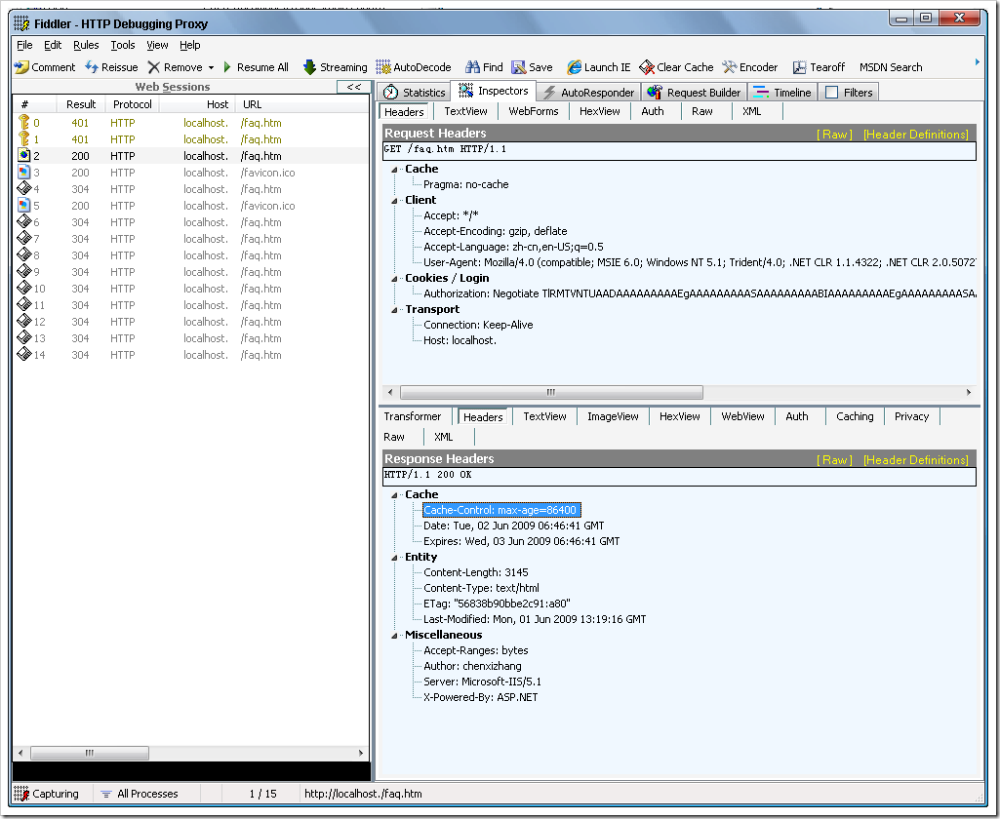](http://images.cnblogs.com/cnblogs_com/chenxizhang/WindowsLiveWriter/7057d4e11e70_D735/image_12.png) 

 如果下一次请求的时候，服务器端的页面内容发生了变化呢？答案是，此时服务器会发送新的版本，替换掉客户端缓存。这是肯定需要的，否则就麻烦了。

 [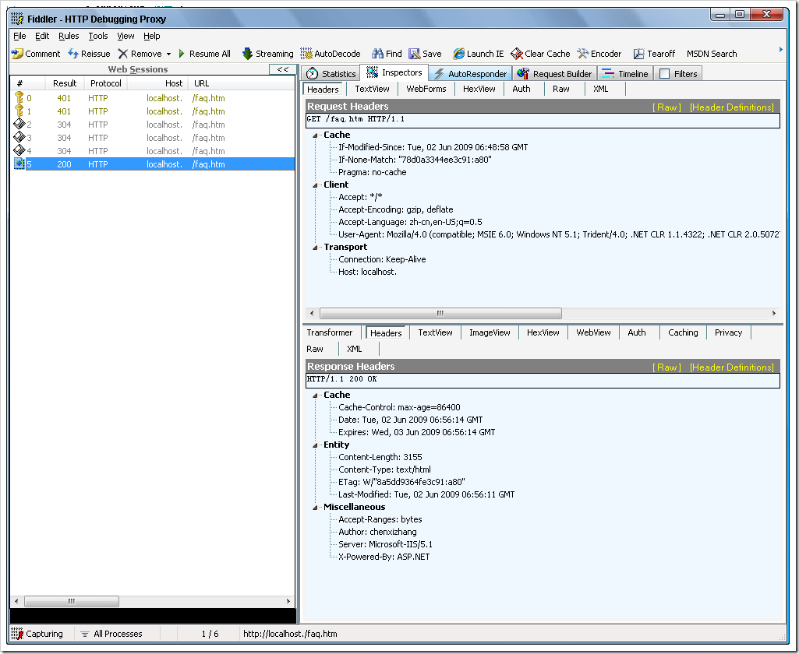](http://images.cnblogs.com/cnblogs_com/chenxizhang/WindowsLiveWriter/7057d4e11e70_D735/image_18.png) 

  

 那么对照以上两种情况，我们总结出来的东西是：

 如果启用内容过期，则可以明确地声明使用缓存的策略。如果使用缓存，则减轻了服务器的负担。

  

 但是，我们反过来想一下，如果没有启用内容过期呢，会怎么样呢？（这也是默认的情况）

 [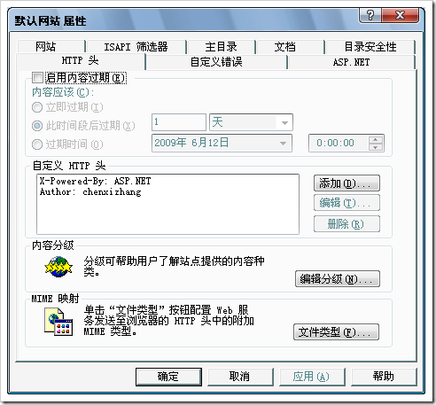](http://images.cnblogs.com/cnblogs_com/chenxizhang/WindowsLiveWriter/7057d4e11e70_D735/image_20.png) 

 我们发现，它最开始也是200，后来是304.什么意思呢？ 后面的几次请求也会检测到服务器没有更新，所以使用缓存。这又是为什么呢？

 [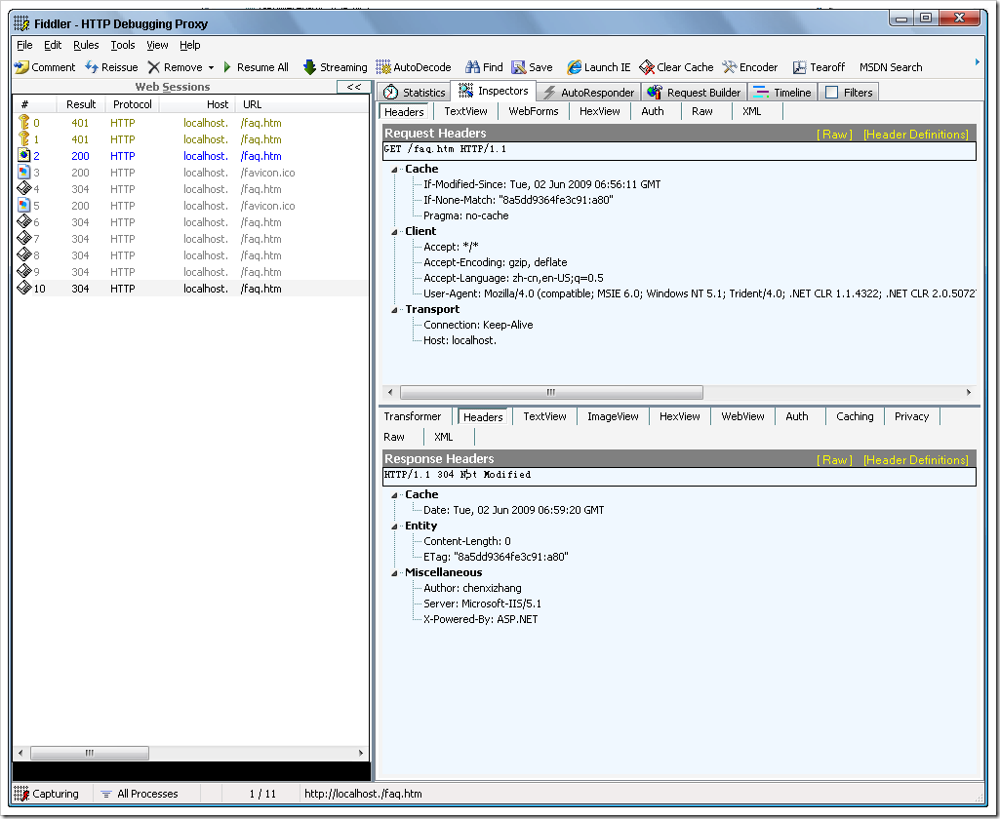](http://images.cnblogs.com/cnblogs_com/chenxizhang/WindowsLiveWriter/7057d4e11e70_D735/image_22.png) 

 这个问题应该跟浏览器本身的设置是有关系的

 [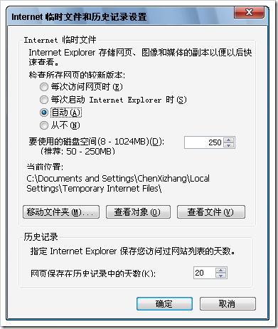](http://images.cnblogs.com/cnblogs_com/chenxizhang/WindowsLiveWriter/7057d4e11e70_D735/image_24.png) 

    就是说，浏览器通常对于网页和图像会自动做缓存。它当然需要检查服务器版本是否有变化，但如果没有变化，它就用缓存的版本了。

  

 然后，我们再来考虑一个问题，就是假设我们的网页是动态网页，例如aspx，会怎样呢？

 我们同样启用内容过期

 

 然后去不断地请求faq.aspx页面。我们发现，每次都是200.而且cache的设置是private。这什么意思呢？

 [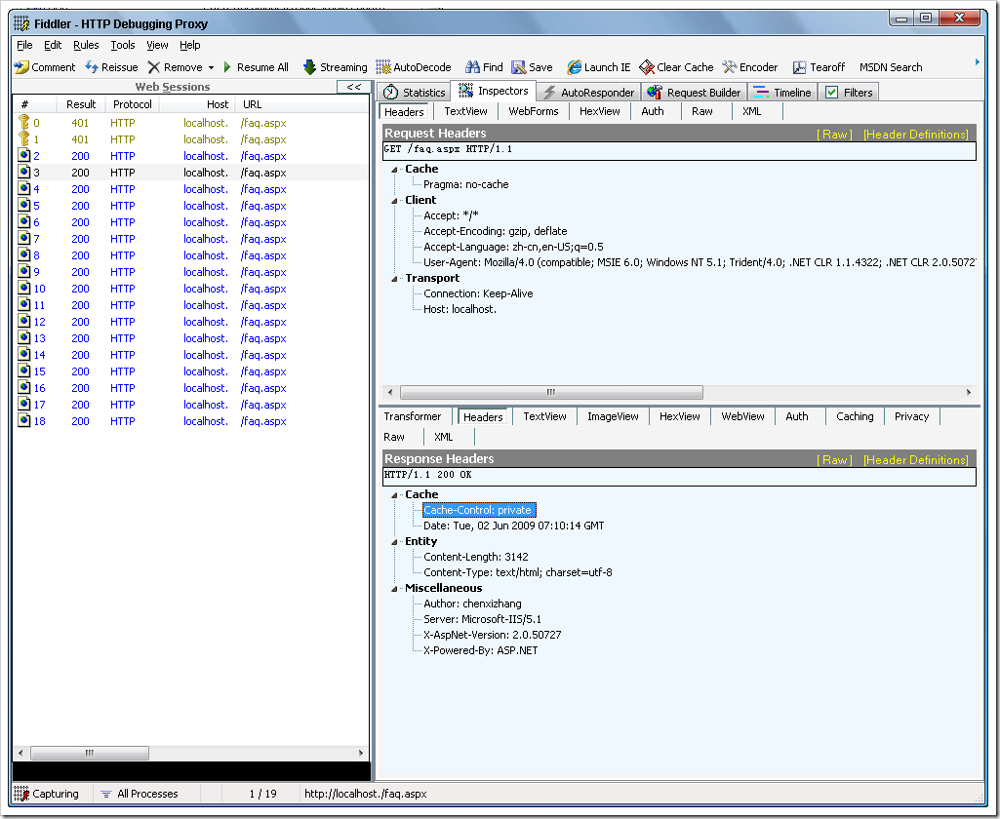](http://images.cnblogs.com/cnblogs_com/chenxizhang/WindowsLiveWriter/7057d4e11e70_D735/image_26.png) 

 也就是说这种扩展名的资源，IIS本身是处理不了的，它得交给aspnet\_isapi.dll进行处理。那么，这肯定是独立的，我们都知道asp.net本身有一个OutputCacheModule，专门负责做这个事情。因为他是动态页面，所以必须是有这么样一个处理。

 如果我们的页面，启用了OutputCache，会怎么样呢？下面这个例子，我让它5秒钟过期

 <!DOCTYPE html PUBLIC "-//W3C//DTD XHTML 1.0 Transitional//EN" "<http://www.w3.org/TR/xhtml1/DTD/xhtml1-transitional.dtd">>  
<%@ Page Language="C#" %>  
**<%@ OutputCache Duration="5" VaryByParam="none" %>**<html dir="ltr" xmlns="<http://www.w3.org/1999/xhtml">> <head runat="server">  
<meta http-equiv="Content-Type" content="text/html; charset=utf-8" />  
<title>这是服务器网页</title>  
</head> <body> <form id="form1" runat="server">  
</form>  
这是服务器网页的网页内容这是服务器网页的网页内容这是服务器网页的网页内容这是服务器网页的网页内容这是服务器网页的网页内容这是服务器网页的网页内容这是服务器网页的网页内容这是服务器网页的网页内容这是服务器网页的网页内容这是服务器网页的网页内容这是服务器网页的网页内容这是服务器网页的网页内容这是服务器网页的网页内容这是服务器网页的网页内容这是服务器网页的网页内容这是服务器网页的网页内容这是服务器网页的网页内容这是服务器网页的网页内容这是服务器网页的网页内容这是服务器网页的网页内容这是服务器网页的网页内容这是服务器网页的网页内容这是服务器网页的网页内容这是服务器网页的网页内容这是服务器网页的网页内容这是服务器网页的网页内容这是服务器网页的网页内容这是服务器网页的网页内容这是服务器网页的网页内容这是服务器网页的网页内容这是服务器网页的网页内容这是服务器网页的网页内容这是服务器网页的网页内容这是服务器网页的网页内容这是服务器网页的网页内容这是服务器网页的网页内容这是服务器网页的网页内容这是服务器网页的网页内容这是服务器网页的网页内容这是服务器网页的网页内容这是服务器网页的网页内容这是服务器网页的网页内容这是服务器网页的网页内容这是服务器网页的网页内容  
</body> </html>   此时，不断地刷新页面，你会发现每隔5秒钟，会出现一次200的状态。期间的状态都为304. [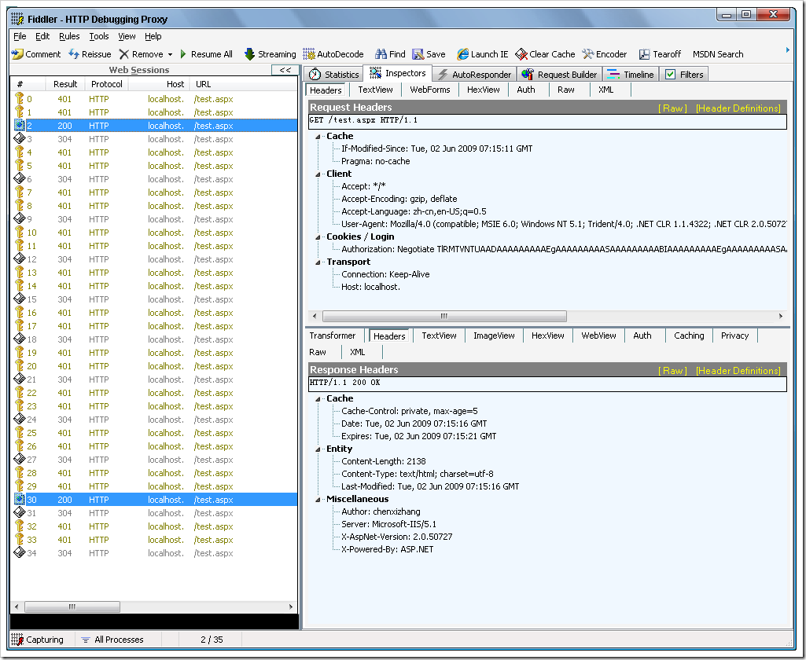](http://images.cnblogs.com/cnblogs_com/chenxizhang/WindowsLiveWriter/7057d4e11e70_D735/image_28.png)

