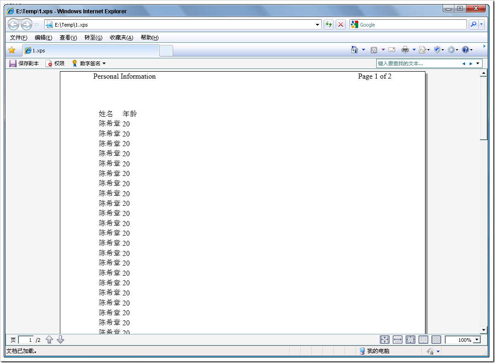
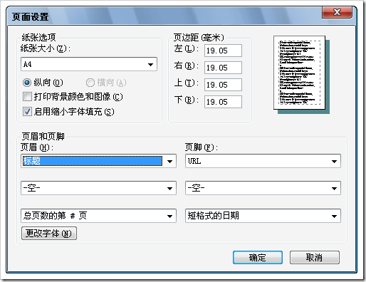
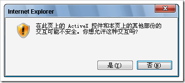
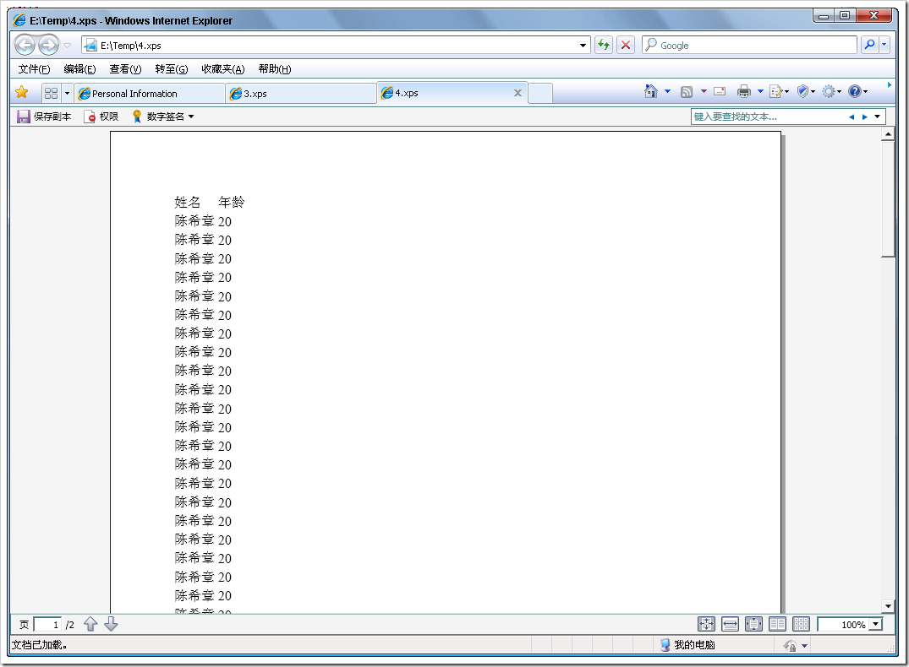

# 如何控制浏览器打印效果 
> 原文发表于 2009-06-03, 地址: http://www.cnblogs.com/chenxizhang/archive/2009/06/03/1495232.html 

我们知道，默认情况下，通过IE的打印对话框，打印出来的内容都有页眉和页脚的。如下

  

 这是IE浏览器默认的页面打印设置。要想去除掉这个设置，首先可以通过手工地修改下面这个对话框来实现

  

 但是，如果用户就是不想自己去修改，则可以通过下面的脚本强制进行修改

 var hkey\_root,hkey\_path,hkey\_key  
hkey\_root="HKEY\_CURRENT\_USER"  
hkey\_path="\\Software\\Microsoft\\Internet Explorer\\PageSetup\\"  
//设置网页打印的页眉页脚为空  
function pagesetup\_null(){  
try{  
    var RegWsh = new ActiveXObject("WScript.Shell")  
    hkey\_key="header"   
    RegWsh.RegWrite(hkey\_root+hkey\_path+hkey\_key,"")  
    hkey\_key="footer"  
    RegWsh.RegWrite(hkey\_root+hkey\_path+hkey\_key,"")  
    }catch(e){}  
} 这一招有些狠，它是去修改注册表。所以一般都会弹出一个对话框

  

 如果点击了“是”，那么如你所愿，现在页眉和页脚都没有了

  

 接下来，如果说我们需要恢复呢？

 //设置网页打印的页眉页脚为默认值  
function pagesetup\_default(){  
    try{  
    var RegWsh = new ActiveXObject("WScript.Shell")  
    hkey\_key="header"   
    RegWsh.RegWrite(hkey\_root+hkey\_path+hkey\_key,"&w&b页码，&p/&P")  
    hkey\_key="footer"  
    RegWsh.RegWrite(hkey\_root+hkey\_path+hkey\_key,"&u&b&d")  
    }catch(e){}  
}  

  

 最后一个问题，怎么样通过脚本的方式去实现打印某个部分内容呢？

 //打印某个内容 function PrintContent(el) {         var iframe = document.createElement('IFRAME'); var content=document.getElementById(el);         var doc = null; iframe.style.position="absolute"; iframe.style.width="0px"; iframe.style.height="0px"; iframe.style.left="-500px"; iframe.style.top="-500px";         //$(iframe).attr('style', 'position:absolute;width:0px;height:0px;left:-500px;top:-500px;');         document.body.appendChild(iframe);         doc = iframe.contentWindow.document;         var links = window.document.getElementsByTagName('link');         for (var i = 0; i < links.length; i++)             if (links[i].rel.toLowerCase() == 'stylesheet')             doc.write('<link type="text/css" rel="stylesheet" href="' + links[i].href + '"></link>'); //        doc.write('
' + $(el).html() + '
'); doc.write('
' + content.innerHTML + '
');                          doc.close();         iframe.contentWindow.focus();         iframe.contentWindow.print();         document.body.removeChild(iframe); }  

  

 整个测试页面的完整代码如下

 <!DOCTYPE html PUBLIC "-//W3C//DTD XHTML 1.0 Transitional//EN" "<http://www.w3.org/TR/xhtml1/DTD/xhtml1-transitional.dtd">>  
<html xmlns="<http://www.w3.org/1999/xhtml">> <head>  
<meta http-equiv="Content-Type" content="text/html; charset=utf-8" />  
<title>Personal Information</title> </head> <body>  
  
<input type="button" value="清空页码" onclick="pagesetup\_null()" />  
<input type="button" value="恢复页码" onclick="pagesetup\_default()" />  
<input type="button" value="打印内容" onclick="PrintContent('contents')"/> 
  
<table>  
    <thead>  
    <tr><td>姓名</td><td>年龄</td></tr>  
    </thead>  
    <tbody>  
    <tr>  
        <td>陈希章</td>  
        <td>20</td>  
    </tr>  
    <tr>  
        <td>陈希章</td>  
        <td>20</td>  
    </tr>  
    <tr>  
        <td>陈希章</td>  
        <td>20</td>  
    </tr>  
    <tr>  
        <td>陈希章</td>  
        <td>20</td>  
    </tr>  
    <tr>  
        <td>陈希章</td>  
        <td>20</td>  
    </tr>  
    <tr>  
        <td>陈希章</td>  
        <td>20</td>  
    </tr>  
    <tr>  
        <td>陈希章</td>  
        <td>20</td>  
    </tr>  
    <tr>  
        <td>陈希章</td>  
        <td>20</td>  
    </tr>  
    <tr>  
        <td>陈希章</td>  
        <td>20</td>  
    </tr>  
    <tr>  
        <td>陈希章</td>  
        <td>20</td>  
    </tr>  
    <tr>  
        <td>陈希章</td>  
        <td>20</td>  
    </tr>  
    <tr>  
        <td>陈希章</td>  
        <td>20</td>  
    </tr>  
    <tr>  
        <td>陈希章</td>  
        <td>20</td>  
    </tr>  
    <tr>  
        <td>陈希章</td>  
        <td>20</td>  
    </tr>  
    <tr>  
        <td>陈希章</td>  
        <td>20</td>  
    </tr>  
    <tr>  
        <td>陈希章</td>  
        <td>20</td>  
    </tr>  
    <tr>  
        <td>陈希章</td>  
        <td>20</td>  
    </tr>  
    <tr>  
        <td>陈希章</td>  
        <td>20</td>  
    </tr>  
    <tr>  
        <td>陈希章</td>  
        <td>20</td>  
    </tr>  
    <tr>  
        <td>陈希章</td>  
        <td>20</td>  
    </tr>  
    <tr>  
        <td>陈希章</td>  
        <td>20</td>  
    </tr>  
    <tr>  
        <td>陈希章</td>  
        <td>20</td>  
    </tr>  
    <tr>  
        <td>陈希章</td>  
        <td>20</td>  
    </tr>  
    <tr>  
        <td>陈希章</td>  
        <td>20</td>  
    </tr>  
    <tr>  
        <td>陈希章</td>  
        <td>20</td>  
    </tr>  
    <tr>  
        <td>陈希章</td>  
        <td>20</td>  
    </tr>  
    <tr>  
        <td>陈希章</td>  
        <td>20</td>  
    </tr>  
    <tr>  
        <td>陈希章</td>  
        <td>20</td>  
    </tr>  
    <tr>  
        <td>陈希章</td>  
        <td>20</td>  
    </tr>  
    <tr>  
        <td>陈希章</td>  
        <td>20</td>  
    </tr>  
    <tr>  
        <td>陈希章</td>  
        <td>20</td>  
    </tr>  
    <tr>  
        <td>陈希章</td>  
        <td>20</td>  
    </tr>  
    <tr>  
        <td>陈希章</td>  
        <td>20</td>  
    </tr>  
    <tr>  
        <td>陈希章</td>  
        <td>20</td>  
    </tr>  
    <tr>  
        <td>陈希章</td>  
        <td>20</td>  
    </tr>  
    <tr>  
        <td>陈希章</td>  
        <td>20</td>  
    </tr>  
    <tr>  
        <td>陈希章</td>  
        <td>20</td>  
    </tr>  
    <tr>  
        <td>陈希章</td>  
        <td>20</td>  
    </tr>  
    <tr>  
        <td>陈希章</td>  
        <td>20</td>  
    </tr>  
    <tr>  
        <td>陈希章</td>  
        <td>20</td>  
    </tr>  
    <tr>  
        <td>陈希章</td>  
        <td>20</td>  
    </tr>  
    <tr>  
        <td>陈希章</td>  
        <td>20</td>  
    </tr>  
    <tr>  
        <td>陈希章</td>  
        <td>20</td>  
    </tr>  
    <tr>  
        <td>陈希章</td>  
        <td>20</td>  
    </tr>  
    <tr>  
        <td>陈希章</td>  
        <td>20</td>  
    </tr>  
    <tr>  
        <td>陈希章</td>  
        <td>20</td>  
    </tr>  
    <tr>  
        <td>陈希章</td>  
        <td>20</td>  
    </tr>  
    <tr>  
        <td>陈希章</td>  
        <td>20</td>  
    </tr>  
    <tr>  
        <td>陈希章</td>  
        <td>20</td>  
    </tr>  
    <tr>  
        <td>陈希章</td>  
        <td>20</td>  
    </tr>  
    <tr>  
        <td>陈希章</td>  
        <td>20</td>  
    </tr>  
    <tr>  
        <td>陈希章</td>  
        <td>20</td>  
    </tr>  
    <tr>  
        <td>陈希章</td>  
        <td>20</td>  
    </tr>  
    <tr>  
        <td>陈希章</td>  
        <td>20</td>  
    </tr>  
    <tr>  
        <td>陈希章</td>  
        <td>20</td>  
    </tr>  
    <tr>  
        <td>陈希章</td>  
        <td>20</td>  
    </tr>  
    <tr>  
        <td>陈希章</td>  
        <td>20</td>  
    </tr>  
    <tr>  
        <td>陈希章</td>  
        <td>20</td>  
    </tr>  
    <tr>  
        <td>陈希章</td>  
        <td>20</td>  
    </tr>  
    <tr>  
        <td>陈希章</td>  
        <td>20</td>  
    </tr>  
    <tr>  
        <td>陈希章</td>  
        <td>20</td>  
    </tr>  
    <tr>  
        <td>陈希章</td>  
        <td>20</td>  
    </tr>  
    <tr>  
        <td>陈希章</td>  
        <td>20</td>  
    </tr>  
    <tr>  
        <td>陈希章</td>  
        <td>20</td>  
    </tr>  
    <tr>  
        <td>陈希章</td>  
        <td>20</td>  
    </tr>  
    <tr>  
        <td>陈希章</td>  
        <td>20</td>  
    </tr>  
    <tr>  
        <td>陈希章</td>  
        <td>20</td>  
    </tr>  
    <tr>  
        <td>陈希章</td>  
        <td>20</td>  
    </tr>  
    <tr>  
        <td>陈希章</td>  
        <td>20</td>  
    </tr>  
    <tr>  
        <td>陈希章</td>  
        <td>20</td>  
    </tr>  
    <tr>  
        <td>陈希章</td>  
        <td>20</td>  
    </tr>  
    <tr>  
        <td>陈希章</td>  
        <td>20</td>  
    </tr>  
    <tr>  
        <td>陈希章</td>  
        <td>20</td>  
    </tr>  
    <tr>  
        <td>陈希章</td>  
        <td>20</td>  
    </tr>  
    <tr>  
        <td>陈希章</td>  
        <td>20</td>  
    </tr>  
    <tr>  
        <td>陈希章</td>  
        <td>20</td>  
    </tr>  
    <tr>  
        <td>陈希章</td>  
        <td>20</td>  
    </tr>  
    <tr>  
        <td>陈希章</td>  
        <td>20</td>  
    </tr>  
    </tbody>  
</table> 
 </body> </html>

