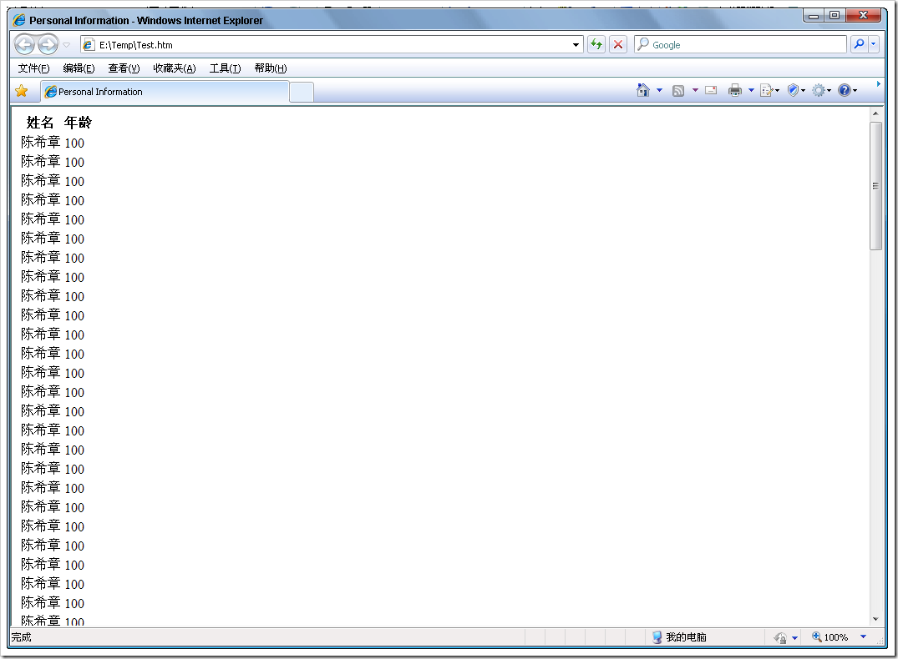

# 动态通过js脚本构造html页面 
> 原文发表于 2009-06-03, 地址: http://www.cnblogs.com/chenxizhang/archive/2009/06/03/1495473.html 

下面的例子是使用jquery，实现动态构造html页面的代码   <!DOCTYPE html PUBLIC "-//W3C//DTD XHTML 1.0 Transitional//EN" "<http://www.w3.org/TR/xhtml1/DTD/xhtml1-transitional.dtd">>  
<html xmlns="<http://www.w3.org/1999/xhtml">> <head>  
<meta http-equiv="Content-Type" content="text/html; charset=utf-8" />  
<title>Personal Information</title>  
    </head> <body>  
<table id="contents">  
    <tr>  
        <th>姓名</th>  
        <th>年龄</th>  
    </tr>  
</table> </body> </html>   运行起来的效果如下    这样看起来很不错的, 但如果那个行比较复杂，则构造起来挺麻烦的。我们还可以利用模板的方式来做，如下 <!DOCTYPE html PUBLIC "-//W3C//DTD XHTML 1.0 Transitional//EN" "<http://www.w3.org/TR/xhtml1/DTD/xhtml1-transitional.dtd">>  
<html xmlns="<http://www.w3.org/1999/xhtml">> <head>  
<meta http-equiv="Content-Type" content="text/html; charset=utf-8" />  
<title>Personal Information</title>  
  </head> <body>  
<table id="contents">  
    <tr>  
        <th>姓名</th>  
        <th>年龄</th>  
    </tr>  
**<tr id="template">  
        <td id="name"></td>  
        <td id="age"></td>  
    </tr>**  
</table> </body> </html> 

