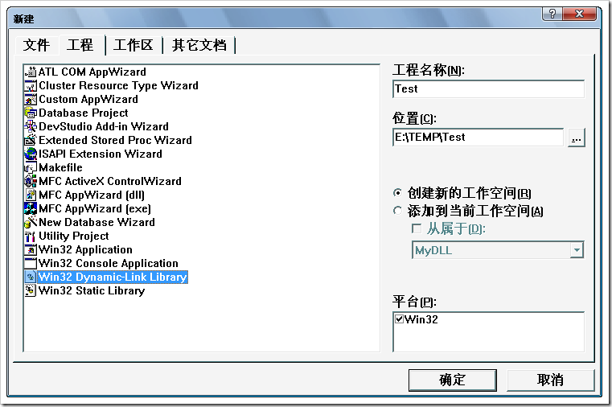
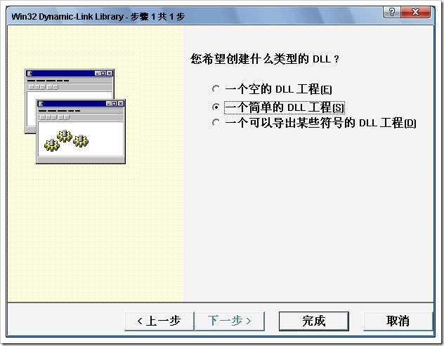
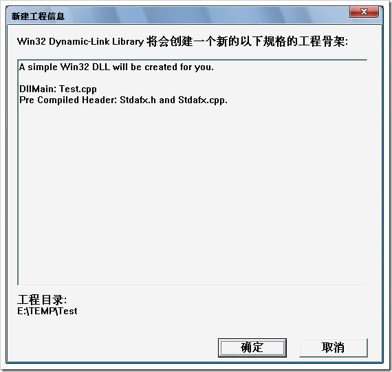
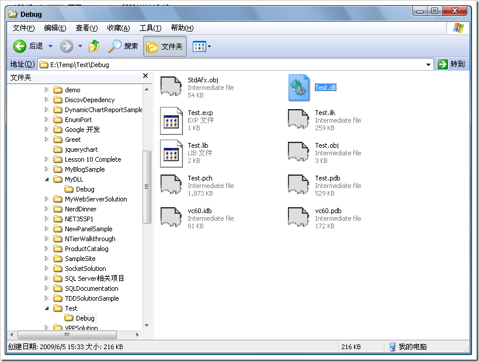
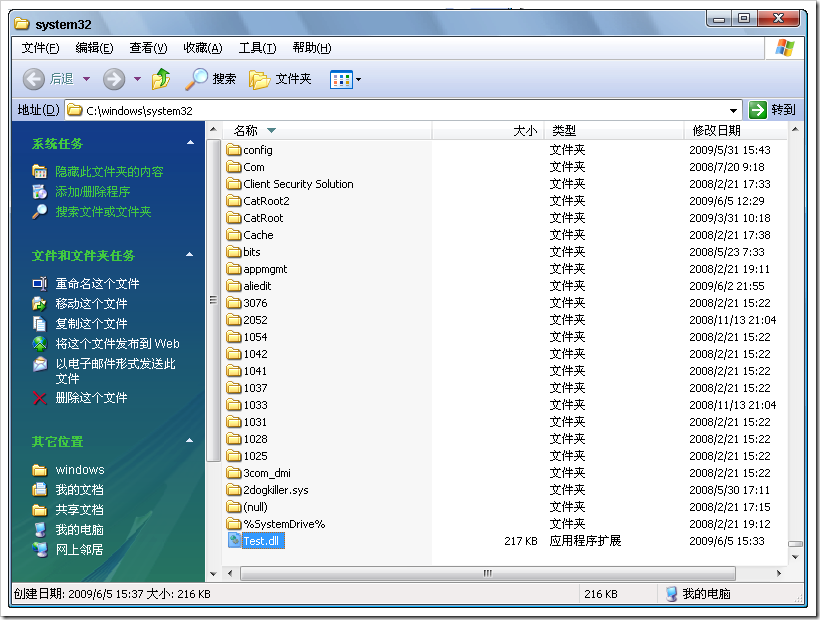
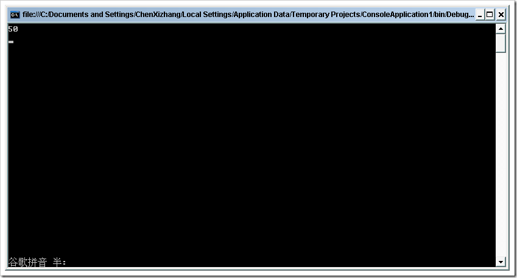
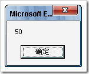
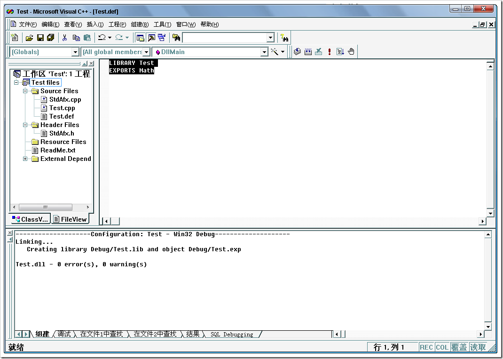

# VC++编写动态链接库及其使用 
> 原文发表于 2009-06-05, 地址: http://www.cnblogs.com/chenxizhang/archive/2009/06/05/1497103.html 

 

 1. 创建项目

  

  

  

  

   2. 编写最简单的代码如下

 // Test.cpp : Defines the entry point for the DLL application.  
// #include "stdafx.h" **extern "C" \_\_declspec(dllexport)  int \_\_stdcall Math(int,int); //声明一个可以导出的方法**  //这是任何一个dll的入口点  
BOOL APIENTRY DllMain( HANDLE hModule,   
                       DWORD  ul\_reason\_for\_call,   
                       LPVOID lpReserved  
                     )  
{  
    switch (ul\_reason\_for\_call)  
    {  
        case DLL\_PROCESS\_ATTACH:  
        case DLL\_THREAD\_ATTACH:  
        case DLL\_THREAD\_DETACH:  
        case DLL\_PROCESS\_DETACH:  
            break;  
    }  
    return TRUE;  
} **int  \_\_stdcall Math(int a,int b)  
{  
    return a+b;  
}**  

  

 3. F7键，编译的结果如下

  

 4. 将该dll复制到c:\windows\system32中去

  

  

 5. 然后，编写一个简单的.NET Console程序，来调用该函数

 using System;  
using System.Collections.Generic;  
using System.Text;  
**using System.Runtime.InteropServices;** namespace ConsoleApplication1  
{  
    class Program  
    {  
**[DllImport("Test.dll")]  
        public static extern int Math(int a, int b);**         static void Main(string[] args)  
        {  
            Console.WriteLine(Math(20, 30));  
            Console.Read();  
        }  
    }  
}  运行调试之后，可以看到如下的效果

  

 **【备注】这个dll也可以直接放在.NET程序的根目录**

 这样，我们就实现了在.NET里面对它的调用。

  

 6. 我们再来看一下，如何在VB等传统程序中调用它

 Declare Function Math Lib "Test" (ByVal a As Integer, ByVal b As Integer) As Integer Public Sub Test()  
Msgbox(Math(20, 30))  
End Sub  

 但要确保VB能调用成功，必须添加一个后缀名为def的文件，内容就是两句话

  

 只有这样才可以

  

 7.最后，我们还要看一下，如何在其他的C++程序中使用它呢？  

 下面这段摘自：<http://dev.yesky.com/283/2640283_1.shtml>   

 　　动态链接库DLL的链接  
　　应用程序使用DLL可以采用两种方式：一种是隐式链接，另一种是显式链接。在使用DLL之前首先要知道DLL中函数的结构信息。Visual C++6.0在VC\bin目录下提供了一个名为Dumpbin.exe的小程序，用它可以查看DLL文件中的函数结构。另外，Windows系统将遵循下面的搜索顺序来定位DLL： 1．包含EXE文件的目录，2．进程的当前工作目录， 3．Windows系统目录， 4．Windows目录，5．列在Path环境变量中的一系列目录。  
　　（一）隐式链接  
　　隐式链接就是在程序开始执行时就将DLL文件加载到应用程序当中。实现隐式链接很容易，只要将导入函数关键字\_declspec(dllimport)函数名等写到应用程序相应的头文件中就可以了。下面的例子通过隐式链接调用MyDll.dll库中的Min函数。首先生成一个项目为TestDll，在DllTest.h、DllTest.cpp文件中分别输入如下代码： //Dlltest.h  
#pragma comment(lib，"MyDll.lib")  
extern "C"\_declspec(dllimport) int Max(int a,int b);  
extern "C"\_declspec(dllimport) int Min(int a,int b);  
//TestDll.cpp  
#include<stdio.h>  
#include"Dlltest.h"  
void main()  
{  
　int a;  
　a=min(8,10)  
　printf("比较的结果为%d\n"，a);  
} 　　在创建DllTest.exe文件之前，要先将MyDll.dll和MyDll.lib拷贝到当前工程所在的目录下面，也可以拷贝到windows的System目录下。如果DLL使用的是def文件，要删除TestDll.h文件中关键字extern "C"。TestDll.h文件中的关键字Progam commit是要Visual C+的编译器在link时，链接到MyDll.lib文件，当然，开发人员也可以不使用#pragma comment(lib，"MyDll.lib")语句，而直接在工程的Setting->Link页的Object/Moduls栏填入MyDll.lib既可。  
　　（二）显式链接  
　　显式链接是应用程序在执行过程中随时可以加载DLL文件，也可以随时卸载DLL文件，这是隐式链接所无法作到的，所以显式链接具有更好的灵活性，对于解释性语言更为合适。不过实现显式链接要麻烦一些。在应用程序中用LoadLibrary或MFC提供的AfxLoadLibrary显式的将自己所做的动态链接库调进来，动态链接库的文件名即是上述两个函数的参数，此后再用GetProcAddress()获取想要引入的函数。自此，你就可以象使用如同在应用程序自定义的函数一样来调用此引入函数了。在应用程序退出之前，应该用FreeLibrary或MFC提供的AfxFreeLibrary释放动态链接库。下面是通过显式链接调用DLL中的Max函数的例子。 #include <studio.h>  
#include<widows.h>  
void main(void)  
{  
　typedef int(*pMax)(int a,int b);  
　typedef int(*pMin)(int a,int b);  
　HINSTANCE hDLL;  
　PMax Max  
　HDLL=LoadLibrary("MyDll.dll");//加载动态链接库MyDll.dll文件；  
　Max=(pMax)GetProcAddress(hDLL,"Max");  
　A=Max(5,8);  
　Printf("比较的结果为%d\n"，a);  
　FreeLibrary(hDLL);//卸载MyDll.dll文件；  
} 　　在上例中使用类型定义关键字typedef，定义指向和DLL中相同的函数原型指针，然后通过LoadLibray()将DLL加载到当前的应用程序中并返回当前DLL文件的句柄，然后通过GetProcAddress()函数获取导入到应用程序中的函数指针，函数调用完毕后，使用FreeLibrary()卸载DLL文件。在编译程序之前，首先要将DLL文件拷贝到工程所在的目录或Windows系统目录下。  
　　使用显式链接应用程序编译时不需要使用相应的Lib文件。另外，使用GetProcAddress()函数时，可以利用MAKEINTRESOURCE()函数直接使用DLL中函数出现的顺序号，如将GetProcAddress(hDLL,"Min")改为GetProcAddress(hDLL, MAKEINTRESOURCE(2))（函数Min()在DLL中的顺序号是2），这样调用DLL中的函数速度很快，但是要记住函数的使用序号，否则会发生错误。

