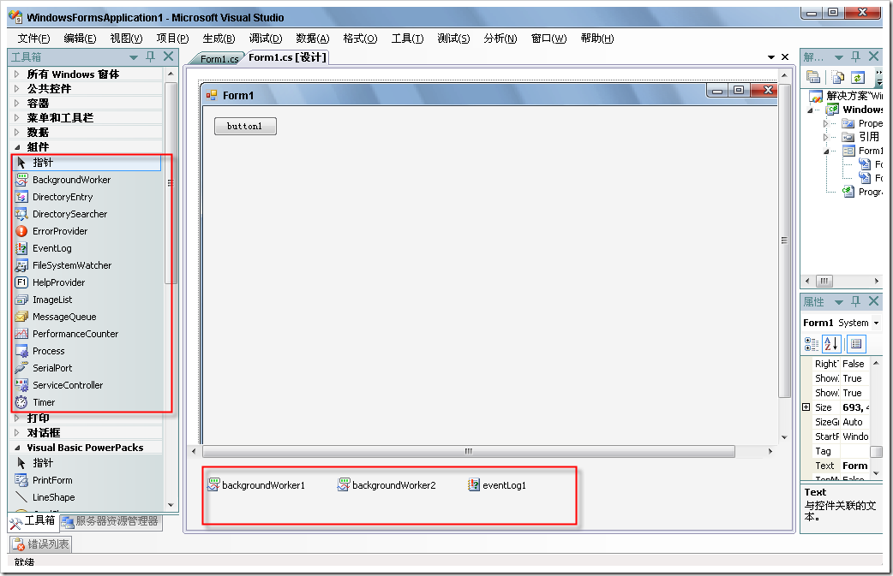
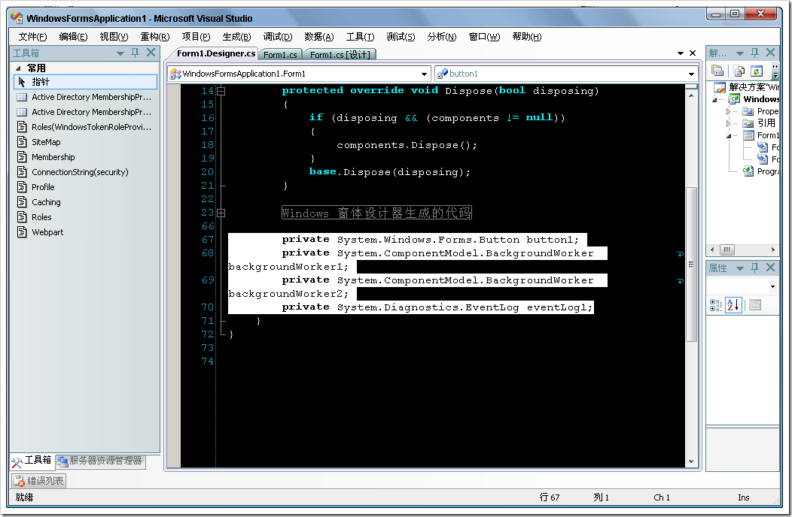
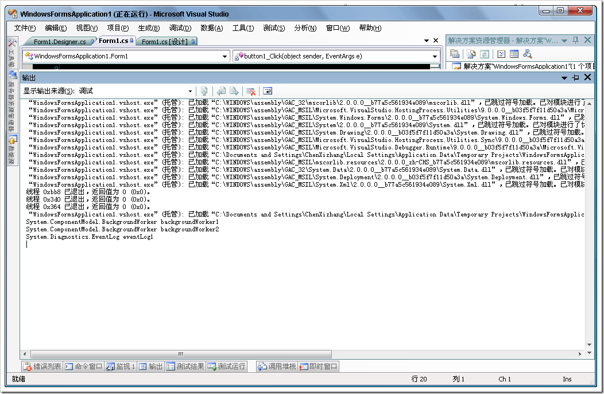

# 如何取得窗体中的组件(Component) 列表 
> 原文发表于 2009-06-06, 地址: http://www.cnblogs.com/chenxizhang/archive/2009/06/06/1497445.html 

先谈两个基本概念，以免有的朋友看不懂

 1.什么是组件

 Component类型是在System.ComponentModel空间下定义的的一些类型。它与控件(Control)的最大区别在于它们没有界面。

  

 2. 哪些是组件。工具箱里面专门有一个选项卡是放组件的，而且组件拖放到窗体后，并不在窗体上显示，而是在窗体底部一个区域显示

  

  

 言归正传，我们今天要解决什么问题呢？

 这些组件可以拖放在窗体上，但是如果我们需要遍历他们，那么该怎么办呢? 例如我们需要在另外一个类型里面，动态地解析这个窗体上有几个backgroundworker，应该怎么做呢？

  

 有些同学马上会灵机一动，说，我们遍历窗体的Controls集合吧？是这样吗？刚才就说过了，组件不是Control，自如不会添加到 Controls集合中去。 

 那么，我们是不是可以遍历Components集合呢？很不错的想法，但是不行，因为窗体没有所谓的Components属性。

  

 额。。。。实在太难了，这也不行，那也不行，还让不让人活了呢？

 好吧，好吧，just follow me ，下面我们来看看如何解决该问题？

 首先，我们打开Form1.designer.cs文件，看一些这些组件是如何初始化的

  

 我们看到其实不管是控件，还是组件，它们都需要在这个文件里面定义的。这种定义方式是什么呢？对，这就是所谓的字段（Field）.

 所以，既然把我们逼急了，我们难道不可以直接遍历这个Field的集合吗？

 using System;  
using System.Collections.Generic;  
using System.ComponentModel;  
using System.Data;  
using System.Drawing;  
using System.Text;  
using System.Windows.Forms;  
using System.Reflection; namespace WindowsFormsApplication1  
{  
    public partial class Form1 : Form  
    {  
        public Form1()  
        {  
            InitializeComponent();         }         private void button1\_Click(object sender, EventArgs e)  
        {  
            //取得所有字段列表  
                Type t = this.GetType();  
                FieldInfo[] flds = t.GetFields(BindingFlags.DeclaredOnly | BindingFlags.Static| BindingFlags.Instance | BindingFlags.Public | BindingFlags.NonPublic);                 foreach (FieldInfo fld in flds)  
                {  
                    if (fld.FieldType.BaseType == typeof(Component))  
                    {  
                        Console.WriteLine(fld.ToString());  
                    }  
                }  
        }  
    }  
}  

 看到了吧，最后面几行就是啦

