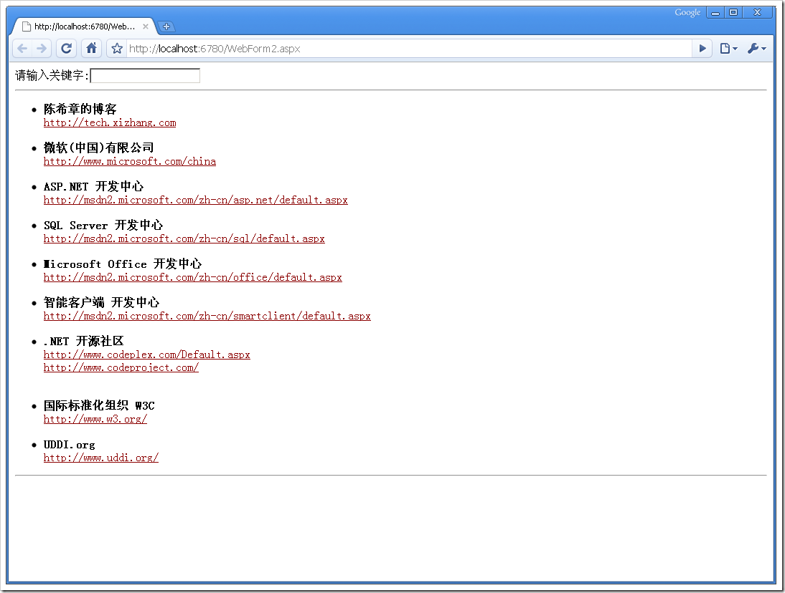
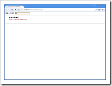
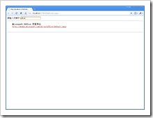
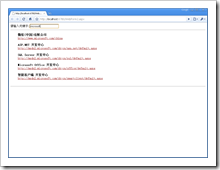
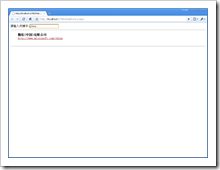
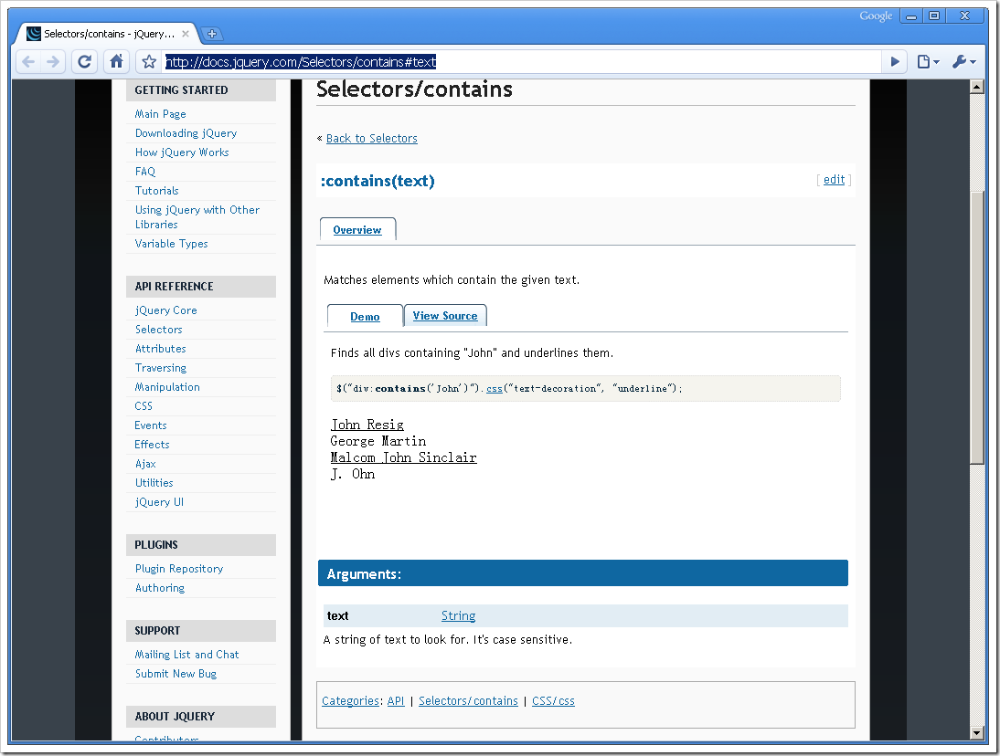

# 利用javascript实现页面内容筛选 
> 原文发表于 2009-06-07, 地址: http://www.cnblogs.com/chenxizhang/archive/2009/06/07/1498096.html 

在页面中，我们可以利用javascript实现很丰富的效果。例如内容的筛选

 1. 我们来下面的页面

  

 我们希望在关键字框中输入任何的关键字后，就能动态过滤掉下面的一些内容。如下图

     

  

 2. 首先，我们要知道，要监控到用户在关键字框输入的东西，那么就需要订阅一个事件，通常是keyup事件，就是按钮弹起的时候进行搜索

     3. 完整代码如下，包含源文件。 <%@ Page Language="C#" AutoEventWireup="true" CodeBehind="WebForm2.aspx.cs" Inherits="WebApplication3.WebForm2" %> <!DOCTYPE html PUBLIC "-//W3C//DTD XHTML 1.0 Transitional//EN" "<http://www.w3.org/TR/xhtml1/DTD/xhtml1-transitional.dtd">> <html xmlns="<http://www.w3.org/1999/xhtml"> >  
<head runat="server">  
    <title></title>  
      
      
</head>  
<body>  
                请输入关键字:<input type="text" id="search"/>
  
               <ul class="style1">  
                    <li><strong>陈希章的博客</strong>   
                        <a href="<http://tech.xizhang.com">  
                            style="color: rgb(139, 0, 0); text-decoration: underline; ">  
<http://tech.xizhang.com></a>   
                           
                    </li>  
                    <li><strong>微软(中国)有限公司</strong>   
                        <a href="<http://www.microsoft.com/china">  
                            style="color: rgb(139, 0, 0); text-decoration: underline; ">  
<http://www.microsoft.com/china></a>   
                           
                    </li>  
                    <li><strong>ASP.NET 开发中心</strong>   
                        <a href="<http://msdn2.microsoft.com/zh-cn/asp.net/default.aspx">  
                            style="color: rgb(139, 0, 0); text-decoration: underline; ">  
<http://msdn2.microsoft.com/zh-cn/asp.net/default.aspx></a>   
                           
                    </li>  
                    <li><strong>SQL Server 开发中心   
                        </strong><a href="<http://msdn2.microsoft.com/zh-cn/sql/default.aspx">  
                            style="color: rgb(139, 0, 0); text-decoration: underline; ">  
<http://msdn2.microsoft.com/zh-cn/sql/default.aspx></a>   
                           
                    </li>  
                    <li><strong>Microsoft Office 开发中心   
                        </strong><a href="<http://msdn2.microsoft.com/zh-cn/office/default.aspx">  
                            style="color: rgb(139, 0, 0); text-decoration: underline; ">  
<http://msdn2.microsoft.com/zh-cn/office/default.aspx></a>   
                           
                    </li>  
                    <li><strong>智能客户端 开发中心   
                        </strong><a href="<http://msdn2.microsoft.com/zh-cn/smartclient/default.aspx">  
                            style="color: rgb(139, 0, 0); text-decoration: underline; ">  
<http://msdn2.microsoft.com/zh-cn/smartclient/default.aspx></a>   
                           
                    </li>  
                    <li><strong>.NET 开源社区   
                        </strong><a href="<http://www.codeplex.com/Default.aspx">  
                            style="color: rgb(139, 0, 0); text-decoration: underline; ">  
<http://www.codeplex.com/Default.aspx></a>   
                        <a href="<http://www.codeproject.com/">  
                            style="color: rgb(139, 0, 0); text-decoration: underline; ">  
<http://www.codeproject.com/></a>   
                           
                           
                    </li>  
                    <li><strong>国际标准化组织 W3C</strong>   
                        <a href="<http://www.w3.org/">  
                            style="color: rgb(139, 0, 0); text-decoration: underline; ">  
<http://www.w3.org/></a>   
                           
                    </li>  
                    <li><strong>UDDI.org   
                        </strong><a href="<http://www.uddi.org/">  
                            style="color: rgb(139, 0, 0); text-decoration: underline; ">  
<http://www.uddi.org/></a></li>  
                </ul>  
                
 </body>  
</html>  

 4. 另外一个问题

 在做这个例子的时候，我最开始想到的是，利用jquery中选择器的一个特殊语法 :contains

  

 看起来正好满足要求，但却达不到我们的目的，因为这个语法接受的筛选字符串必须是固定的，不能动态指定。所以，我还是用了filter函数

