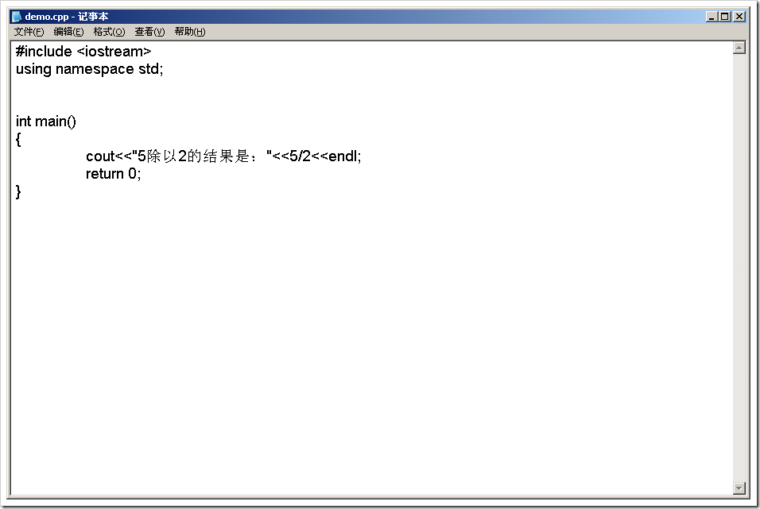
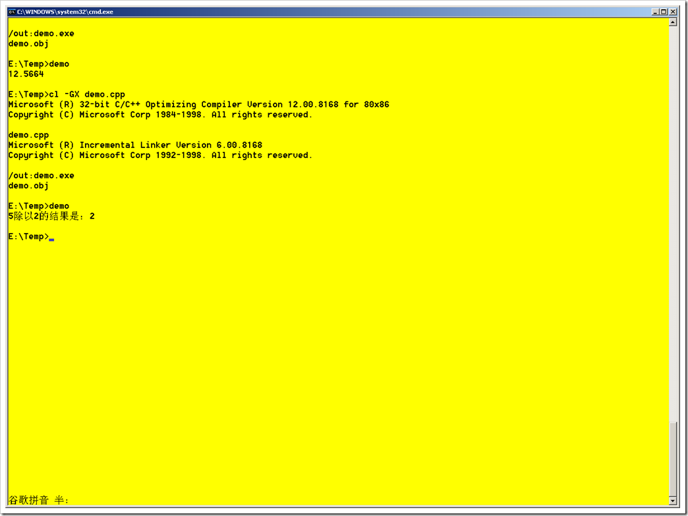
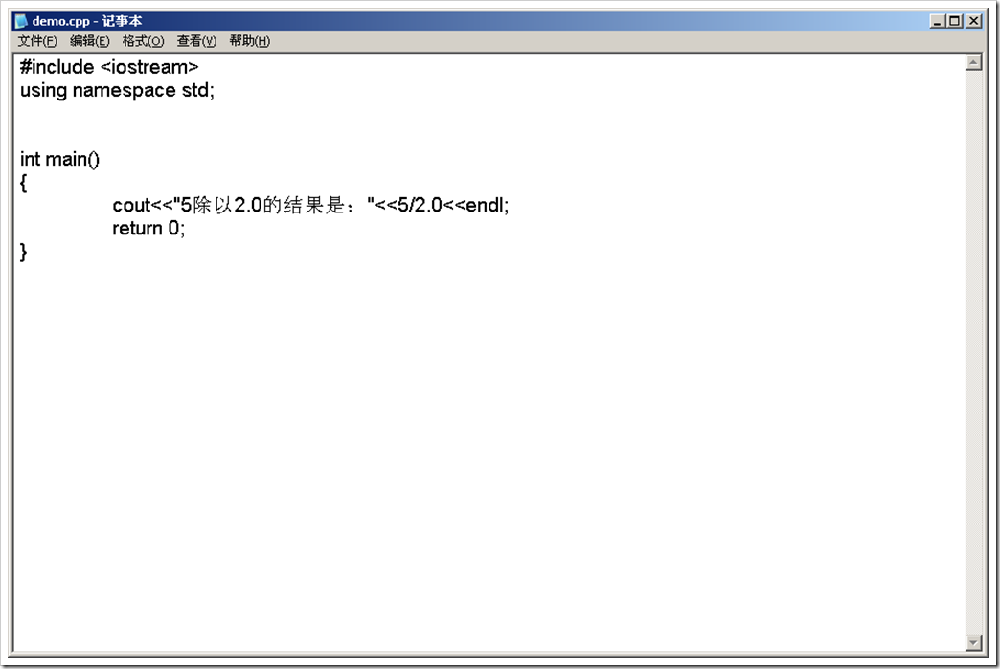
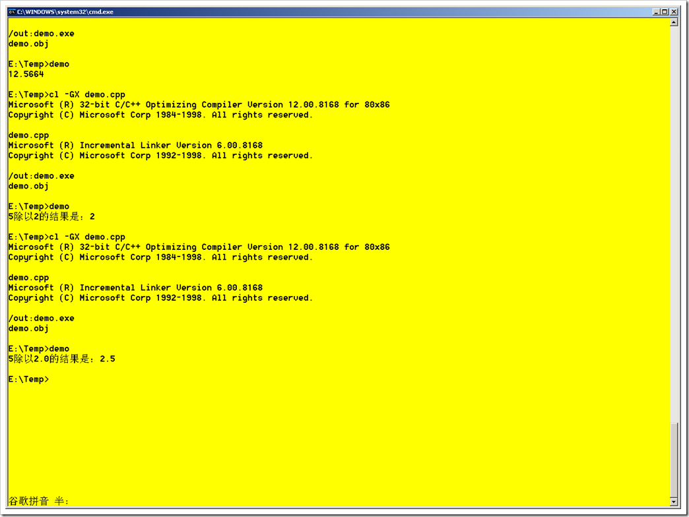

# 老调重弹之整除与实数除 
> 原文发表于 2009-06-08, 地址: http://www.cnblogs.com/chenxizhang/archive/2009/06/08/1498389.html 

学计算机的同学一定被人问到这样的问题

 1. 5除以2等于多少？

 很多人第一反应就是暴怒，这么简单的问题居然还拿来考我，真是岂有此理。小学生都会的啊，等于2.5嘛

 等等，好像事情没有那么简单吧？如果这么简单的话，为什么还要拿来问呢？

 我们来看一下到底等于多少？

  

  

 看到了吗? 它的结果是等于2. 太不可思议了吧。但其实不奇怪，这就是我们所谓的整除。

 整数的意思就是说：如果分子和分母都是整数，那么它的结果也是整数。

  

 2. 继续第二个问题，请回答：5除以2.0等于多少？

 个别同学听到这个问题之后，依然是暴怒。说，刚才不是讨论过了嘛，算错的情况下等于2.5，算对的情况下等于2嘛

 但大部分同学显然是被上面的问题惊着了，一言不发，作沉思状。他一定在想的事情是：可不能再被忽悠了，到底是树上七个猴，还是树上骑个猴呢？

 好吧，事实上等于多少呢？

  

  

 这回，它真的等于2.5了。这是咋回事呢？没想法了吧，这就是所谓的实数除。也就是说，分子分母中只要有一个是实数（而不是整数），那么结果就是实数。

 什么是实数？简单地说，就是整数之外的数啦，带有小数点的嘛。C++中的实数类型有float(单精度）,double（双精度），long double(长双精度：非常长）

  

 题外话：最后谈一个与除法有关的另外一个运算符（%）

 %运算符，我们有时候也称为“取模”或者说“整除取余数”，也就是两个数相除，取其余数。

 所以，最后一个问题是：5%2等于多少？

 有同学马上回答：5/2等于2，5/2.0等于2.5，5%2等于1

  

 恭喜你，你会抢答了，而且一气答对了仨问题

