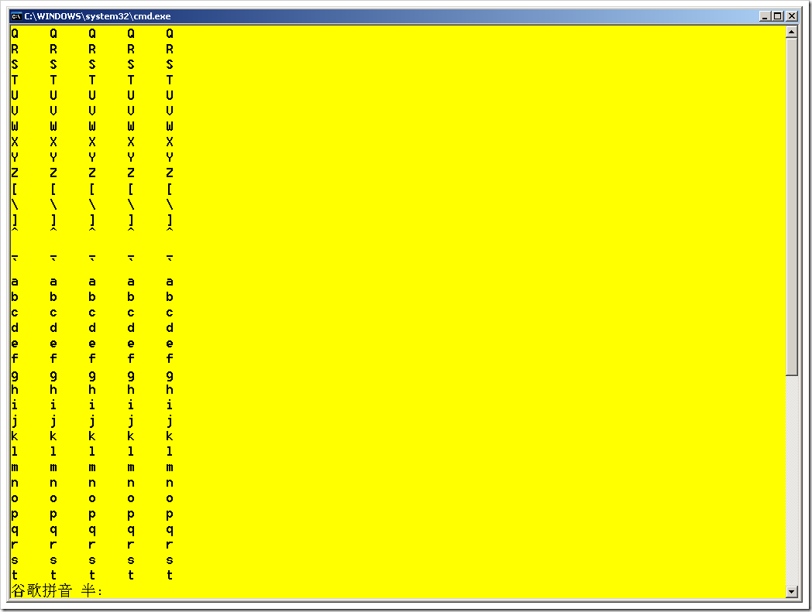
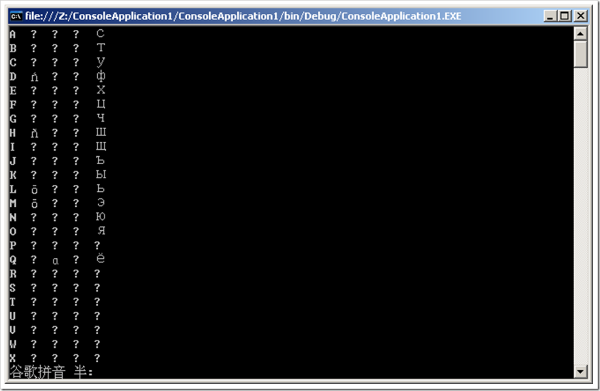

# 怎么理解符号整数的取值范围(C++) 
> 原文发表于 2009-06-08, 地址: http://www.cnblogs.com/chenxizhang/archive/2009/06/08/1498936.html 

之前我们讨论到了整数有区分符号的，也就是有正负数之分。一个典型的整数，如char。有符号和没有符号，取值范围是不一样的

 1. 有符号的char : 取值范围为-128～127

 2. 无符号的char : 取值范围为0～255

 首先看无符号的

 1. 为什么最小为0： 0000 0000 当然是0

 2. 为什么最大是255 ： 1111 1111当然是255

 这个很好理解。

  

 然后来看有符号的。C++标准中并没有规定如何处理符号，这个问题一般都是由各个编译器决定怎么处理。通常情况下的做法都是用一个位作为符号位。这个符号位如果为1，则为负数，这个符号位如果为0，则为0或者正数。

 1. 为什么最小为-128？

 
>  1 111 1111
> 
>  第一个1表示负数，后面7个1为127.所以应该是-127的。为什么说是-128呢？可能有的编译器是这样决定的：因为0～127之间，一共是128个数字。然后负数方面呢，就不需要考虑0了，因为0已经表示过了，其实就是（00000000），它不可能再用一个（1000000）去表示另外一个零，这毫无意义。所以，在负数方面也要128个数，加起来才是256个数。那么从-1到-128正好是128个数。
> 
>   
> 
> 

 2. 为什么最大为127？

 
>  0 111 1111 这肯定是127.
> 
> 

  

 那么，如果说赋予给数值的值超过了范围呢？会怎么样呢？

 一般都是这样处理：将实际的数值求256的模，然后返回。例如给出的300，则实际上代表的是300%256,也就是多少呢

 为了演示这个效果，我写了一段小的程序

 #include <iostream>  
using namespace std; int main()  
{     int v=255;  
        for(int n=65;n<123;n++)  
        {  
            for(int m=0;m<5;m++)  
            {  
            cout<< (char)(m*256+n-1)<<"    ";  
            }  
            cout<<endl;  
        }  
    return 0;  
}  

  

 看这个例子就知道，其实就是每隔256，又重复一遍。那么就说明什么呢？

  

 但是，同样的代码在C#中的显示却很怪异，不知道该如何解释了。我们看到第二列开始并没有按照预期地出现想要的字符。又不全部是问号，诡异。。

 

