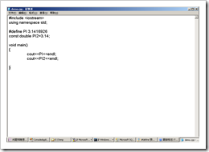
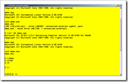

# #define 预处理指令（C++,C#,VB.NET) 
> 原文发表于 2009-06-11, 地址: http://www.cnblogs.com/chenxizhang/archive/2009/06/11/1501065.html 

在C++中,我们可以通过#define这个指令定义所谓的符号常量，这种常量会被直接编译到二进制代码中去。在这种情况下，它与用const定义的常值变量的效果是基本类似。的，

 例如：

   

 但#define还有一个作用，就是改变编译器行为，例如根据它决定是否要编译某句代码

 在很多C++源文件中都会有下面这样的代码

 #if !defined(AFX\_MAINFRM\_H\_\_0EFEA8A4\_112C\_4528\_B7A8\_761F1B02C20C\_\_INCLUDED\_) //如果没有定义  
#define AFX\_MAINFRM\_H\_\_0EFEA8A4\_112C\_4528\_B7A8\_761F1B02C20C\_\_INCLUDED\_ //那么就定义 #if \_MSC\_VER > 1000 //如果某个符号常量大于1000  
#pragma once  
#endif // \_MSC\_VER > 1000   那么，这个行为在.NET里面是怎么表现的呢？ 1。 C#中继承了#define作为编译指令的作用。 #define DEBUG 【注意】在C#中，不可以给定义的符号赋值，例如下面的语句是无效的 #define DEBUG=TRUE 也就是说，#define只需要定义即可，而不要（也没有必要）指定这个符号的值 后续代码中，也是用#if这样的语法进行判断某个符号是否被定义。   2.  VB.NET也有类似的实现，但它不使用#define关键字，而是用#const关键字 **#Const MINI = 1** #Const VERSION = 1.0 Const MINI As String = "4" #Region "这是一个代码块" Sub Main() #If MINI = 1 Then Console.WriteLine("Hello.world") #End If End Sub #End Region

