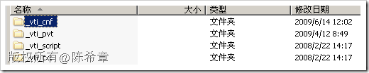

# 由_vti目录想到的 
> 原文发表于 2009-06-19, 地址: http://www.cnblogs.com/chenxizhang/archive/2009/06/19/1506408.html 

如果你曾经用FrontPage开发过网站，以及如果你现在使用最新的SharePoint Designer设计网站，你会发现网站目录下面有一些特殊目录，都带有\_vti前缀。

  

 很多朋友都对这个目录很疑惑，事实上删除之后，又会自动回来。

 其实这个目录就是FrontPage或者SharePoint Designer自己要用到一些特殊目录。那么为什么都有vti的前缀呢？因为FrontPage是从一个公司收购过来的，而该公司的缩写就是vti ( Vermeer Technologies Inc)

 有关FrontPage的历史，有兴趣的朋友可以参考下面的说明

 [http://www.seoconsultants.com/frontpage/history/](http://www.seoconsultants.com/frontpage/history/ "http://www.seoconsultants.com/frontpage/history/")

 可以说，FrontPage是一个不错的产品，我当年也是使用FrontPage开发了第一个网站，虽然完全是静态的，但当时的激动之情也是溢于言表的。

 FrontPage已经走入历史，它的后继者包括两个

 * 针对SharePoint设计的SharePoint Designer
* 针对其他网站设计的Expression Web

 其实，除了设计网站时会有这个目录，如果你细心的话，其实在SharePoint Server中有些重要的东西也是带有\_vti前缀的。例如SharePoint所提供的那一套Web Service。举个例子来说

 **Admin Web Service**  
http://<AdminSite>/**\_vti\_adm**/Admin.asmx  
Provides methods for managing a deployment of Microsoft Windows SharePoint Services, such as for creating or deleting site collections.  
CreateSite  
DeleteSite  
GetLanguages  
RefreshConfigCache 那么，这又是为什么呢？难道SharePoint网站是使用FrontPage做出来的么？当然不是！但是你要知道SharePoint Service的前身是什么？是FrontPage Server Extension。这样有点明白了吧，呵呵 最后，让我们向vti 致意  本文由作者：[陈希章](http://www.xizhang.com) 于 2009/6/19 7:04:07 发布在：<http://www.cnblogs.com/chenxizhang/>  
 本文版权归作者所有，可以转载，但未经作者同意必须保留此段声明，且在文章页面明显位置给出原文连接，否则保留追究法律责任的权利。   
 更多博客文章，以及作者对于博客引用方面的完整声明以及合作方面的政策，请参考以下站点：[陈希章的博客中心](http://www.xizhang.com/blog.htm) 

