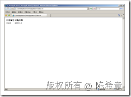
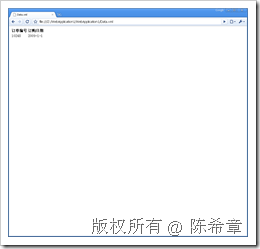

# 如何在XSLT样式表中声明命名空间 
> 原文发表于 2009-06-19, 地址: http://www.cnblogs.com/chenxizhang/archive/2009/06/19/1507020.html 


XML技术确实是相当好，但其中的命名空间这个部分除外。事实上，几乎所有XML开发人员都表示命名空间（namespace)的加入导致的麻烦远甚于它原本可以带来的好处。

 虽然很多人都在反馈这个问题，但要想更改这个标准却不是那么容易。有一个事实就是现在确实有不少XML文档已经包含了各种各样的命名空间。

 接下来我有几篇文章分别介绍命名空间给XML文档验证、转换、读取带来的麻烦，以及相应的对策。这一篇中讲解的是，如何在样式表中添加命名空间，让它可以针对含有特殊命名空间的XML数据文件。

 首先，假设我们有如下一份的XML数据文件


```
<?xml version="1.0" encoding="utf-8" ?>
<Order xmlns:d="http://www.xizhang.com">
  <d:OrderID>10248</d:OrderID>
  <d:OrderDate>2009-1-1</d:OrderDate>
</Order>

```


.csharpcode, .csharpcode pre
{
 font-size: small;
 color: black;
 font-family: consolas, "Courier New", courier, monospace;
 background-color: #ffffff;
 /*white-space: pre;*/
}
.csharpcode pre { margin: 0em; }
.csharpcode .rem { color: #008000; }
.csharpcode .kwrd { color: #0000ff; }
.csharpcode .str { color: #006080; }
.csharpcode .op { color: #0000c0; }
.csharpcode .preproc { color: #cc6633; }
.csharpcode .asp { background-color: #ffff00; }
.csharpcode .html { color: #800000; }
.csharpcode .attr { color: #ff0000; }
.csharpcode .alt 
{
 background-color: #f4f4f4;
 width: 100%;
 margin: 0em;
}
.csharpcode .lnum { color: #606060; }


这个XML文档其实很简单，表示了一个订单。实际上，定义了一个特殊的命名空间并没有太大的作用。我这里只是作为演示目的而加入的。


 


其次，我们要编写一个XSLT文件，准备为其进行转换


```
<?xml version="1.0" encoding="utf-8"?>
<xsl:stylesheet version="1.0" xmlns:xsl="http://www.w3.org/1999/XSL/Transform"
    xmlns:msxsl="urn:schemas-microsoft-com:xslt" exclude-result-prefixes="msxsl" **xmlns:d="http://www.xizhang.com"**
>
    <xsl:output  method="html"/>

    <xsl:template match="/Order">
      <html>
        <body>
          <table>
            <tr>
              <th>订单编号</th>
              <th>订购日期</th>
            </tr>
            <tr>
              <td>
                <xsl:value-of select="**d:OrderID**"/>
              </td>
              <td>
                <xsl:value-of select="**d:OrderDate**"/>
              </td>
            </tr>
          </table>
        </body>
        
      </html>
    </xsl:template>
</xsl:stylesheet>

```

请注意，红色粗体的部分，就是说，为了与数据文件匹配，我们必须加入相同的命名空间定义，并且在绑定元素的时候，也是要加入相应的名称前缀的


 


最后，我们可以直接在XML文件中，添加对样式表的引用。这样它就可以直接在一些通用的XML阅读器（例如IE）中打开了 
.csharpcode, .csharpcode pre
{
 font-size: small;
 color: black;
 font-family: consolas, "Courier New", courier, monospace;
 background-color: #ffffff;
 /*white-space: pre;*/
}
.csharpcode pre { margin: 0em; }
.csharpcode .rem { color: #008000; }
.csharpcode .kwrd { color: #0000ff; }
.csharpcode .str { color: #006080; }
.csharpcode .op { color: #0000c0; }
.csharpcode .preproc { color: #cc6633; }
.csharpcode .asp { background-color: #ffff00; }
.csharpcode .html { color: #800000; }
.csharpcode .attr { color: #ff0000; }
.csharpcode .alt 
{
 background-color: #f4f4f4;
 width: 100%;
 margin: 0em;
}
.csharpcode .lnum { color: #606060; }


```
<?xml version="1.0" encoding="utf-8" ?>
**<?xml-stylesheet type="text/xsl" href="XSLTFile1.xslt"?>**
<Order xmlns:d="http://www.xizhang.com">
  <d:OrderID>10248</d:OrderID>
  <d:OrderDate>2009-1-1</d:OrderDate>
</Order>

```

.csharpcode, .csharpcode pre
{
 font-size: small;
 color: black;
 font-family: consolas, "Courier New", courier, monospace;
 background-color: #ffffff;
 /*white-space: pre;*/
}
.csharpcode pre { margin: 0em; }
.csharpcode .rem { color: #008000; }
.csharpcode .kwrd { color: #0000ff; }
.csharpcode .str { color: #006080; }
.csharpcode .op { color: #0000c0; }
.csharpcode .preproc { color: #cc6633; }
.csharpcode .asp { background-color: #ffff00; }
.csharpcode .html { color: #800000; }
.csharpcode .attr { color: #ff0000; }
.csharpcode .alt 
{
 background-color: #f4f4f4;
 width: 100%;
 margin: 0em;
}
.csharpcode .lnum { color: #606060; }

这个XML文件，如果直接双击，在浏览器中看到的效果如下


[](http://images.cnblogs.com/cnblogs_com/chenxizhang/WindowsLiveWriter/XSLT_116EF/image_2.png) [](http://images.cnblogs.com/cnblogs_com/chenxizhang/WindowsLiveWriter/XSLT_116EF/image_4.png) 


  


* **命名空间的未来**在 XML 领域中，有许多开发都侧重于处理围绕 XML 命名空间开发而产生的一些问题。首先，当前的 W3C XML 命名空间建议的草案没有为取消对已映射到前缀的命名空间的声明提供机制。W3C XML 命名空间 v1.1 工作草案将提供一种机制来取消对实例文档中前缀-命名空间映射的声明，以纠正这种疏忽。


对于在试图取消引用命名空间 URI 的内容时应当返回什么内容存在着争论，这导致在 XML 领域中引起富有争议的辩论，并且还成为 W3C 的 Technical Architecture Group 目前争论的焦点。当前版本的 XML 命名空间建议不要求命名空间 URI 实际上是可解析的，因为命名空间 URI 应当只是一个用作唯一标识符的命名空间名称，而不是资源在 Internet 上的位置。 
Tim Bray（XML 语言和 XML 命名空间建议最初的编辑之一）已经撰写了一篇详尽的论文，论述有关命名空间 URI 和命名空间文档的问题，可以（或者也许不可以）从 URI 中检索到这些文档。此文包含在创建资源目录描述语言 (RDDL) 时涉及到的许多推理。RDDL 设计用于创建命名空间文档。 

本文由作者：[陈希章](http://www.xizhang.com) 于 2009/6/19 19:51:22 
发布在：<http://www.cnblogs.com/chenxizhang/>  

本文版权归作者所有，可以转载，但未经作者同意必须保留此段声明，且在文章页面明显位置给出原文连接，否则保留追究法律责任的权利。   


