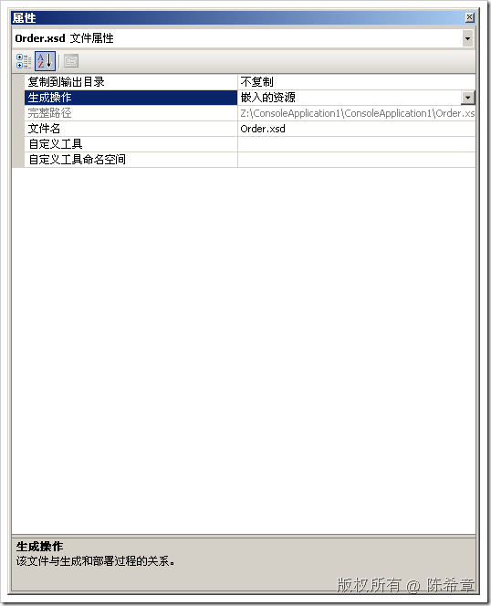
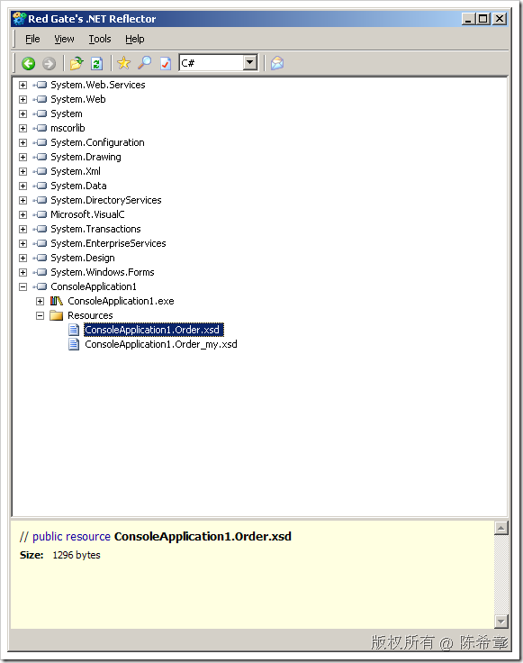
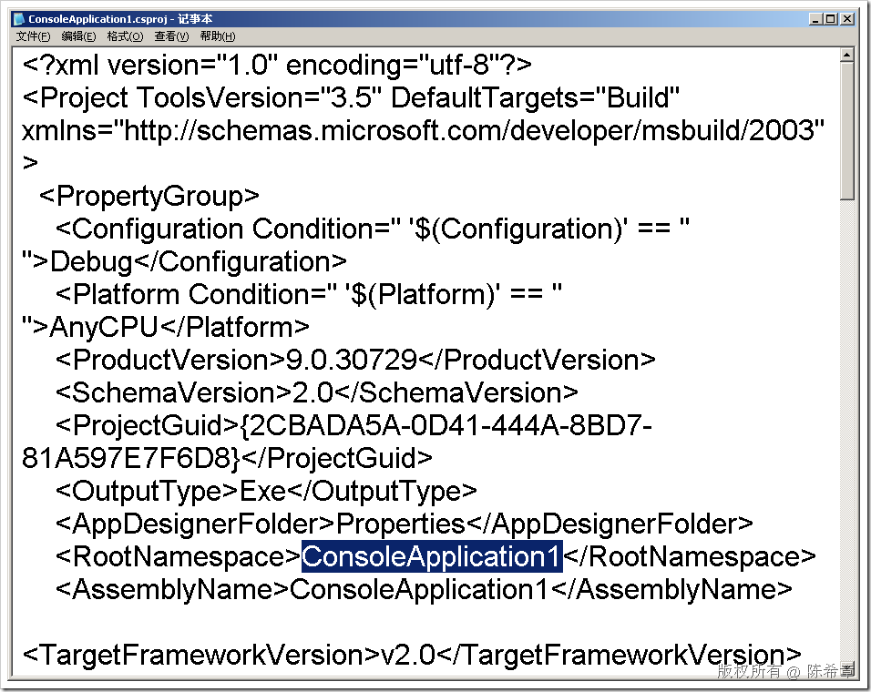
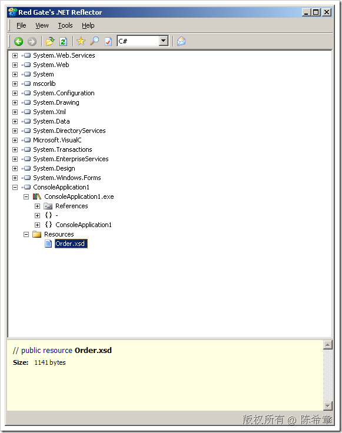
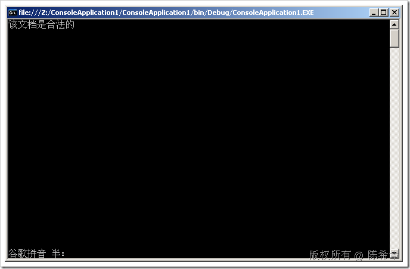
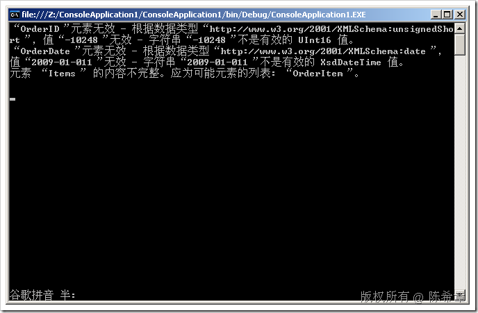

# 将XSD架构文件嵌入资源使用 
> 原文发表于 2009-06-20, 地址: http://www.cnblogs.com/chenxizhang/archive/2009/06/20/1507215.html 


上一篇，我讲解到如何使用XSD架构对XML数据文档进行验证。这一篇深入一点来看：那个XSD架构能不能直接嵌入到程序，作为资源存在呢？这样一来，就可以更好的保护这个文件

 准备工作：为了测试，请创建一个ConsoleApplication

  

 1. 首先，我们的范例数据比较简单。请保存为Order.xml


```
<?xml version="1.0" encoding="utf-8" ?>
<Order>
  <OrderID>10248</OrderID>
  <OrderDate>2009-01-01</OrderDate>
  <Items>
    <OrderItem>
      <ItemNumber>1</ItemNumber>
      <ProductID>2</ProductID>
      <Quantity>12.00</Quantity>
      <UnitPrice>25.6</UnitPrice>
    </OrderItem>
    <OrderItem>
      <ItemNumber>1</ItemNumber>
      <ProductID>2</ProductID>
      <Quantity>12.00</Quantity>
      <UnitPrice>25.6</UnitPrice>
    </OrderItem>
    <OrderItem>
      <ItemNumber>1</ItemNumber>
      <ProductID>2</ProductID>
      <Quantity>12.00</Quantity>
      <UnitPrice>25.6</UnitPrice>
    </OrderItem>
  </Items>
</Order>
```


.csharpcode, .csharpcode pre
{
 font-size: small;
 color: black;
 font-family: consolas, "Courier New", courier, monospace;
 background-color: #ffffff;
 /*white-space: pre;*/
}
.csharpcode pre { margin: 0em; }
.csharpcode .rem { color: #008000; }
.csharpcode .kwrd { color: #0000ff; }
.csharpcode .str { color: #006080; }
.csharpcode .op { color: #0000c0; }
.csharpcode .preproc { color: #cc6633; }
.csharpcode .asp { background-color: #ffff00; }
.csharpcode .html { color: #800000; }
.csharpcode .attr { color: #ff0000; }
.csharpcode .alt 
{
 background-color: #f4f4f4;
 width: 100%;
 margin: 0em;
}
.csharpcode .lnum { color: #606060; }

2. 我们直接通过Visual Studio的菜单：“XML”=》“创建架构”来生成一个XSD文件，默认的名字就是Order.xsd


```
<?xml version="1.0" encoding="utf-8"?>
<xs:schema attributeFormDefault="unqualified" elementFormDefault="qualified" xmlns:xs="http://www.w3.org/2001/XMLSchema">
  <xs:element name="Order">
    <xs:complexType>
      <xs:sequence>
        <xs:element name="OrderID" type="xs:unsignedShort" />
        <xs:element name="OrderDate" type="xs:date" />
        <xs:element name="Items">
          <xs:complexType>
            <xs:sequence>
              <xs:element maxOccurs="unbounded" name="OrderItem">
                <xs:complexType>
                  <xs:sequence>
                    <xs:element name="ItemNumber" type="xs:unsignedByte" />
                    <xs:element name="ProductID" type="xs:unsignedByte" />
                    <xs:element name="Quantity" type="xs:decimal" />
                    <xs:element name="UnitPrice" type="xs:decimal" />
                  </xs:sequence>
                </xs:complexType>
              </xs:element>
            </xs:sequence>
          </xs:complexType>
        </xs:element>
      </xs:sequence>
    </xs:complexType>
  </xs:element>
</xs:schema>
```

.csharpcode, .csharpcode pre
{
 font-size: small;
 color: black;
 font-family: consolas, "Courier New", courier, monospace;
 background-color: #ffffff;
 /*white-space: pre;*/
}
.csharpcode pre { margin: 0em; }
.csharpcode .rem { color: #008000; }
.csharpcode .kwrd { color: #0000ff; }
.csharpcode .str { color: #006080; }
.csharpcode .op { color: #0000c0; }
.csharpcode .preproc { color: #cc6633; }
.csharpcode .asp { background-color: #ffff00; }
.csharpcode .html { color: #800000; }
.csharpcode .attr { color: #ff0000; }
.csharpcode .alt 
{
 background-color: #f4f4f4;
 width: 100%;
 margin: 0em;
}
.csharpcode .lnum { color: #606060; }

我们对其做一点修改


```
<?xml version="1.0" encoding="utf-8"?>
<xs:schema attributeFormDefault="unqualified" elementFormDefault="qualified" xmlns:xs="http://www.w3.org/2001/XMLSchema">
  <xs:element name="Order">
    <xs:complexType>
      <xs:sequence>
        <xs:element name="OrderID" type="xs:unsignedShort" />
        <xs:element name="OrderDate" type="xs:date" />
        <xs:element name="Items">
          <xs:complexType>
            <xs:sequence>
              <xs:element maxOccurs="unbounded" name="OrderItem" **minOccurs="1"**>
                <xs:complexType>
                  <xs:sequence>
                    <xs:element name="ItemNumber" type="xs:unsignedByte" />
                    <xs:element name="ProductID" type="xs:unsignedByte" />
                    <xs:element name="Quantity" type="xs:decimal" />
                    <xs:element name="UnitPrice" type="xs:decimal" />
                  </xs:sequence>
                </xs:complexType>
              </xs:element>
            </xs:sequence>
          </xs:complexType>
        </xs:element>
      </xs:sequence>
    </xs:complexType>
  </xs:element>
</xs:schema>
```

```
保存该文件到项目目录，因为它默认是在临时目录创建的
```

##### 3.将该文件的生成操作设置为“嵌入的资源”


.csharpcode, .csharpcode pre
{
 font-size: small;
 color: black;
 font-family: consolas, "Courier New", courier, monospace;
 background-color: #ffffff;
 /*white-space: pre;*/
}
.csharpcode pre { margin: 0em; }
.csharpcode .rem { color: #008000; }
.csharpcode .kwrd { color: #0000ff; }
.csharpcode .str { color: #006080; }
.csharpcode .op { color: #0000c0; }
.csharpcode .preproc { color: #cc6633; }
.csharpcode .asp { background-color: #ffff00; }
.csharpcode .html { color: #800000; }
.csharpcode .attr { color: #ff0000; }
.csharpcode .alt 
{
 background-color: #f4f4f4;
 width: 100%;
 margin: 0em;
}
.csharpcode .lnum { color: #606060; }

[](http://images.cnblogs.com/cnblogs_com/chenxizhang/WindowsLiveWriter/XSD_8499/image_2.png)  


4. 生成该项目，我们查看一下该文件在程序集里面是怎么一个表现形式


我们通过Reflector打开这个exe


[](http://images.cnblogs.com/cnblogs_com/chenxizhang/WindowsLiveWriter/XSD_8499/image_6.png) 


请记住这个名字：ConsoleApplication1.Order.xsd


如果你实在不想要前面这一段前缀：ConsoleApplication1，则可以手工修改一下ConsoleApplication1.csproj文件，把里面的RootNameSpace清空


[](http://images.cnblogs.com/cnblogs_com/chenxizhang/WindowsLiveWriter/XSD_8499/image_8.png) 


然后，再来看就很简洁了：Order.xsd


[](http://images.cnblogs.com/cnblogs_com/chenxizhang/WindowsLiveWriter/XSD_8499/image_10.png) 


5. 编写代码，使用该嵌入资源文件作为架构，进行验证


```
using System;
using System.Collections.Generic;
using System.Text;

using System.Reflection;
using System.Xml;

namespace ConsoleApplication1
{
    class Program
    {
        static void Main(string[] args)
        {
            string dataFile = "Order.xml";
            string namespaceUrl = string.Empty;
            XmlReaderSettings settings = new XmlReaderSettings();
            settings.ValidationType = ValidationType.Schema;
            settings.Schemas.Add(namespaceUrl,
                **XmlReader.Create(Assembly.GetExecutingAssembly().GetManifestResourceStream("Order.xsd")));**
            settings.ValidationEventHandler += new System.Xml.Schema.ValidationEventHandler(settings\_ValidationEventHandler);

            string errorMessage = "这不是一个合乎规范的数据文件";
            sb = new StringBuilder();

            XmlReader reader = XmlReader.Create(dataFile, settings);
            try
            {
                reader.MoveToContent();
                while (reader.Read())
                {
                    if (reader.NodeType == XmlNodeType.Document && reader.NamespaceURI != namespaceUrl)
                    {
                        Console.WriteLine("文档不是合法的");
                        break;
                    }
                }
            }
            catch (XmlException ex)
            {
                sb.AppendFormat("{0}\n", ex.Message);
            }
            finally
            {
                reader.Close();
            }

            if (sb.Length == 0)
                Console.WriteLine("该文档是合法的");
            else
                Console.WriteLine(sb.ToString());

            Console.Read();

            
        }

        static StringBuilder sb = null;
        static void settings\_ValidationEventHandler(object sender, System.Xml.Schema.ValidationEventArgs e)
        {
            sb.AppendFormat("{0}\n", e.Message);
        }
    }
}

```

.csharpcode, .csharpcode pre
{
 font-size: small;
 color: black;
 font-family: consolas, "Courier New", courier, monospace;
 background-color: #ffffff;
 /*white-space: pre;*/
}
.csharpcode pre { margin: 0em; }
.csharpcode .rem { color: #008000; }
.csharpcode .kwrd { color: #0000ff; }
.csharpcode .str { color: #006080; }
.csharpcode .op { color: #0000c0; }
.csharpcode .preproc { color: #cc6633; }
.csharpcode .asp { background-color: #ffff00; }
.csharpcode .html { color: #800000; }
.csharpcode .attr { color: #ff0000; }
.csharpcode .alt 
{
 background-color: #f4f4f4;
 width: 100%;
 margin: 0em;
}
.csharpcode .lnum { color: #606060; }


 


6. 按下F5键进行调试


[](http://images.cnblogs.com/cnblogs_com/chenxizhang/WindowsLiveWriter/XSD_8499/image_12.png) 


同样道理，如果故意将XML文件修改一下，则可能导致验证无法通过


[](http://images.cnblogs.com/cnblogs_com/chenxizhang/WindowsLiveWriter/XSD_8499/image_14.png) 


最后，仍然要提一下，如果验证的时候，需要考虑命名空间的问题，则上述代码会有问题。因为之前我们介绍过，那种情况下需要两个或者更多个架构文件，而且这些文件之间还需要有所联系。解决方案就是：那些架构文件可以嵌入，但验证之前，仍然需要在磁盘的同一个目录下临时创建起来，然后用磁盘文件的方式去验证。就是不能使用内存流的方式来做，因为它不知道怎么关联。


由此可见，命名空间这个东西实在是麻烦，不是吗？


本文由作者：[陈希章](http://www.xizhang.com) 于 2009/6/20 9:25:46 
发布在：<http://www.cnblogs.com/chenxizhang/>  

本文版权归作者所有，可以转载，但未经作者同意必须保留此段声明，且在文章页面明显位置给出原文连接，否则保留追究法律责任的权利。   

更多博客文章，以及作者对于博客引用方面的完整声明以及合作方面的政策，请参考以下站点：[陈希章的博客中心](http://www.xizhang.com/blog.htm)
