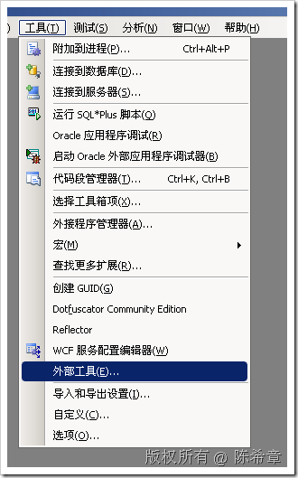
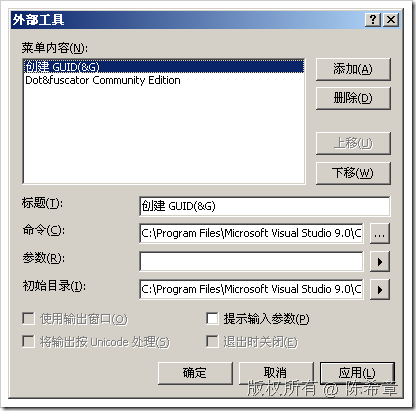
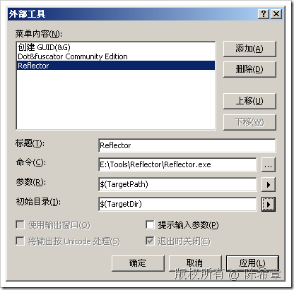
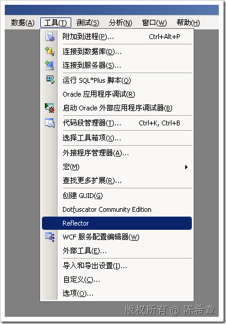
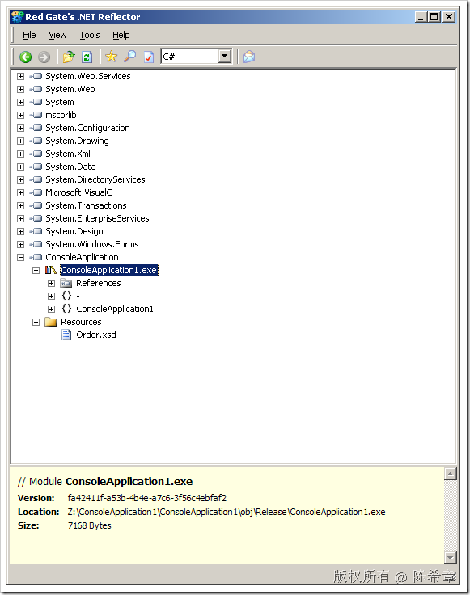

# 自定义打开Reflector的方式 
> 原文发表于 2009-06-20, 地址: http://www.cnblogs.com/chenxizhang/archive/2009/06/20/1507231.html 

刚才突然想到了这个问题，我们经常需要用Reflector这个工具来查看程序集的源代码，而每次使用都是有如下的步骤

 1. 打开Reflector

 2. 找到项目生成的exe或者dll。（这个路径一般都比较长，也比较难找）

 3. 将exe或者dll拖拽到reflector中去

 我就在想，这个操作能不能更加智能一些，例如一个步骤就完成上面三个操作呢？动了一下脑筋，最后找到下面这个方法，很不错：简单实用

 1. 在Visual Studio中，点击“工具”=》“外部工具”

  

  

 2. 点击“添加”,输入或者选择一下的四个信息

  

 点击“确定”即可

 3. 现在我们来测试一下

  

     

 很显然，其他一些常用工具也可以这样做

 本文由作者：[陈希章](http://www.xizhang.com) 于 2009/6/20 10:05:16 发布在：<http://www.cnblogs.com/chenxizhang/>  
 本文版权归作者所有，可以转载，但未经作者同意必须保留此段声明，且在文章页面明显位置给出原文连接，否则保留追究法律责任的权利。   
 更多博客文章，以及作者对于博客引用方面的完整声明以及合作方面的政策，请参考以下站点：[陈希章的博客中心](http://www.xizhang.com/blog.htm) 