# 在SSIS中使用Web Service任务进行集成 
> 原文发表于 2009-06-20, 地址: http://www.cnblogs.com/chenxizhang/archive/2009/06/20/1507270.html 


SSIS是SQL Server 2005新增的一个服务，全称是SQL Server Integration Service。中文一般翻译为：集成服务或者整合服务。

 SSIS在整个SQL Server的BI 平台中的定位是ETL解决方案，它的前身是SQL Server 2000的DTS(Data Transfomation Service)，但较之DTS，有了很大的改变和增强：它是完全基于.NET编写的，并且提供了完整的服务、运行引擎、异常处理、跟踪日志、扩展机制等等。

 有关SSIS的完整内容，如果有兴趣，应该参考有关的书籍，或者参加有关的培训学习。

 本文主要讲解一下，如何在SSIS中使用Web Service，这是我经常被问到的问题：因为在做数据集成的时候，数据源系统可能没有办法让我们直接访问数据库。但是他们可以公开一些服务，这样我们就可以通过访问这些Web Service对其进行读取和整合。

 1. 作为演示目的，我写了一个很简单的服务。模拟的是人事系统，它通过Web Service的方式将最新的员工信息发布出来。

 [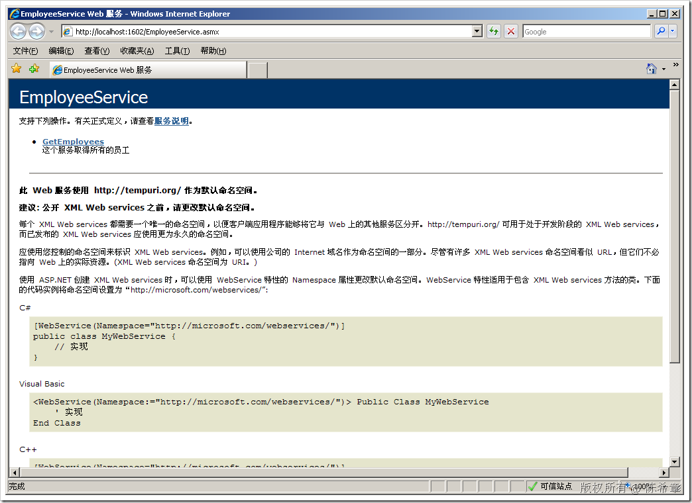](http://images.cnblogs.com/cnblogs_com/chenxizhang/WindowsLiveWriter/SSISWebService_9C0A/image_2.png) 

 点击”GetEmployees” 链接

 [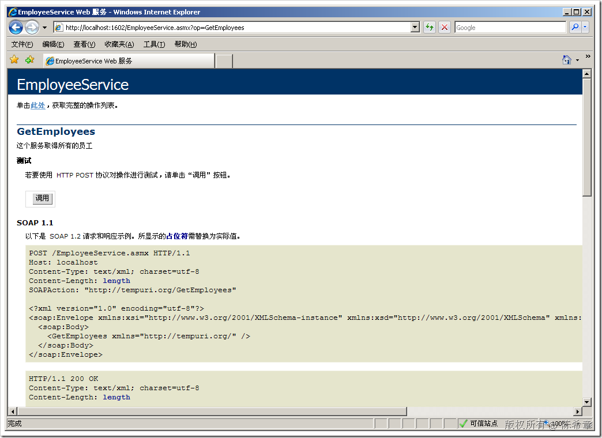](http://images.cnblogs.com/cnblogs_com/chenxizhang/WindowsLiveWriter/SSISWebService_9C0A/image_4.png) 

 点击“调用”按钮

 [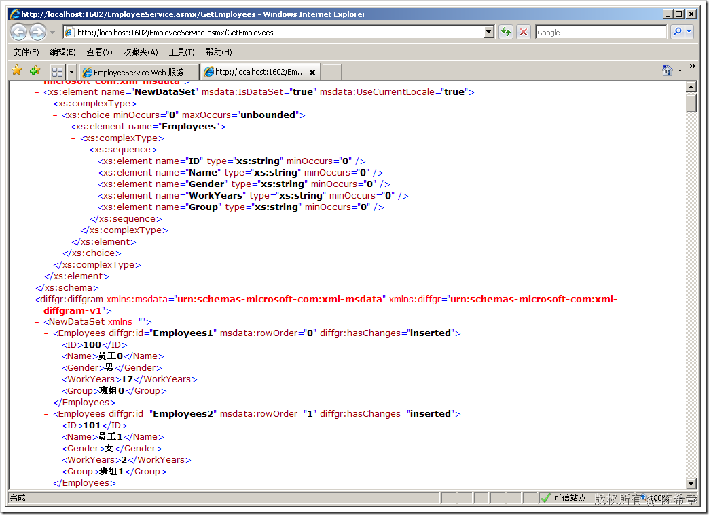](http://images.cnblogs.com/cnblogs_com/chenxizhang/WindowsLiveWriter/SSISWebService_9C0A/image_6.png) 

 我这里只是简单地随机产生了100个员工，包括了ID,Name，Gender,WorkYears，Groups等信息

 这个服务的代码如下


```
using System;
using System.Web.Services;
using System.Data;

namespace HRService
{
    /// <summary>
    /// 这个服务模拟了一个人事系统，它将最新的员工列表发布出来
    /// 作者：陈希章
    /// </summary>
    [WebService(Namespace = "http://tempuri.org/")]
    [WebServiceBinding(ConformsTo = WsiProfiles.BasicProfile1\_1)]
    [System.ComponentModel.ToolboxItem(false)]
    public class EmployeeService : System.Web.Services.WebService
    {
        [WebMethod(
            Description="这个服务取得所有的员工")]
        public DataSet GetEmployees()
        {
            DataSet ds = new DataSet();
            DataTable tb = new DataTable("Employees");

            tb.Columns.Add("ID");
            tb.Columns.Add("Name");
            tb.Columns.Add("Gender");
            tb.Columns.Add("WorkYears");
            tb.Columns.Add("Group");

            Random rnd=new Random();
            for (int i = 0; i < 100; i++)
            {
                DataRow row = tb.NewRow();
                row[0] = i+100;
                row[1] = "员工" + i.ToString();
                row[2] = i % 5 == 0 ? "男" : "女";
                row[3] = rnd.Next(20);
                row[4] = "班组" + i % 9;

                tb.Rows.Add(row);
            }
            ds.Tables.Add(tb);

            return ds;
        }
    }
}

```


.csharpcode, .csharpcode pre
{
 font-size: small;
 color: black;
 font-family: consolas, "Courier New", courier, monospace;
 background-color: #ffffff;
 /*white-space: pre;*/
}
.csharpcode pre { margin: 0em; }
.csharpcode .rem { color: #008000; }
.csharpcode .kwrd { color: #0000ff; }
.csharpcode .str { color: #006080; }
.csharpcode .op { color: #0000c0; }
.csharpcode .preproc { color: #cc6633; }
.csharpcode .asp { background-color: #ffff00; }
.csharpcode .html { color: #800000; }
.csharpcode .attr { color: #ff0000; }
.csharpcode .alt 
{
 background-color: #f4f4f4;
 width: 100%;
 margin: 0em;
}
.csharpcode .lnum { color: #606060; }


2. 创建一个SSIS包，准备使用Web Service任务项去调用该服务


[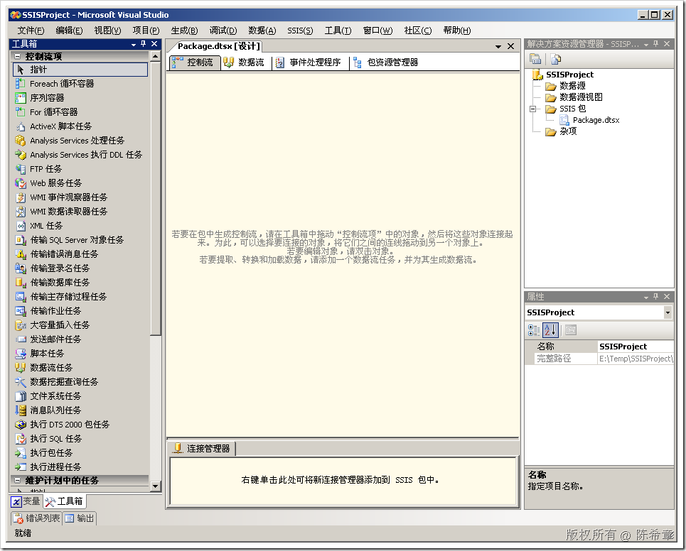](http://images.cnblogs.com/cnblogs_com/chenxizhang/WindowsLiveWriter/SSISWebService_9C0A/image_8.png) 


我们从工具箱中，拖拽一个”Web服务任务”到“控制流”的空白区域


[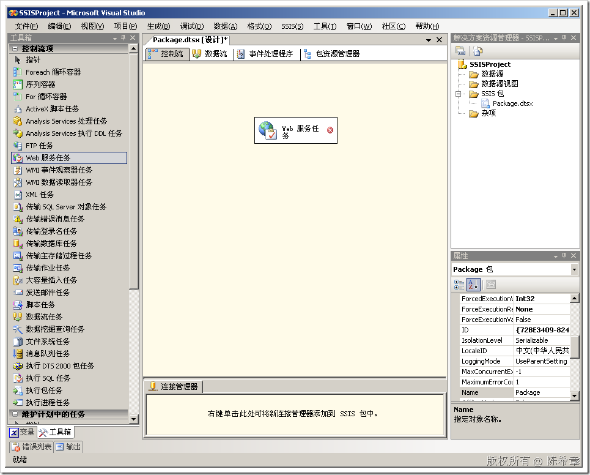](http://images.cnblogs.com/cnblogs_com/chenxizhang/WindowsLiveWriter/SSISWebService_9C0A/image_10.png) 


选中该任务，点击右键，“编辑”


[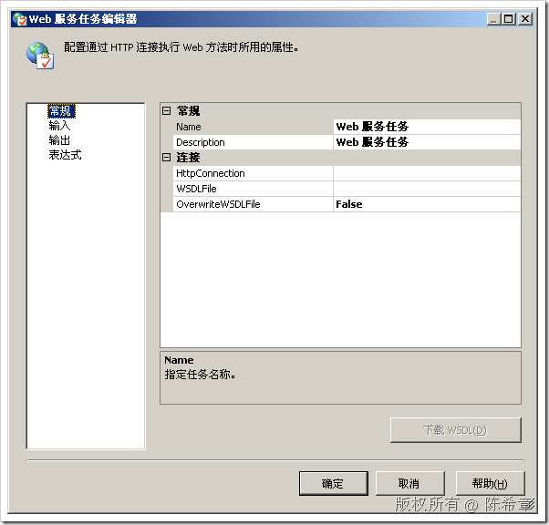](http://images.cnblogs.com/cnblogs_com/chenxizhang/WindowsLiveWriter/SSISWebService_9C0A/image_12.png) 


点击”HttpConnection”右侧的下拉按钮，选择“新建连接”


[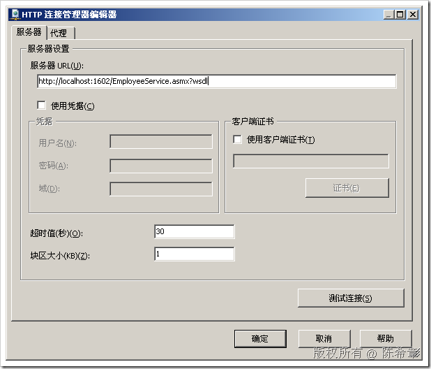](http://images.cnblogs.com/cnblogs_com/chenxizhang/WindowsLiveWriter/SSISWebService_9C0A/image_14.png)   


【注意】这里的服务器Url应该带有wsdl后缀，因为等一下可以利用这个路径生成一个本地的wsdl文件


我们这里没有使用凭据。需要说明一下的是，“Web服务任务”能够使用的凭据只有两种：匿名或者基本验证。


何时使用证书？如何我们的服务是用WSE做了安全控制的话。


 


点击“测试连接”，确保它是成功的


[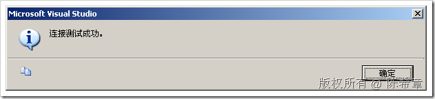](http://images.cnblogs.com/cnblogs_com/chenxizhang/WindowsLiveWriter/SSISWebService_9C0A/image_16.png) 


点击“确定”，“确定”退出连接管理器设置界面


[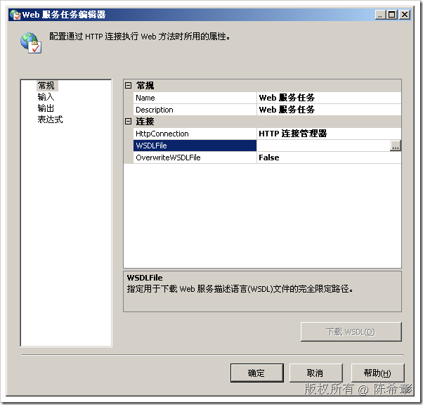](http://images.cnblogs.com/cnblogs_com/chenxizhang/WindowsLiveWriter/SSISWebService_9C0A/image_18.png) 


在“WSDLFile”这里面输入一个临时路径，例如：E:\TEMP\Employee.wsdl


[](http://images.cnblogs.com/cnblogs_com/chenxizhang/WindowsLiveWriter/SSISWebService_9C0A/image_20.png) 


点击“下载WSDL”按钮, 如果不出意外的话，应该可以看到下面的提示


[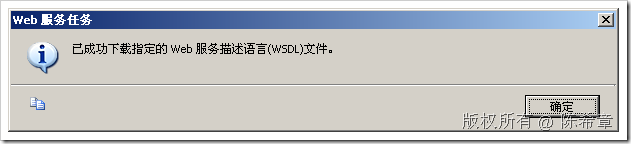](http://images.cnblogs.com/cnblogs_com/chenxizhang/WindowsLiveWriter/SSISWebService_9C0A/image_22.png) 


这个操作其实是产生了一个wsdl文件，我们可以打开来看一下


[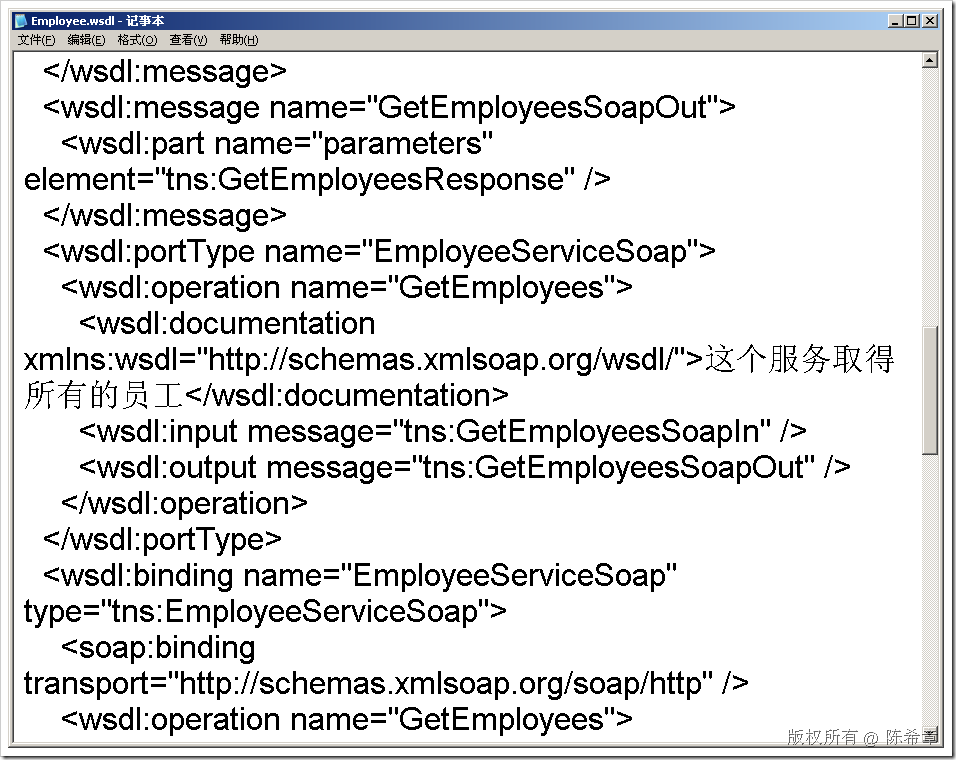](http://images.cnblogs.com/cnblogs_com/chenxizhang/WindowsLiveWriter/SSISWebService_9C0A/image_24.png) 


顾名思义，WSDL是对服务进行了描述。为什么需要描述呢？就是后续需要用到里面的信息进行设置。


接下来，我们转到“输入”这个页面


[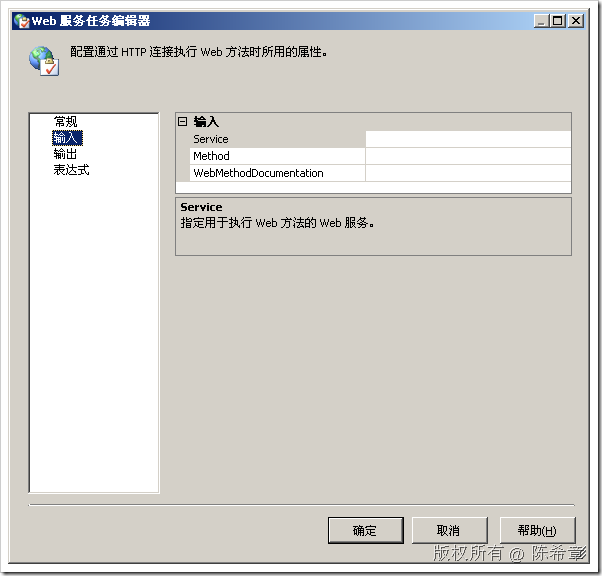](http://images.cnblogs.com/cnblogs_com/chenxizhang/WindowsLiveWriter/SSISWebService_9C0A/image_26.png) 


依次在右侧选择Service和Method


[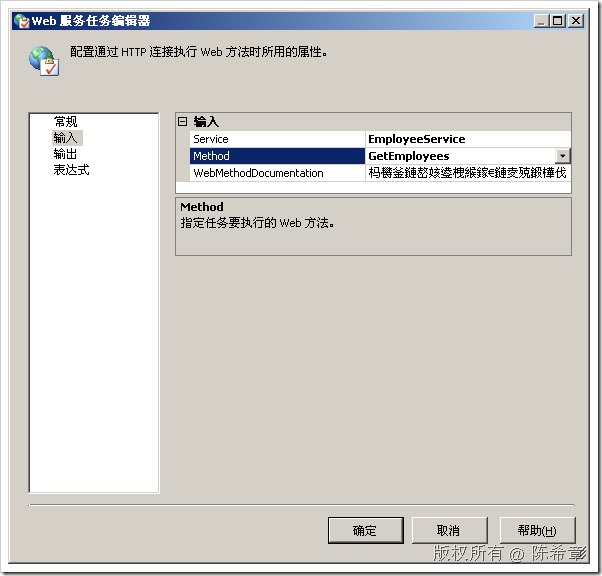](http://images.cnblogs.com/cnblogs_com/chenxizhang/WindowsLiveWriter/SSISWebService_9C0A/image_28.png) 


【注意】第三行有些乱码，是因为对中文支持不好，可以不予理会


这样，我们就完成了输入设置，也就是可以连接到Web Service了。


 


3. 如何将获取到的数据进行保存或者处理呢？


我们可以转到“输出”页面


[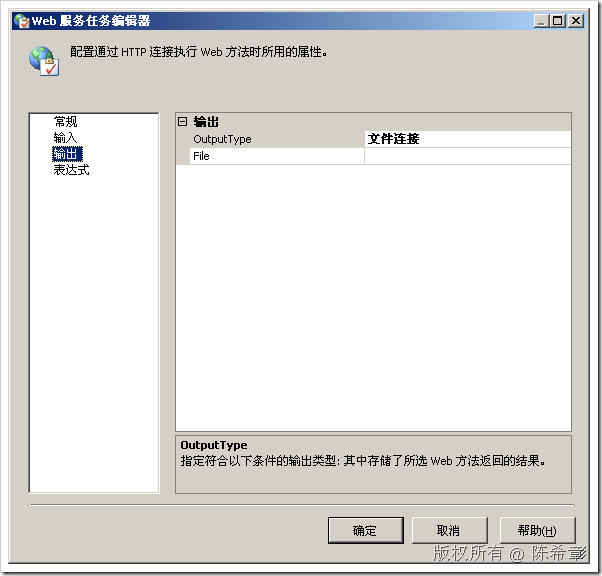](http://images.cnblogs.com/cnblogs_com/chenxizhang/WindowsLiveWriter/SSISWebService_9C0A/image_30.png) 


它支持两种输出类型：文件连接或者变量


我们先用“文件连接”来接受输出，然后点击”File”右侧的小下拉箭头，点击“新建连接”


[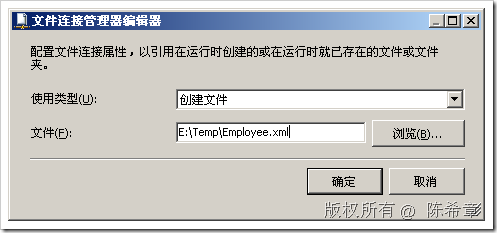](http://images.cnblogs.com/cnblogs_com/chenxizhang/WindowsLiveWriter/SSISWebService_9C0A/image_32.png) 


我们让它创建一个新的文件，保存在临时目录下。点击“确定”后即可完成该任务的配置


 


4. 测试任务运行。


[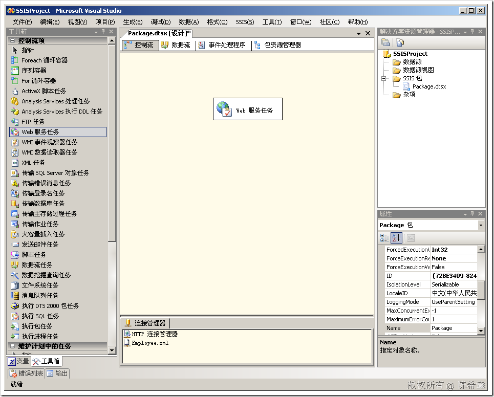](http://images.cnblogs.com/cnblogs_com/chenxizhang/WindowsLiveWriter/SSISWebService_9C0A/image_34.png) 


选中“Web服务任务”，点击右键，“执行任务”


[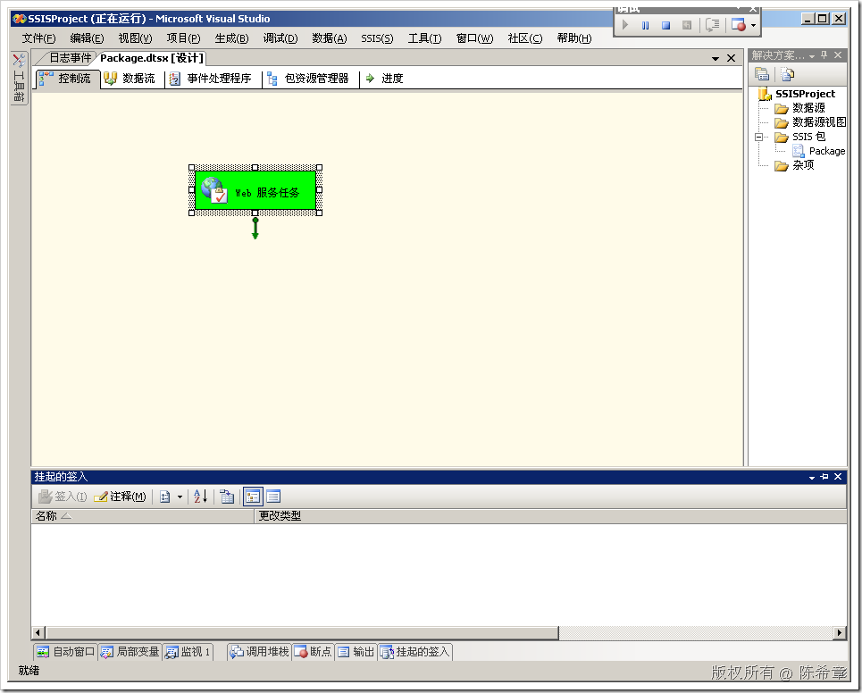](http://images.cnblogs.com/cnblogs_com/chenxizhang/WindowsLiveWriter/SSISWebService_9C0A/image_36.png) 


如果不出意外的话，该任务能够成功执行。


 


5. 查看结果。我们打开保存的那个文件，可以看到，这是一个标准的XML文件，证明我们已经把数据下载下来了。


[](http://images.cnblogs.com/cnblogs_com/chenxizhang/WindowsLiveWriter/SSISWebService_9C0A/image_38.png) 


 


结束语：我们现在已经通过“Web服务任务”成功地完成了服务的调用，并且将结果保存为一个本地文件。那么，怎么处理该文件，并将其数据上传到我们的数据仓库中去呢？


这个问题在下一篇讲解


本文由作者：[陈希章](http://www.xizhang.com) 于 2009/6/20 11:20:05 
发布在：<http://www.cnblogs.com/chenxizhang/>  

本文版权归作者所有，可以转载，但未经作者同意必须保留此段声明，且在文章页面明显位置给出原文连接，否则保留追究法律责任的权利。   
