# 为SSIS编写自定义任务项(Task)之入门篇 
> 原文发表于 2009-06-20, 地址: http://www.cnblogs.com/chenxizhang/archive/2009/06/20/1507386.html 


在BI Studio中，默认提供了很多很好用的任务项供我们使用。

 [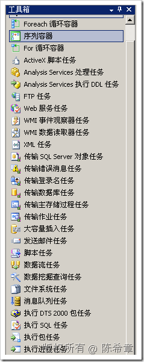](http://images.cnblogs.com/cnblogs_com/chenxizhang/WindowsLiveWriter/SSISTask_E17B/image_32.png) [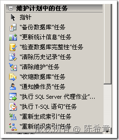](http://images.cnblogs.com/cnblogs_com/chenxizhang/WindowsLiveWriter/SSISTask_E17B/image_34.png) 

 但是如果这些任务还没有满足我们的要求，我们能不能自己写一个然后添加到工具箱呢？答案是肯定的。

 本文介绍如何开始该工作。

  

 1. 创建一个类库项目

 [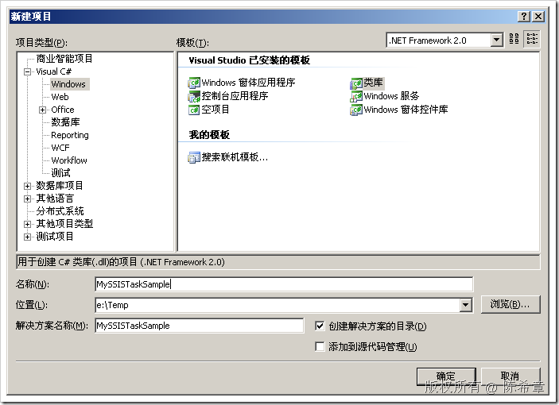](http://images.cnblogs.com/cnblogs_com/chenxizhang/WindowsLiveWriter/SSISTask_E17B/image_2.png) 

 将默认的Class1重命名为MyXMLTask

 [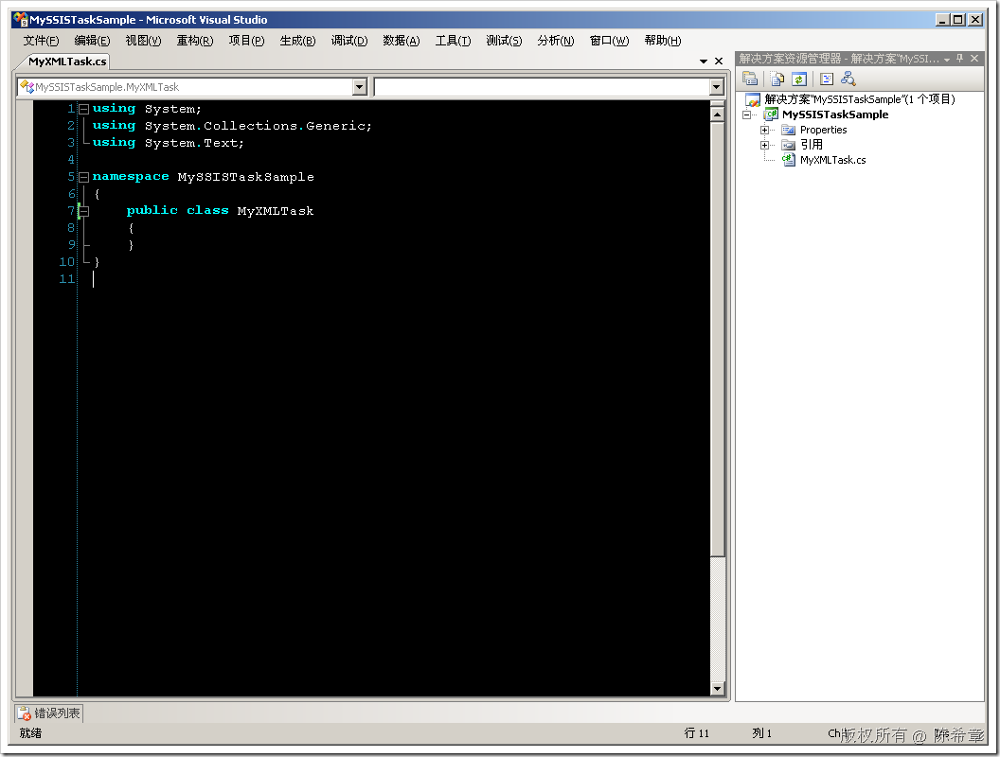](http://images.cnblogs.com/cnblogs_com/chenxizhang/WindowsLiveWriter/SSISTask_E17B/image_4.png) 

 添加程序集引用： Microsoft.SQLServer.ManagedDTS

 [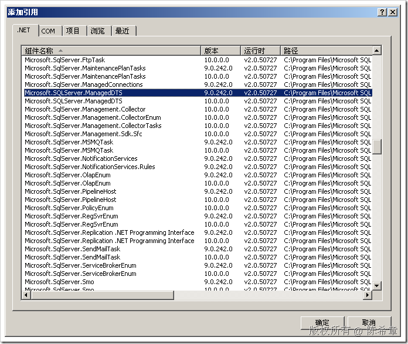](http://images.cnblogs.com/cnblogs_com/chenxizhang/WindowsLiveWriter/SSISTask_E17B/image_6.png) 

 2. 编写一个最简单的任务项。我们目前为其实现的功能是：当它执行的时候，弹出一个对话框，告诉我们它在执行了

 为此，我们添加System.Windows.Forms 的引用

 [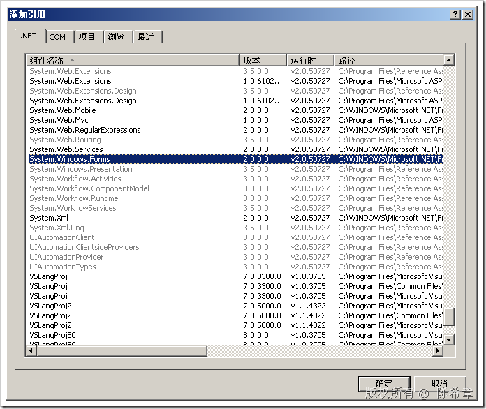](http://images.cnblogs.com/cnblogs_com/chenxizhang/WindowsLiveWriter/SSISTask_E17B/image_8.png) 

 让我们的类型继承自Task，并为其重写Execute方法。同时为其添加一个DTSTask的Attribute

  


```
using System;
using System.Collections.Generic;
using System.Text;
using Microsoft.SqlServer.Dts.Runtime;
using System.Windows.Forms;
namespace MySSISTaskSample
{
    [DtsTask(
        Description="这是我的一个自定义XML任务，"+
            "它与标准的XML任务的区别就在于可以自动处理命名空间问题",
        DisplayName="超强XML任务",
        TaskContact="陈希章:http://www.xizhang.com"
        )]
    public class MyXMLTask:Task
    {

        /// <summary>
        /// 这个方法真正执行操作
        /// </summary>
        /// <param name="connections"></param>
        /// <param name="variableDispenser"></param>
        /// <param name="componentEvents"></param>
        /// <param name="log"></param>
        /// <param name="transaction"></param>
        /// <returns></returns>
        public override DTSExecResult Execute(Connections connections, 
            VariableDispenser variableDispenser, 
            IDTSComponentEvents componentEvents, 
            IDTSLogging log, object transaction)
        {

            MessageBox.Show("我在工作了");
            return base.Execute(connections, variableDispenser, componentEvents, log, transaction);
        }
    }
}

```

.csharpcode, .csharpcode pre
{
 font-size: small;
 color: black;
 font-family: consolas, "Courier New", courier, monospace;
 background-color: #ffffff;
 /*white-space: pre;*/
}
.csharpcode pre { margin: 0em; }
.csharpcode .rem { color: #008000; }
.csharpcode .kwrd { color: #0000ff; }
.csharpcode .str { color: #006080; }
.csharpcode .op { color: #0000c0; }
.csharpcode .preproc { color: #cc6633; }
.csharpcode .asp { background-color: #ffff00; }
.csharpcode .html { color: #800000; }
.csharpcode .attr { color: #ff0000; }
.csharpcode .alt 
{
 background-color: #f4f4f4;
 width: 100%;
 margin: 0em;
}
.csharpcode .lnum { color: #606060; }


3. 部署该任务项


请严格按照这篇文章的介绍操作 <http://msdn.microsoft.com/zh-cn/library/ms403356.aspx>


首先为其生成强名称签名


[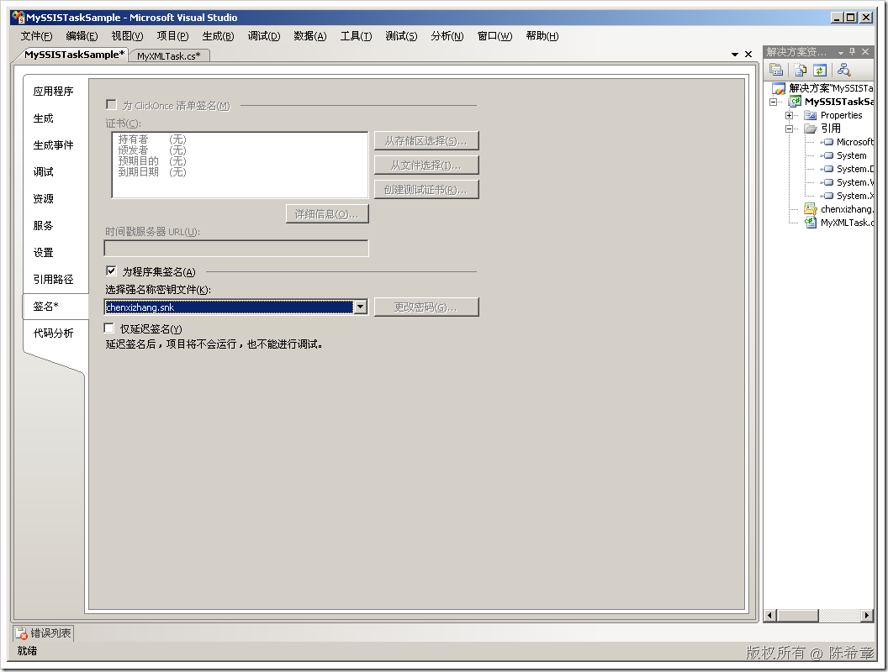](http://images.cnblogs.com/cnblogs_com/chenxizhang/WindowsLiveWriter/SSISTask_E17B/image_10.png) 


然后，生成项目，复制dll到如下目录


[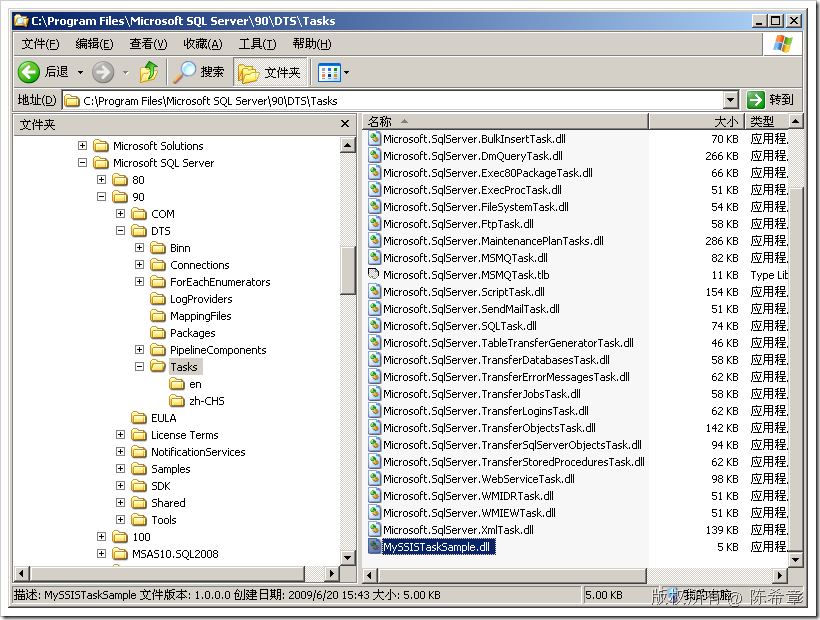](http://images.cnblogs.com/cnblogs_com/chenxizhang/WindowsLiveWriter/SSISTask_E17B/image_12.png) 


与此同时，我们还需要将其添加到GAC


[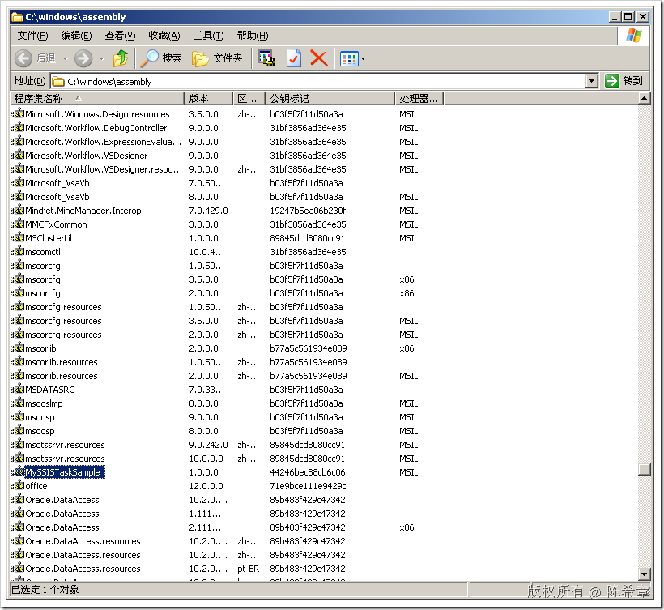](http://images.cnblogs.com/cnblogs_com/chenxizhang/WindowsLiveWriter/SSISTask_E17B/image_14.png) 


4. 在BI Studio中添加该Task


[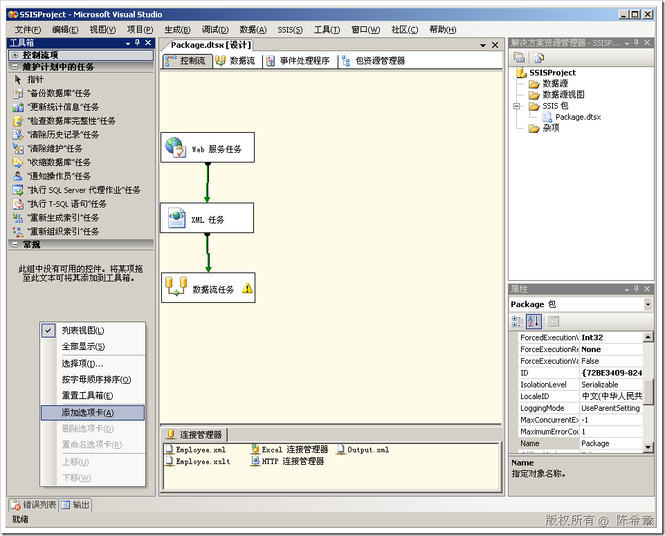](http://images.cnblogs.com/cnblogs_com/chenxizhang/WindowsLiveWriter/SSISTask_E17B/image_16.png) 


添加一个选项卡：“自定义”


[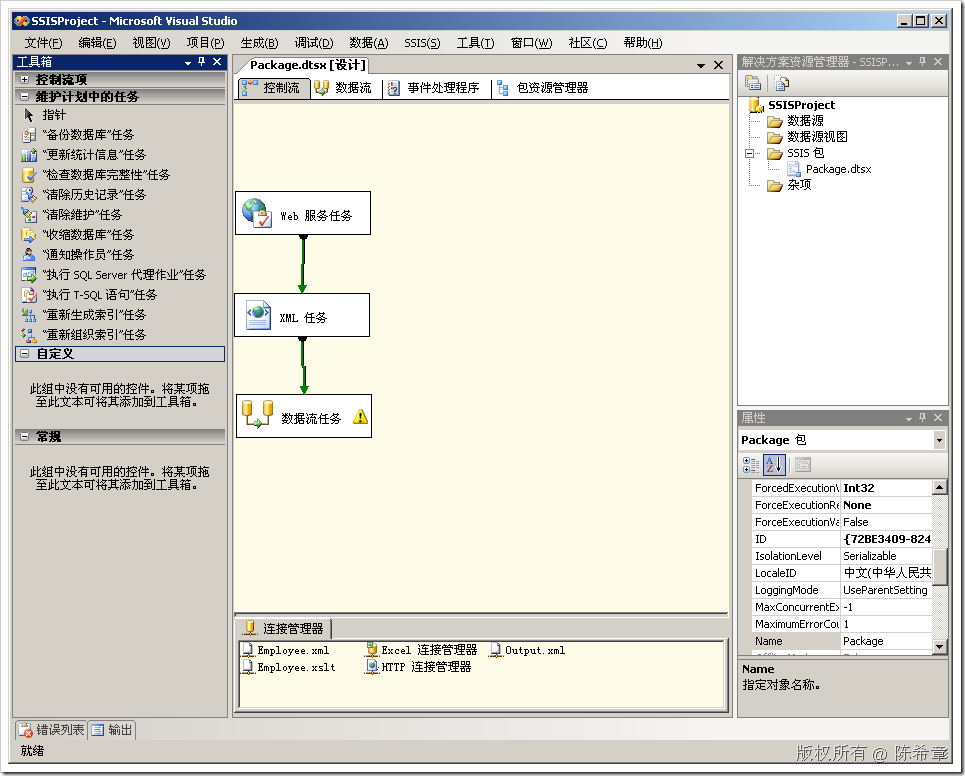](http://images.cnblogs.com/cnblogs_com/chenxizhang/WindowsLiveWriter/SSISTask_E17B/image_18.png) 


在“自定义”的空白处，点击右键，“选择项”


[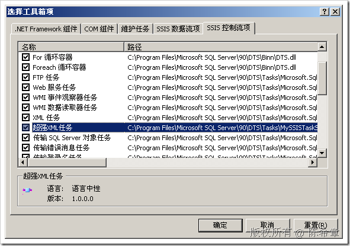](http://images.cnblogs.com/cnblogs_com/chenxizhang/WindowsLiveWriter/SSISTask_E17B/image_20.png) 


切换到“SSIS控制项”这个页面，选中“超强XML任务”


点击“确定”


[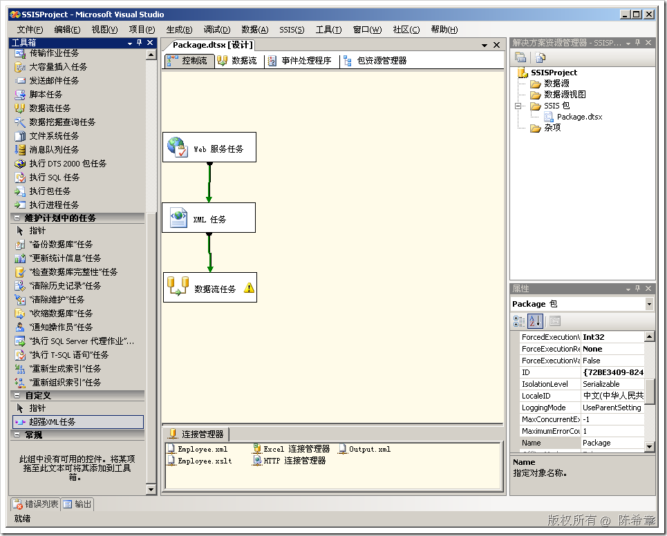](http://images.cnblogs.com/cnblogs_com/chenxizhang/WindowsLiveWriter/SSISTask_E17B/image_22.png) 


5. 测试该Task


我们新建一个包来测试该任务


[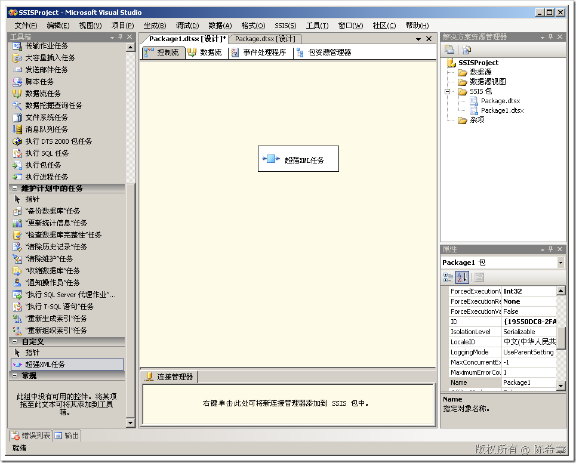](http://images.cnblogs.com/cnblogs_com/chenxizhang/WindowsLiveWriter/SSISTask_E17B/image_24.png) 


执行该任务


[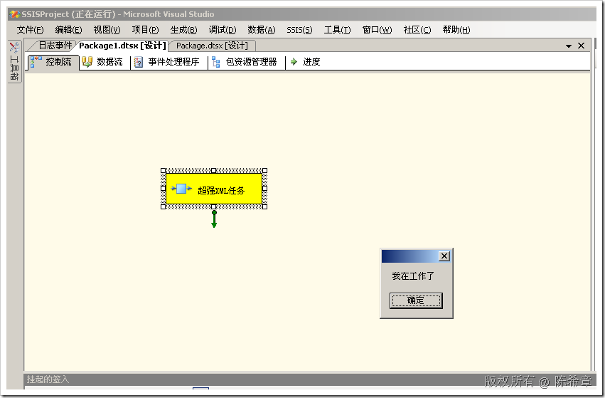](http://images.cnblogs.com/cnblogs_com/chenxizhang/WindowsLiveWriter/SSISTask_E17B/image_26.png) 


[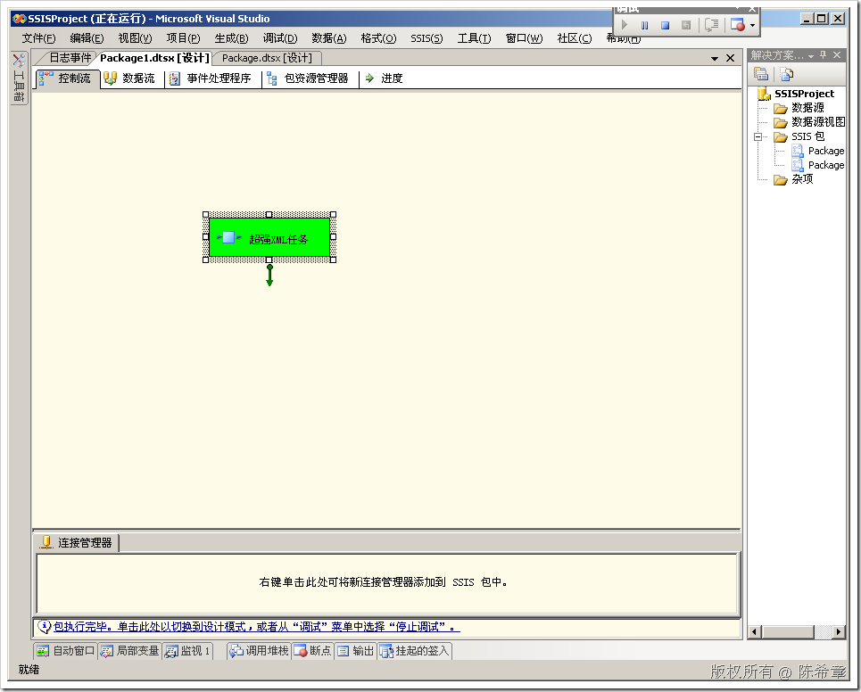](http://images.cnblogs.com/cnblogs_com/chenxizhang/WindowsLiveWriter/SSISTask_E17B/image_28.png) 


到这里为止，我们写的自定义任务已经可以工作了，当然它现在的工作几乎没有什么意义。但本文主要是介绍开发和部署的流程。下一篇，我们将介绍，如何添加自定义编辑页面


本文由作者：[陈希章](http://www.xizhang.com) 于 2009/6/20 16:02:05 
发布在：<http://www.cnblogs.com/chenxizhang/>  

本文版权归作者所有，可以转载，但未经作者同意必须保留此段声明，且在文章页面明显位置给出原文连接，否则保留追究法律责任的权利。   

更多博客文章，以及作者对于博客引用方面的完整声明以及合作方面的政策，请参考以下站点：[陈希章的博客中心](http://www.xizhang.com/blog.htm)
