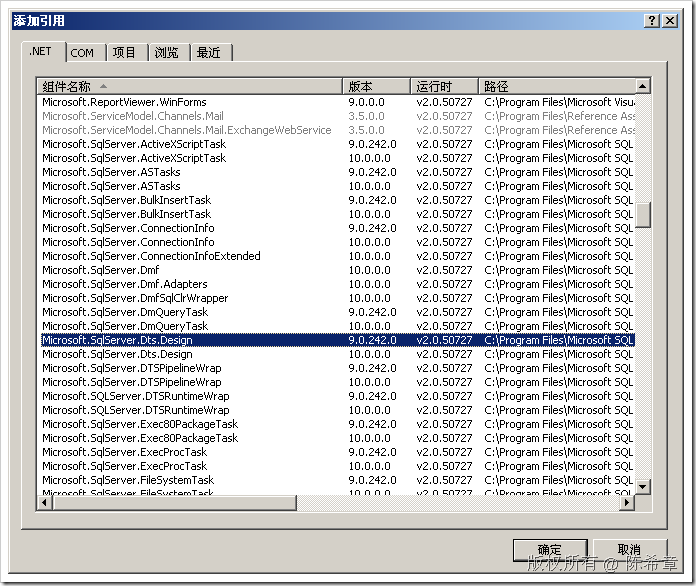
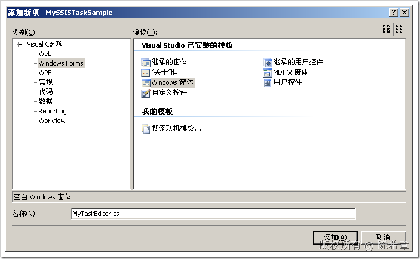
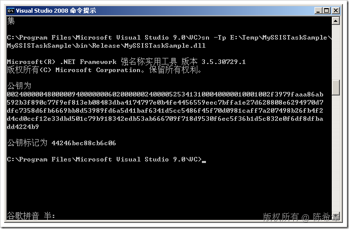
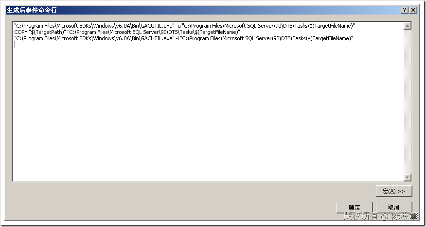
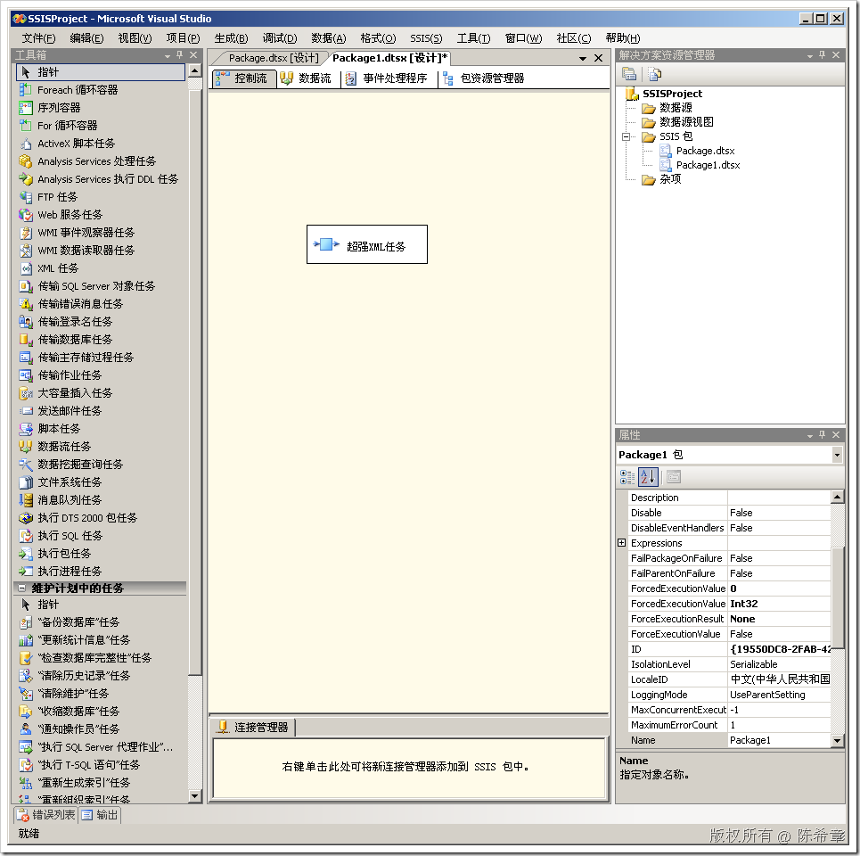
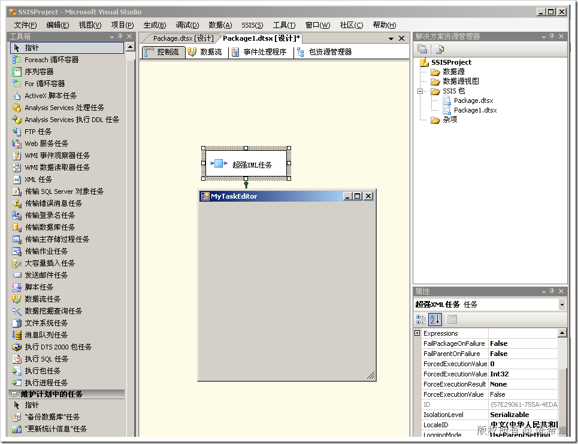

# 为SSIS编写自定义任务项(Task)之进阶篇 
> 原文发表于 2009-06-20, 地址: http://www.cnblogs.com/chenxizhang/archive/2009/06/20/1507423.html 


上一篇，我们演示了如何编写一个简单的Task，并将其部署到SSIS中去使用。


```
using System;
using System.Collections.Generic;
using System.Text;
using Microsoft.SqlServer.Dts.Runtime;
using System.Windows.Forms;
namespace MySSISTaskSample
{
    [DtsTask(
        Description="这是我的一个自定义XML任务，"+
            "它与标准的XML任务的区别就在于可以自动处理命名空间问题",
        DisplayName="超强XML任务",
        TaskContact="陈希章:http://www.xizhang.com"
        )]
    public class MyXMLTask:Task
    {

        /// <summary>
        /// 这个方法真正执行操作
        /// </summary>
        /// <param name="connections"></param>
        /// <param name="variableDispenser"></param>
        /// <param name="componentEvents"></param>
        /// <param name="log"></param>
        /// <param name="transaction"></param>
        /// <returns></returns>
        public override DTSExecResult Execute(Connections connections, 
            VariableDispenser variableDispenser, 
            IDTSComponentEvents componentEvents, 
            IDTSLogging log, object transaction)
        {
            
            
            MessageBox.Show("我在工作了");
            return base.Execute(connections, variableDispenser, componentEvents, log, transaction);
        }
    }
}

```


.csharpcode, .csharpcode pre
{
 font-size: small;
 color: black;
 font-family: consolas, "Courier New", courier, monospace;
 background-color: #ffffff;
 /*white-space: pre;*/
}
.csharpcode pre { margin: 0em; }
.csharpcode .rem { color: #008000; }
.csharpcode .kwrd { color: #0000ff; }
.csharpcode .str { color: #006080; }
.csharpcode .op { color: #0000c0; }
.csharpcode .preproc { color: #cc6633; }
.csharpcode .asp { background-color: #ffff00; }
.csharpcode .html { color: #800000; }
.csharpcode .attr { color: #ff0000; }
.csharpcode .alt 
{
 background-color: #f4f4f4;
 width: 100%;
 margin: 0em;
}
.csharpcode .lnum { color: #606060; }

上面的代码很简单，这个任务在执行的时候仅仅显示一个对话框。这显然是不够的，我们在这一篇讲解一下，如何为任务添加自定义编辑视图，并且根据用户的设置执行任务。


 


1. 添加一个引用


[](http://images.cnblogs.com/cnblogs_com/chenxizhang/WindowsLiveWriter/SSISTask_E5B1/image_4.png) 


2. 添加一个类型


```
using Microsoft.SqlServer.Dts.Runtime.Design;
```

.csharpcode, .csharpcode pre
{
 font-size: small;
 color: black;
 font-family: consolas, "Courier New", courier, monospace;
 background-color: #ffffff;
 /*white-space: pre;*/
}
.csharpcode pre { margin: 0em; }
.csharpcode .rem { color: #008000; }
.csharpcode .kwrd { color: #0000ff; }
.csharpcode .str { color: #006080; }
.csharpcode .op { color: #0000c0; }
.csharpcode .preproc { color: #cc6633; }
.csharpcode .asp { background-color: #ffff00; }
.csharpcode .html { color: #800000; }
.csharpcode .attr { color: #ff0000; }
.csharpcode .alt 
{
 background-color: #f4f4f4;
 width: 100%;
 margin: 0em;
}
.csharpcode .lnum { color: #606060; }


```
    public class MyTaskUI : IDtsTaskUI
    {

        #region IDtsTaskUI 成员

        public void Delete(IWin32Window parentWindow)
        {
            throw new NotImplementedException();
        }

        public ContainerControl GetView()
        {
            throw new NotImplementedException();
        }

        public void Initialize(TaskHost taskHost, IServiceProvider serviceProvider)
        {
            throw new NotImplementedException();
        }

        public void New(IWin32Window parentWindow)
        {
            throw new NotImplementedException();
        }

        #endregion
    }
```

.csharpcode, .csharpcode pre
{
 font-size: small;
 color: black;
 font-family: consolas, "Courier New", courier, monospace;
 background-color: #ffffff;
 /*white-space: pre;*/
}
.csharpcode pre { margin: 0em; }
.csharpcode .rem { color: #008000; }
.csharpcode .kwrd { color: #0000ff; }
.csharpcode .str { color: #006080; }
.csharpcode .op { color: #0000c0; }
.csharpcode .preproc { color: #cc6633; }
.csharpcode .asp { background-color: #ffff00; }
.csharpcode .html { color: #800000; }
.csharpcode .attr { color: #ff0000; }
.csharpcode .alt 
{
 background-color: #f4f4f4;
 width: 100%;
 margin: 0em;
}
.csharpcode .lnum { color: #606060; }

3. 添加一个窗体


[](http://images.cnblogs.com/cnblogs_com/chenxizhang/WindowsLiveWriter/SSISTask_E5B1/image_2.png) 


```
为该窗体添加一个特殊的构造器。以便该窗体与宿主环境可以关联。主要是属性的读写。
```

```
using System;
using System.Collections.Generic;
using System.ComponentModel;
using System.Data;
using System.Drawing;
using System.Text;
using System.Windows.Forms;

**using Microsoft.SqlServer.Dts.Runtime;**

namespace MySSISTaskSample
{
    public partial class MyTaskEditor : Form
    {
        public MyTaskEditor()
        {
            InitializeComponent();
        }

 **private TaskHost taskHost = null;
 public MyTaskEditor(TaskHost host):this()
 {
 taskHost = host;//这里接受传递过来的宿主
 }**

    }
}

```

.csharpcode, .csharpcode pre
{
 font-size: small;
 color: black;
 font-family: consolas, "Courier New", courier, monospace;
 background-color: #ffffff;
 /*white-space: pre;*/
}
.csharpcode pre { margin: 0em; }
.csharpcode .rem { color: #008000; }
.csharpcode .kwrd { color: #0000ff; }
.csharpcode .str { color: #006080; }
.csharpcode .op { color: #0000c0; }
.csharpcode .preproc { color: #cc6633; }
.csharpcode .asp { background-color: #ffff00; }
.csharpcode .html { color: #800000; }
.csharpcode .attr { color: #ff0000; }
.csharpcode .alt 
{
 background-color: #f4f4f4;
 width: 100%;
 margin: 0em;
}
.csharpcode .lnum { color: #606060; }

 


4. 实现MyTaskUI 


```
    public class MyTaskUI : IDtsTaskUI
    {

        private TaskHost host = null;

        #region IDtsTaskUI 成员

        public void Delete(IWin32Window parentWindow)
        {

        }

        public ContainerControl GetView()
        {
 **return new MyTaskEditor(host);**
        }

        public void Initialize(TaskHost taskHost, IServiceProvider serviceProvider)
        {
            host = taskHost;
        }

        public void New(IWin32Window parentWindow)
        {

        }

        #endregion
    }
```

.csharpcode, .csharpcode pre
{
 font-size: small;
 color: black;
 font-family: consolas, "Courier New", courier, monospace;
 background-color: #ffffff;
 /*white-space: pre;*/
}
.csharpcode pre { margin: 0em; }
.csharpcode .rem { color: #008000; }
.csharpcode .kwrd { color: #0000ff; }
.csharpcode .str { color: #006080; }
.csharpcode .op { color: #0000c0; }
.csharpcode .preproc { color: #cc6633; }
.csharpcode .asp { background-color: #ffff00; }
.csharpcode .html { color: #800000; }
.csharpcode .attr { color: #ff0000; }
.csharpcode .alt 
{
 background-color: #f4f4f4;
 width: 100%;
 margin: 0em;
}
.csharpcode .lnum { color: #606060; }

  
 


5. 将该UI与我们的任务进行关联。


```
    [DtsTask(
        Description="这是我的一个自定义XML任务，"+
            "它与标准的XML任务的区别就在于可以自动处理命名空间问题",
        DisplayName="超强XML任务",
        TaskContact="陈希章:http://www.xizhang.com",
        **UITypeName = "MySSISTaskSample.MyTaskUI,MySSISTaskSample,"+
 "Version=1.0.0.0,Culture=Neutral,PublicKeyToken=44246bec88cb6c06"**
        )]
    public class MyXMLTask:Task
    {

        /// <summary>
        /// 这个方法真正执行操作
        /// </summary>
        /// <param name="connections"></param>
        /// <param name="variableDispenser"></param>
        /// <param name="componentEvents"></param>
        /// <param name="log"></param>
        /// <param name="transaction"></param>
        /// <returns></returns>
        public override DTSExecResult Execute(Connections connections, 
            VariableDispenser variableDispenser, 
            IDTSComponentEvents componentEvents, 
            IDTSLogging log, object transaction)
        {
            
            
            MessageBox.Show("我在工作了");
            return base.Execute(connections, variableDispenser, componentEvents, log, transaction);
        }
    }
```

.csharpcode, .csharpcode pre
{
 font-size: small;
 color: black;
 font-family: consolas, "Courier New", courier, monospace;
 background-color: #ffffff;
 /*white-space: pre;*/
}
.csharpcode pre { margin: 0em; }
.csharpcode .rem { color: #008000; }
.csharpcode .kwrd { color: #0000ff; }
.csharpcode .str { color: #006080; }
.csharpcode .op { color: #0000c0; }
.csharpcode .preproc { color: #cc6633; }
.csharpcode .asp { background-color: #ffff00; }
.csharpcode .html { color: #800000; }
.csharpcode .attr { color: #ff0000; }
.csharpcode .alt 
{
 background-color: #f4f4f4;
 width: 100%;
 margin: 0em;
}
.csharpcode .lnum { color: #606060; }

.csharpcode, .csharpcode pre
{
 font-size: small;
 color: black;
 font-family: consolas, "Courier New", courier, monospace;
 background-color: #ffffff;
 /*white-space: pre;*/
}
.csharpcode pre { margin: 0em; }
.csharpcode .rem { color: #008000; }
.csharpcode .kwrd { color: #0000ff; }
.csharpcode .str { color: #006080; }
.csharpcode .op { color: #0000c0; }
.csharpcode .preproc { color: #cc6633; }
.csharpcode .asp { background-color: #ffff00; }
.csharpcode .html { color: #800000; }
.csharpcode .attr { color: #ff0000; }
.csharpcode .alt 
{
 background-color: #f4f4f4;
 width: 100%;
 margin: 0em;
}
.csharpcode .lnum { color: #606060; }

这里的关键，在于要完整地描述出来UI的名称。里面有一个PublicKeyToken，可以通过下面这样的方式取得


[](http://images.cnblogs.com/cnblogs_com/chenxizhang/WindowsLiveWriter/SSISTask_E5B1/image_6.png) 


6. 重新生成，部署


为了方便部署，我们可以编写如下的生成后事件


[](http://images.cnblogs.com/cnblogs_com/chenxizhang/WindowsLiveWriter/SSISTask_E5B1/image_10.png) 


 


7. 测试该任务


[](http://images.cnblogs.com/cnblogs_com/chenxizhang/WindowsLiveWriter/SSISTask_E5B1/image_12.png) 


现在，我们去点击“超级XML任务”，右键中选择“编辑”


[](http://images.cnblogs.com/cnblogs_com/chenxizhang/WindowsLiveWriter/SSISTask_E5B1/image_14.png) 


我们欣喜地看到，虽然我们的窗体没有任何内容，但无论如何，它已经显示出来了


 


我们下一篇还要探讨到底如何设计这个编辑界面


本文由作者：[陈希章](http://www.xizhang.com) 于 2009/6/20 17:16:40 
发布在：<http://www.cnblogs.com/chenxizhang/>  

本文版权归作者所有，可以转载，但未经作者同意必须保留此段声明，且在文章页面明显位置给出原文连接，否则保留追究法律责任的权利。   
