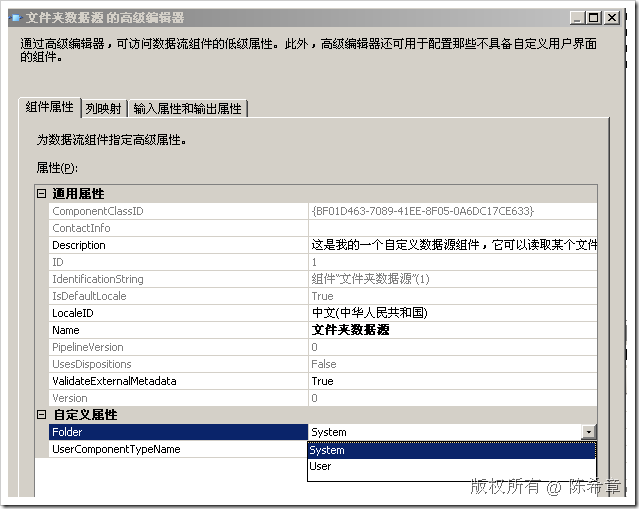

# 如何为自定义属性提供下拉选项 
> 原文发表于 2009-06-21, 地址: http://www.cnblogs.com/chenxizhang/archive/2009/06/21/1507686.html 


上一篇我们讲解到如何为自定义属性提供一个特殊的编辑器。我们的编辑器是一个对话框窗体，点击之后会用Dialog的方式显示。这种情况比较适合于属性比较复杂的情况。

 对于某些比较简单的属性，我们可能不希望弹出对话框，而是直接选择。例如下面这样的效果

 [](http://images.cnblogs.com/cnblogs_com/chenxizhang/WindowsLiveWriter/e65c5997e17e_B1E3/image_2.png) 

 这个图中，我们看到Folder属性，有两个可选值。System和User。而且用户必须选择其一，不可以输入其他可能性。

 那么这是怎么实现的呢？

 1. 我们添加一个枚举类型


```
public enum FolderEnum
{ 
    System,
    User
}
```

.csharpcode, .csharpcode pre
{
 font-size: small;
 color: black;
 font-family: consolas, "Courier New", courier, monospace;
 background-color: #ffffff;
 /*white-space: pre;*/
}
.csharpcode pre { margin: 0em; }
.csharpcode .rem { color: #008000; }
.csharpcode .kwrd { color: #0000ff; }
.csharpcode .str { color: #006080; }
.csharpcode .op { color: #0000c0; }
.csharpcode .preproc { color: #cc6633; }
.csharpcode .asp { background-color: #ffff00; }
.csharpcode .html { color: #800000; }
.csharpcode .attr { color: #ff0000; }
.csharpcode .alt 
{
 background-color: #f4f4f4;
 width: 100%;
 margin: 0em;
}
.csharpcode .lnum { color: #606060; }

 


2. 然后将该枚举指定给我们的自定义属性


```
 IDTSCustomProperty90 folder = ComponentMetaData.CustomPropertyCollection.New();
 folder.Name = "Folder";
 folder.TypeConverter = typeof(FolderEnum).AssemblyQualifiedName;
```

.csharpcode, .csharpcode pre
{
 font-size: small;
 color: black;
 font-family: consolas, "Courier New", courier, monospace;
 background-color: #ffffff;
 /*white-space: pre;*/
}
.csharpcode pre { margin: 0em; }
.csharpcode .rem { color: #008000; }
.csharpcode .kwrd { color: #0000ff; }
.csharpcode .str { color: #006080; }
.csharpcode .op { color: #0000c0; }
.csharpcode .preproc { color: #cc6633; }
.csharpcode .asp { background-color: #ffff00; }
.csharpcode .html { color: #800000; }
.csharpcode .attr { color: #ff0000; }
.csharpcode .alt 
{
 background-color: #f4f4f4;
 width: 100%;
 margin: 0em;
}
.csharpcode .lnum { color: #606060; }

3. 在BI Studio中测试


本文由作者：[陈希章](http://www.xizhang.com) 于 2009/6/21 12:39:00 
发布在：<http://www.cnblogs.com/chenxizhang/>  

本文版权归作者所有，可以转载，但未经作者同意必须保留此段声明，且在文章页面明显位置给出原文连接，否则保留追究法律责任的权利。   

更多博客文章，以及作者对于博客引用方面的完整声明以及合作方面的政策，请参考以下站点：[陈希章的博客中心](http://www.xizhang.com/blog.htm)
