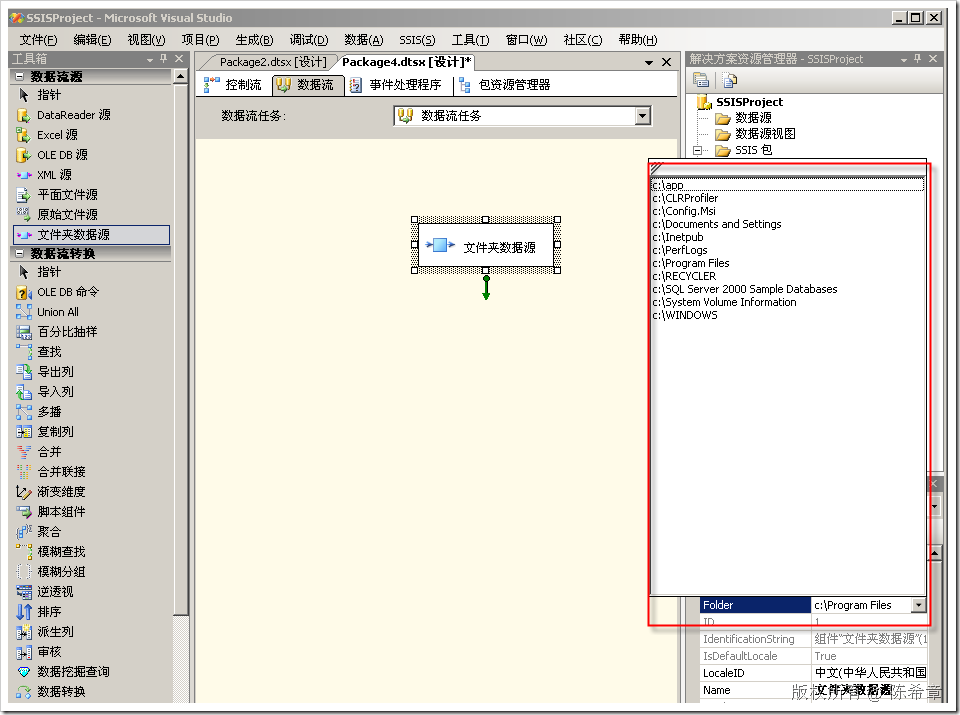
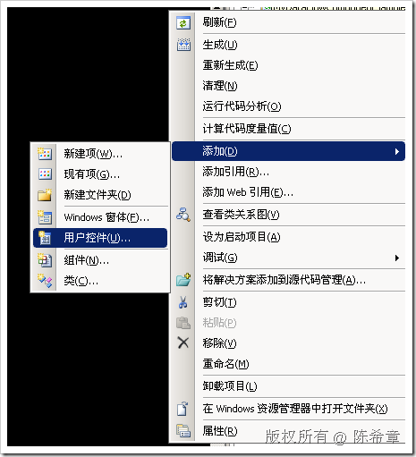
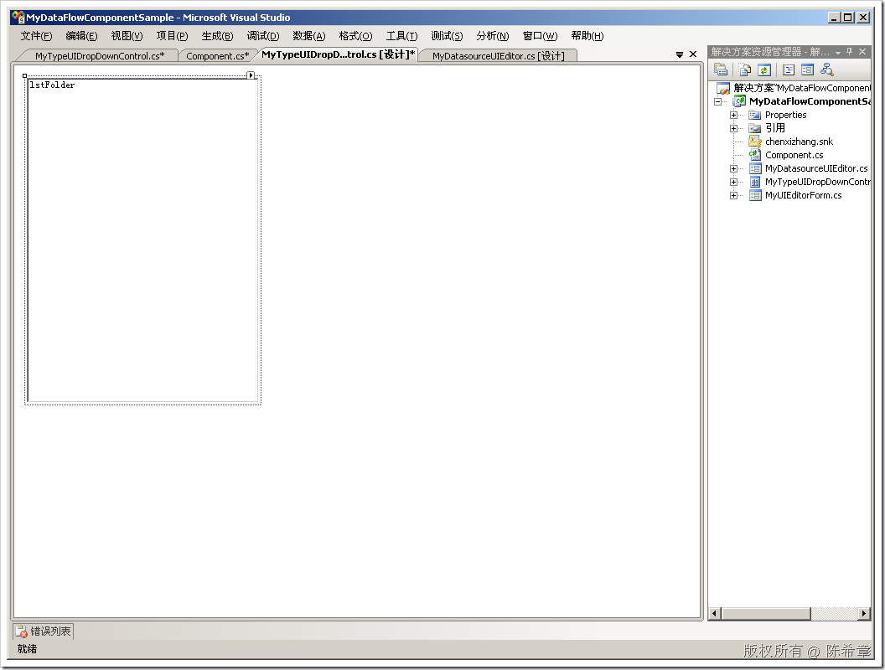
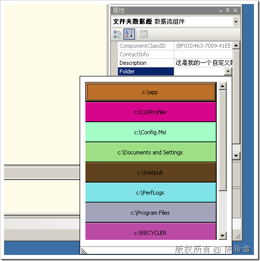

# 为SSIS编写自定义数据流组件之进阶篇:自定义属性的下拉式编辑器 
> 原文发表于 2009-06-21, 地址: http://www.cnblogs.com/chenxizhang/archive/2009/06/21/1507812.html 


之前的一篇文章中，我们讲解到了，如果一个自定义属性是可选值，我们可能更希望用下拉列表的方式让用户选择，而不是弹出一个对话框。

 [http://www.cnblogs.com/chenxizhang/archive/2009/06/21/1507686.html](http://www.cnblogs.com/chenxizhang/archive/2009/06/21/1507686.html "http://www.cnblogs.com/chenxizhang/archive/2009/06/21/1507686.html")

 上面这一篇讲解的是如何通过枚举类型的方式实现简单的下拉列表。很显然的一个问题是，枚举的个数是固定的，而且是有限的。

 那么有没有办法让我们的列表更加灵活呢？例如动态生成一个列表。答案是：可以的。这就是本篇文章探讨的问题

  

 我们首先来看一下具体的效果

 [](http://images.cnblogs.com/cnblogs_com/chenxizhang/WindowsLiveWriter/SSIS_E84C/image_2.png) 

 还是我们那个“文件夹数据源”的组件，它的Folder属性，现在点击下拉框之后，能够自动地枚举出来C盘下面的所有子目录，以供选择。这当然会更加好一些。

  

 下面来看看我们是怎么实现的

 1. 创建一个单独的UITypeEditor

 
```
    public class MyTypeUIDropDownEditor : System.Drawing.Design.UITypeEditor {
```

```
 
```

```
        IWindowsFormsEditorService editorService = null;
```

```
 
```

```
        public override object EditValue(System.ComponentModel.ITypeDescriptorContext context, 
```

```
            IServiceProvider provider, object value)
```

```
        {
```

```
            if (context != null && context.Instance != null && provider != null)
```

```
            {
```

```
                editorService = (IWindowsFormsEditorService)provider.GetService(typeof(IWindowsFormsEditorService));
```

```
                if (editorService != null)
```

```
                {
```

```
                    string current = "没有选择文件夹";
```

```
                    if (value != null)//这个value其实就是当前用户已经选择好的值
```

```
                        current = value.ToString();
```

```
                    MyTypeUIDropDownControl ctrl = new MyTypeUIDropDownControl(current);
```

```
 
```

```
                    ctrl.ValueChanged += new MyTypeUIDropDownControl.ValueChangedHander(ctrl\_ValueChanged);
```

```
                    //添加这个事件的目的是在值发生变化的时候，自动把列表关闭掉
```

```
                    //这是一个自定义事件
```

```
 
```

```
 
```

```
                    editorService.DropDownControl(ctrl);
```

```
                    
```

```
                    value = ctrl.Folder;
```

```
                    return value;
```

```
                }
```

```
            }
```

```
            return value;
```

```
        }
```

```
 
```

```
        void ctrl\_ValueChanged()
```

```
        {
```

```
            editorService.CloseDropDown();
```

```
        }
```

```
 
```

```
        public override UITypeEditorEditStyle GetEditStyle(
```

```
            System.ComponentModel.ITypeDescriptorContext context)
```

```
        {
```

```
            return UITypeEditorEditStyle.DropDown;
```

```
        }
```

```
 
```

```
        public override bool IsDropDownResizable
```

```
        {
```

```
            get
```

```
            {
```

```
                return true;
```

```
            }
```

```
        }
```

```
 
```

```
        
```

```
    }
```

.csharpcode, .csharpcode pre
{
 font-size: small;
 color: black;
 font-family: consolas, "Courier New", courier, monospace;
 background-color: #ffffff;
 /*white-space: pre;*/
}
.csharpcode pre { margin: 0em; }
.csharpcode .rem { color: #008000; }
.csharpcode .kwrd { color: #0000ff; }
.csharpcode .str { color: #006080; }
.csharpcode .op { color: #0000c0; }
.csharpcode .preproc { color: #cc6633; }
.csharpcode .asp { background-color: #ffff00; }
.csharpcode .html { color: #800000; }
.csharpcode .attr { color: #ff0000; }
.csharpcode .alt 
{
 background-color: #f4f4f4;
 width: 100%;
 margin: 0em;
}
.csharpcode .lnum { color: #606060; }

 


 


2. 我们在这个编辑器中，需要用到一个用户控件。直接继承UserControl


[](http://images.cnblogs.com/cnblogs_com/chenxizhang/WindowsLiveWriter/SSIS_E84C/image_4.png) 


这个控件上，有一个ListBox，它的Dock属性设置为Fill


[](http://images.cnblogs.com/cnblogs_com/chenxizhang/WindowsLiveWriter/SSIS_E84C/image_6.png) 


控件的代码大致如下


```
using System;
```

```
using System.Windows.Forms;
```

```
using System.IO;
```

```
 
```

```
namespace MyDataFlowComponentSample
```

```
{
```

```
    public partial class MyTypeUIDropDownControl : UserControl
```

```
    {
```

```
        public MyTypeUIDropDownControl()
```

```
        {
```

```
            InitializeComponent();
```

```
 
```

```
            foreach (var item in Directory.GetDirectories("c:\\"))
```

```
            {
```

```
                lstFolder.Items.Add(item);
```

```
            }
```

```
        }
```

```
 
```

```
        public MyTypeUIDropDownControl(string current)
```

```
            : this()
```

```
        {
```

```
            lstFolder.SelectedValue = current;
```

```
        }
```

```
 
```

```
 
```

```
        private string folder;
```

```
        public string Folder
```

```
        {
```

```
            get { return folder; }
```

```
            set { folder = value; }
```

```
        }
```

```
        private void lstFile\_SelectedIndexChanged(object sender, EventArgs e)
```

```
        {
```

```
            folder = lstFolder.SelectedItem.ToString();
```

```
            if (ValueChanged != null)
```

```
                ValueChanged();
```

```
        }
```

```
 
```

```
 
```

```
        public delegate void ValueChangedHander();
```

```
        public event ValueChangedHander ValueChanged;
```

```
    }
```

```
}
```

.csharpcode, .csharpcode pre
{
 font-size: small;
 color: black;
 font-family: consolas, "Courier New", courier, monospace;
 background-color: #ffffff;
 /*white-space: pre;*/
}
.csharpcode pre { margin: 0em; }
.csharpcode .rem { color: #008000; }
.csharpcode .kwrd { color: #0000ff; }
.csharpcode .str { color: #006080; }
.csharpcode .op { color: #0000c0; }
.csharpcode .preproc { color: #cc6633; }
.csharpcode .asp { background-color: #ffff00; }
.csharpcode .html { color: #800000; }
.csharpcode .attr { color: #ff0000; }
.csharpcode .alt 
{
 background-color: #f4f4f4;
 width: 100%;
 margin: 0em;
}
.csharpcode .lnum { color: #606060; }

3. 将我们的Editor与自定义属性进行关联


```
folder.UITypeEditor = typeof(MyTypeUIDropDownEditor).AssemblyQualifiedName;
```


.csharpcode, .csharpcode pre
{
 font-size: small;
 color: black;
 font-family: consolas, "Courier New", courier, monospace;
 background-color: #ffffff;
 /*white-space: pre;*/
}
.csharpcode pre { margin: 0em; }
.csharpcode .rem { color: #008000; }
.csharpcode .kwrd { color: #0000ff; }
.csharpcode .str { color: #006080; }
.csharpcode .op { color: #0000c0; }
.csharpcode .preproc { color: #cc6633; }
.csharpcode .asp { background-color: #ffff00; }
.csharpcode .html { color: #800000; }
.csharpcode .attr { color: #ff0000; }
.csharpcode .alt 
{
 background-color: #f4f4f4;
 width: 100%;
 margin: 0em;
}
.csharpcode .lnum { color: #606060; }


4. 生成项目，部署，测试。


如果不出意外，你就可以看到本文开篇出的那个效果


 


5. 更多联想。只要你愿意，你当然可以在那个UserControl中做更多的事情，让你的编辑器下拉列表更加酷。看看下面这样的效果


[](http://images.cnblogs.com/cnblogs_com/chenxizhang/WindowsLiveWriter/SSIS_E84C/image_8.png) 


```
using System;
using System.Windows.Forms;
using System.IO;
using System.Drawing;

namespace MyDataFlowComponentSample
{
    public partial class DropDownControl : UserControl
    {
        public DropDownControl()
        {
            InitializeComponent();
        }
        protected override void OnLoad(EventArgs e)
        {
            int i = 0;
            Random rnd = new Random();
            foreach (var item in Directory.GetDirectories("c:\\"))
            {
                Button bt = new Button();
                bt.Width = this.Width - 40;
                bt.Height = 40;
                bt.BackColor = Color.FromArgb(rnd.Next(255), rnd.Next(255), rnd.Next(255));//随机给一个颜色
                bt.Text = item;

                bt.Left = 0;
                bt.Top = i * 40;
                i++;
                bt.Click += new EventHandler(bt\_Click);

                panel1.Controls.Add(bt);

            }
        }
        private string folder;
        public string Folder
        {
            get { return folder; }
            set { folder = value; }
        }
        void bt\_Click(object sender, EventArgs e)
        {
            folder = ((Button)sender).Text;
        }
    }
}

```

.csharpcode, .csharpcode pre
{
 font-size: small;
 color: black;
 font-family: consolas, "Courier New", courier, monospace;
 background-color: #ffffff;
 /*white-space: pre;*/
}
.csharpcode pre { margin: 0em; }
.csharpcode .rem { color: #008000; }
.csharpcode .kwrd { color: #0000ff; }
.csharpcode .str { color: #006080; }
.csharpcode .op { color: #0000c0; }
.csharpcode .preproc { color: #cc6633; }
.csharpcode .asp { background-color: #ffff00; }
.csharpcode .html { color: #800000; }
.csharpcode .attr { color: #ff0000; }
.csharpcode .alt 
{
 background-color: #f4f4f4;
 width: 100%;
 margin: 0em;
}
.csharpcode .lnum { color: #606060; }

如你所见，我动态创建了一批按钮，并且他们的背景色是随机产生的，这就增加了一些趣味性，不是吗


 


到这里为止，我们针对数据源组件的开发全部介绍完了。下一篇开始将介绍到转换组件和目标组件。但是对于它们与数据源组件相似的地方，例如自定义属性和自定义编辑器，我们都不会重复介绍了。


本文由作者：[陈希章](http://www.xizhang.com) 于 2009/6/21 16:31:09 
发布在：<http://www.cnblogs.com/chenxizhang/>  

本文版权归作者所有，可以转载，但未经作者同意必须保留此段声明，且在文章页面明显位置给出原文连接，否则保留追究法律责任的权利。   

更多博客文章，以及作者对于博客引用方面的完整声明以及合作方面的政策，请参考以下站点：[陈希章的博客中心](http://www.xizhang.com/blog.htm)
