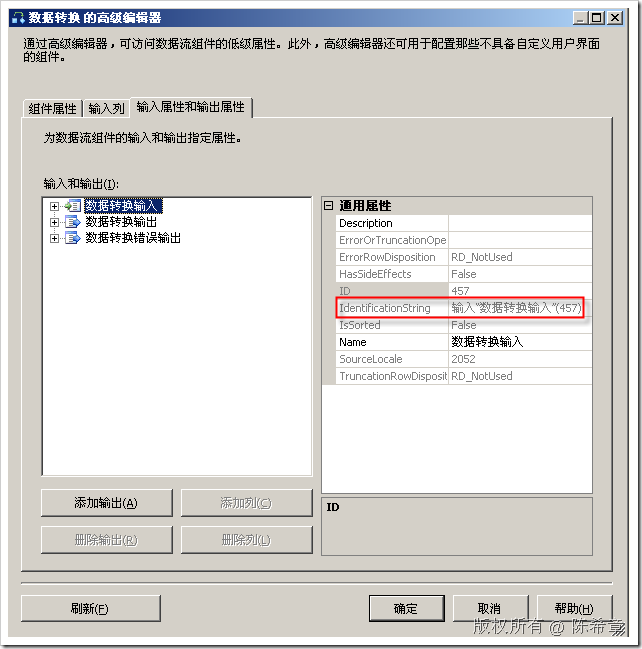
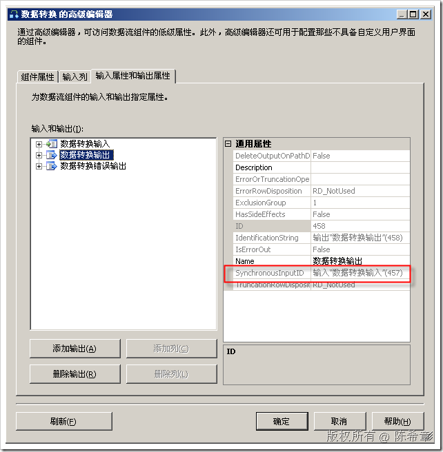
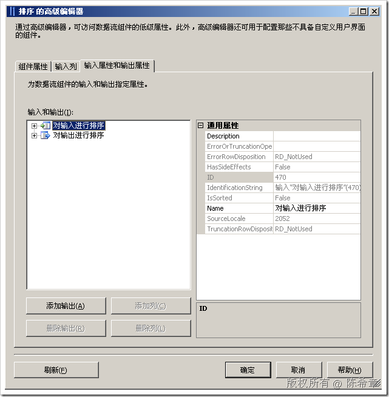
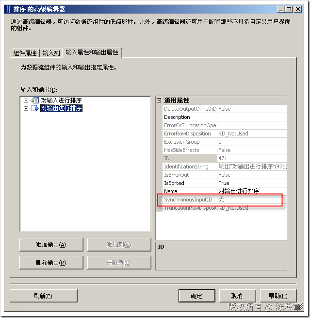

# 同步和异步转换 
> 原文发表于 2009-06-21, 地址: http://www.cnblogs.com/chenxizhang/archive/2009/06/21/1507857.html 

部分内容摘自：[http://msdn.microsoft.com/zh-cn/library/aa337074.aspx](http://msdn.microsoft.com/zh-cn/library/aa337074.aspx "http://msdn.microsoft.com/zh-cn/library/aa337074.aspx")

 1. 同步转换

 **同步转换以一次一行的方式处理传入行并在数据流中传递它们**。输出与输入同步，这意味着输出与输入同时发生。因此，若要处理一个给定行，转换不需要数据集中其他行的信息。在实际实现中，行在从一个组件传递到下一个组件时分组到多个缓冲区中，但是这些缓冲区对于用户是透明的，您可以假定每一行都单独进行处理。 “数据转换”这种转换是同步转换的一个示例。对于每个传入行，它都转换指定列中的值，然后将其向下游发送。**每个单独的转换操作都与数据集中的其他所有行无关。**  在编写 Integration Services 脚本和编程时，可以通过以下方式指定同步转换：**查找一个组件的输入的 ID，然后将其赋给该组件的输出的 SynchronousInputID 属性**。这可以使数据流引擎处理输入中的每一行，然后自动将每行发送给指定输出。**如果希望每一行都产生一个输出，则不必再编写任何其他代码来输出数据。如果使用 ExclusionGroup 属性指定各行的输出只应归为一个或另一个输出组，就像条件性拆分转换中那样，则必须调用 DirectRow 方法来为每一行选择相应的目标。如果存在错误输出，必须调用 DirectErrorRow 将存在错误的行发送到错误输出，而不是默认输出。**  1. 异步转换

 **如果处理每一行时无法独立于其他所有行，则您的设计可能需要异步转换**。换言之，您不能在处理每一行时在数据流中传递该行，而必须使输出数据与输入异步，即两者不同时发生。例如，以下情况需要异步转换： * 组件必须获得多个数据缓冲区后才能执行处理。例如**排序转换**，在该转换中，组件必须在一个操作中处理整个行集。 * 组件必须组合多个输入中的行。例如**合并转换**，在该转换中，组件必须检查来自各个输入的多个行，然后按照排列好的顺序将这些行合并。 * 在输入行和输出行之间不存在一对一的对应关系。例如**聚合转换**，在该转换中，组件必须向输出添加一行来保存计算的聚合值。 * 由于源组件也必须显式将从数据源读取的每一行添加到该组件的输出缓冲区中，因此源与具有异步输出的转换很相似。 还可以创建一个模拟同步转换的异步转换，方法是显式将每个输入行复制到输出中。使用此方法可以重命名列或者转换数据类型或格式。但是，此方法会降低性能。您可以使用内置 Integration Services 组件（如复制列或数据转换）达到同样的效果，但是性能更佳。

   以上两段摘自MSDN帮助。很多朋友都不理解同步和异步的概念，这个其实很重要.为了避免大家产生恐惧，我们还是用图形来说明哪些是同步转换，哪些是异步转换 典型的同步转换是：数据转换（这个经常用来做格式的转换），我们来看两个图。  这是该组件的输入。记住它的编号是457。 然后，我们来看一下输出  在输出中，它的一个所谓的 “同步输入ID” 正好是之前的457. 也就是说，如果一个组件的输出使用到同步ID正好是自己的输入。则表示这是一个同步转换。反之亦然 **这一点对于开发人员来说也尤为重要。如果你要开发的转换组件是同步的，那么你需要设置你的输出的SynchronousInputID为输入的IdentificationString属性**   了解了同步转换，下面来看一个异步转换的例子。 异步转换中，排序是一个典型的例子。大家可以试想一下，它肯定是要把所有的行都接收完了，才能进行排序。而不是是收到一行就处理一行。对吧   大家注意看，这个排序组件中的SynchronousInputId为“无”，这就表示它是一个异步组件。反之亦然  本文由作者：[陈希章](http://www.xizhang.com) 于 2009/6/21 18:23:01 发布在：<http://www.cnblogs.com/chenxizhang/>  
 本文版权归作者所有，可以转载，但未经作者同意必须保留此段声明，且在文章页面明显位置给出原文连接，否则保留追究法律责任的权利。   
 更多博客文章，以及作者对于博客引用方面的完整声明以及合作方面的政策，请参考以下站点：[陈希章的博客中心](http://www.xizhang.com/blog.htm) 

