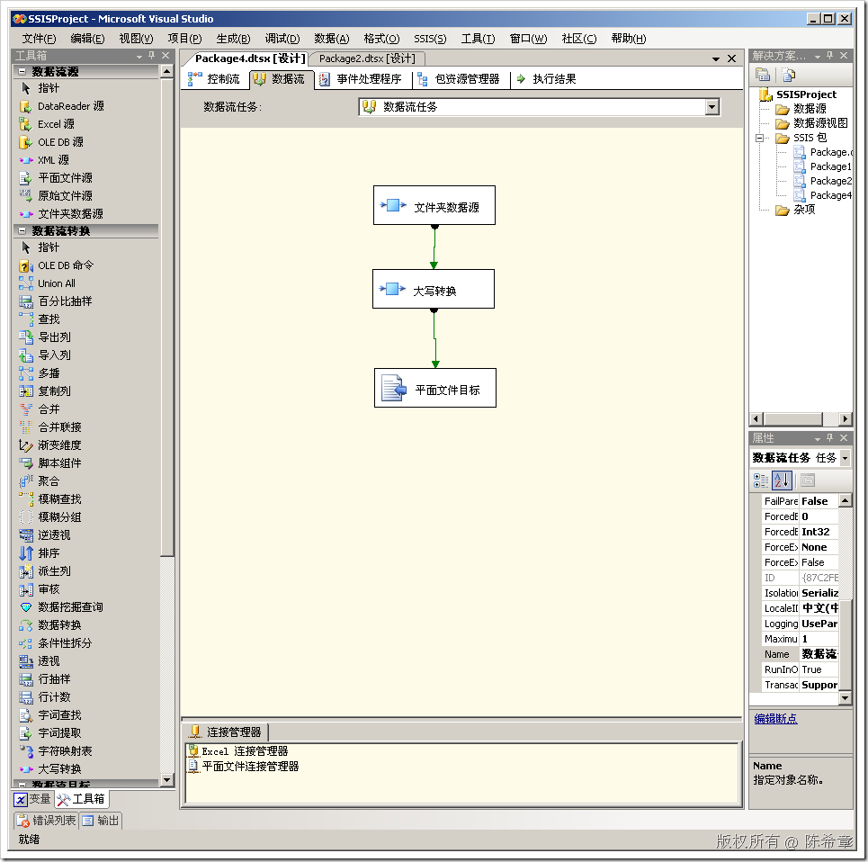

# 为SSIS编写简单的同步转换组件 
> 原文发表于 2009-06-21, 地址: http://www.cnblogs.com/chenxizhang/archive/2009/06/21/1507891.html 


上一篇讲到了同步转换和异步转换的概念。通常情况下，大部分转换都是同步的，即收到一行就处理一行。（注意，这样说可能不是很准确，实际上即便是同步机制，数据流也会适当的进行缓存的，只不过这种缓存对用户数透明的，用户可以理解为收到一行就处理一行）

 同步转换组件可以很简单，也可以很复杂。这取决于你的设计逻辑。

 这一篇我还是用一个简单的例子来讲解，旨在让大家了解同步转换组件的设计流程。

 需求：**我们这个组件很简单，就是将输入列中的文本列的所有字母全部转换为大写。**

  

 1. 准备一个类型


```
    [DtsPipelineComponent(
          ComponentType=ComponentType.Transform,
          Description="这是我的一个自定义数据转换",
          DisplayName="大写转换")]
    public class MyTransfomation:PipelineComponent
    {
   
    }
```

这个类型是我们上次准备好的，但没有做实现。【注意】我把DisplayName改成了“大写转换”


如果你是从头开始做，那么请注意，添加以下的引用和using语句


[](http://images.cnblogs.com/cnblogs_com/chenxizhang/WindowsLiveWriter/SSIS_105C6/image_2.png) 


 


2. 实现代码


代码将由几个部分组成


首先仍然是 ProvideComponentProperties方法，这个方法准备一些元数据。一般都是定义输入和输出的属性。该方法的占位代码如下


```
        public override void ProvideComponentProperties()
        {
            base.ProvideComponentProperties();
        }
```

.csharpcode, .csharpcode pre
{
 font-size: small;
 color: black;
 font-family: consolas, "Courier New", courier, monospace;
 background-color: #ffffff;
 /*white-space: pre;*/
}
.csharpcode pre { margin: 0em; }
.csharpcode .rem { color: #008000; }
.csharpcode .kwrd { color: #0000ff; }
.csharpcode .str { color: #006080; }
.csharpcode .op { color: #0000c0; }
.csharpcode .preproc { color: #cc6633; }
.csharpcode .asp { background-color: #ffff00; }
.csharpcode .html { color: #800000; }
.csharpcode .attr { color: #ff0000; }
.csharpcode .alt 
{
 background-color: #f4f4f4;
 width: 100%;
 margin: 0em;
}
.csharpcode .lnum { color: #606060; }

我们对其加以修改。我们需要知道的一个基础知识就是：任何一个转换，即便不做任何事情，它也自动具有一个默认的输入和输出。


我们在这个代码里面给默认的输入和输出做一个重命名。这样做的目的是让它们更加形象


```
        /// <summary>
        /// 这个方法提供组件必须的一些属性。
        /// 这里主要给默认的输入和输出重命名，让它更加形象
        /// </summary>
        public override void ProvideComponentProperties()
        {
            base.ProvideComponentProperties();
            ComponentMetaData.InputCollection[0].Name = "大写转换输入";
            ComponentMetaData.OutputCollection[0].Name = "大写转换输出";
            //ComponentMetaData.OutputCollection[1].SynchronousInputID = ComponentMetaData.InputCollection[0].ID;
            //如果调用了base.ProvideComponentProperties，则可以省略这句代码
        }
```


.csharpcode, .csharpcode pre
{
 font-size: small;
 color: black;
 font-family: consolas, "Courier New", courier, monospace;
 background-color: #ffffff;
 /*white-space: pre;*/
}
.csharpcode pre { margin: 0em; }
.csharpcode .rem { color: #008000; }
.csharpcode .kwrd { color: #0000ff; }
.csharpcode .str { color: #006080; }
.csharpcode .op { color: #0000c0; }
.csharpcode .preproc { color: #cc6633; }
.csharpcode .asp { background-color: #ffff00; }
.csharpcode .html { color: #800000; }
.csharpcode .attr { color: #ff0000; }
.csharpcode .alt 
{
 background-color: #f4f4f4;
 width: 100%;
 margin: 0em;
}
.csharpcode .lnum { color: #606060; }


第二步：我们重写PreExecute方法，这个方法为执行做准备。我们这里的需求比较简单，就是检查所有最终确定的输入列，如果他们的类型是字符型（不管是STR还是WSTR）,我们就对它们做一个记号


 


```
        List<int> \_columns = new List<int>();//这个集合来保存需要处理的列的索引号
        
        /// <summary>
        /// 这个方法是ProcessInput之前的准备工作。
        /// 我们检测所有输入列中类型为字符型的，并将它的索引号记录起来
        /// 为了让ProcessInput能使用到这个信息，我们定义一个公用变量
        /// </summary>
        public override void PreExecute()
        {
            IDTSInput90 input = ComponentMetaData.InputCollection[0];
            IDTSInputColumnCollection90 columns = input.InputColumnCollection;

            foreach (IDTSInputColumn90 item in columns)
            {
                if (item.DataType == DataType.DT\_WSTR || item.DataType == DataType.DT\_STR)
                {
                    \_columns.Add(BufferManager.FindColumnByLineageID(input.Buffer, item.LineageID));
                }
            }
        }
```

```
 
```

```
第三步：我们重写ProcessInput方法。这个方法会被数据流任务多次调用。我们就是不断地进行处理，直到数据源不再能提供数据为止。
```

```
        public override void ProcessInput(int inputID, PipelineBuffer buffer)
        {
            while (buffer.NextRow())//从这句话可以理解，其实虽然说是同步，但也可能是缓冲了几行后才处理，而不一定是一行处理一次
            {
                foreach (int index in \_columns)
                {
                    string str = buffer.GetString(index);
                    buffer.SetString(index, str.ToUpper());
                }
            }
        }
```

.csharpcode, .csharpcode pre
{
 font-size: small;
 color: black;
 font-family: consolas, "Courier New", courier, monospace;
 background-color: #ffffff;
 /*white-space: pre;*/
}
.csharpcode pre { margin: 0em; }
.csharpcode .rem { color: #008000; }
.csharpcode .kwrd { color: #0000ff; }
.csharpcode .str { color: #006080; }
.csharpcode .op { color: #0000c0; }
.csharpcode .preproc { color: #cc6633; }
.csharpcode .asp { background-color: #ffff00; }
.csharpcode .html { color: #800000; }
.csharpcode .attr { color: #ff0000; }
.csharpcode .alt 
{
 background-color: #f4f4f4;
 width: 100%;
 margin: 0em;
}
.csharpcode .lnum { color: #606060; }

.csharpcode, .csharpcode pre
{
 font-size: small;
 color: black;
 font-family: consolas, "Courier New", courier, monospace;
 background-color: #ffffff;
 /*white-space: pre;*/
}
.csharpcode pre { margin: 0em; }
.csharpcode .rem { color: #008000; }
.csharpcode .kwrd { color: #0000ff; }
.csharpcode .str { color: #006080; }
.csharpcode .op { color: #0000c0; }
.csharpcode .preproc { color: #cc6633; }
.csharpcode .asp { background-color: #ffff00; }
.csharpcode .html { color: #800000; }
.csharpcode .attr { color: #ff0000; }
.csharpcode .alt 
{
 background-color: #f4f4f4;
 width: 100%;
 margin: 0em;
}
.csharpcode .lnum { color: #606060; }

 


我们这里只是对输入的buffer进行处理。注意，这里很有意思的是，我们其实很简单的，先把buffer中某个列的值读出来，然后将其转回大写之后写回去即可。


 


3. 重新编译项目，部署。在BI Studio中进行测试


[](http://images.cnblogs.com/cnblogs_com/chenxizhang/WindowsLiveWriter/SSIS_105C6/image_4.png) 


[](http://images.cnblogs.com/cnblogs_com/chenxizhang/WindowsLiveWriter/SSIS_105C6/image_6.png) 


我们只需要勾选上有关的输入列即可。其他不需要任何的设置


[](http://images.cnblogs.com/cnblogs_com/chenxizhang/WindowsLiveWriter/SSIS_105C6/image_8.png) 


现在就可以执行任务了。如果不出意外，任务能够成功执行，如下图所示


[](http://images.cnblogs.com/cnblogs_com/chenxizhang/WindowsLiveWriter/SSIS_105C6/image_10.png) 


我们最后打开生成的那个文本文件进行验证


[](http://images.cnblogs.com/cnblogs_com/chenxizhang/WindowsLiveWriter/SSIS_105C6/image_12.png) 


我们看到，第一列和第三列的文本全部被处理成了大写。


我们也可以在数据流中添加“查看器”，很清楚的看到从“文件夹数据源”到“大写转换”这个管道中，字符是小写的


[](http://images.cnblogs.com/cnblogs_com/chenxizhang/WindowsLiveWriter/SSIS_105C6/image_14.png) 


而在“大写转换”到“平面文件目标”这个管道中，字符就被转变为大写了


[](http://images.cnblogs.com/cnblogs_com/chenxizhang/WindowsLiveWriter/SSIS_105C6/image_16.png) 


 


**补充：**


该转换组件已经可以工作了。但我们还是可以添加下面的一些功能(例如验证），以便让它更加完整


```
        public override DTSValidationStatus Validate()
        {
            //验证组件，至少要有一个输入列
            IDTSInput90 input = ComponentMetaData.InputCollection[0];
            if (input.InputColumnCollection.Count > 0)
                return DTSValidationStatus.VS\_ISVALID;

            ComponentMetaData.FireWarning(0, 
                ComponentMetaData.Name, 
                "至少应该选择一个输入列", 
                string.Empty, 
                0);
            return DTSValidationStatus.VS\_ISBROKEN;
        }

        public override void DeleteInput(int inputID)
        {
            throw new Exception("不能删除输入");
        }

        public override IDTSCustomProperty90 SetInputProperty(int inputID, 
            string propertyName, object propertyValue)
        {
            throw new Exception("不能修改输入");
        }
```

.csharpcode, .csharpcode pre
{
 font-size: small;
 color: black;
 font-family: consolas, "Courier New", courier, monospace;
 background-color: #ffffff;
 /*white-space: pre;*/
}
.csharpcode pre { margin: 0em; }
.csharpcode .rem { color: #008000; }
.csharpcode .kwrd { color: #0000ff; }
.csharpcode .str { color: #006080; }
.csharpcode .op { color: #0000c0; }
.csharpcode .preproc { color: #cc6633; }
.csharpcode .asp { background-color: #ffff00; }
.csharpcode .html { color: #800000; }
.csharpcode .attr { color: #ff0000; }
.csharpcode .alt 
{
 background-color: #f4f4f4;
 width: 100%;
 margin: 0em;
}
.csharpcode .lnum { color: #606060; }


 


这样的话，如果用户没有选择列，则会出现下面的错误


[](http://images.cnblogs.com/cnblogs_com/chenxizhang/WindowsLiveWriter/SSIS_105C6/image_18.png)


本文由作者：[陈希章](http://www.xizhang.com) 于 2009/6/21 19:50:21 
发布在：<http://www.cnblogs.com/chenxizhang/>  

本文版权归作者所有，可以转载，但未经作者同意必须保留此段声明，且在文章页面明显位置给出原文连接，否则保留追究法律责任的权利。   

更多博客文章，以及作者对于博客引用方面的完整声明以及合作方面的政策，请参考以下站点：[陈希章的博客中心](http://www.xizhang.com/blog.htm)
