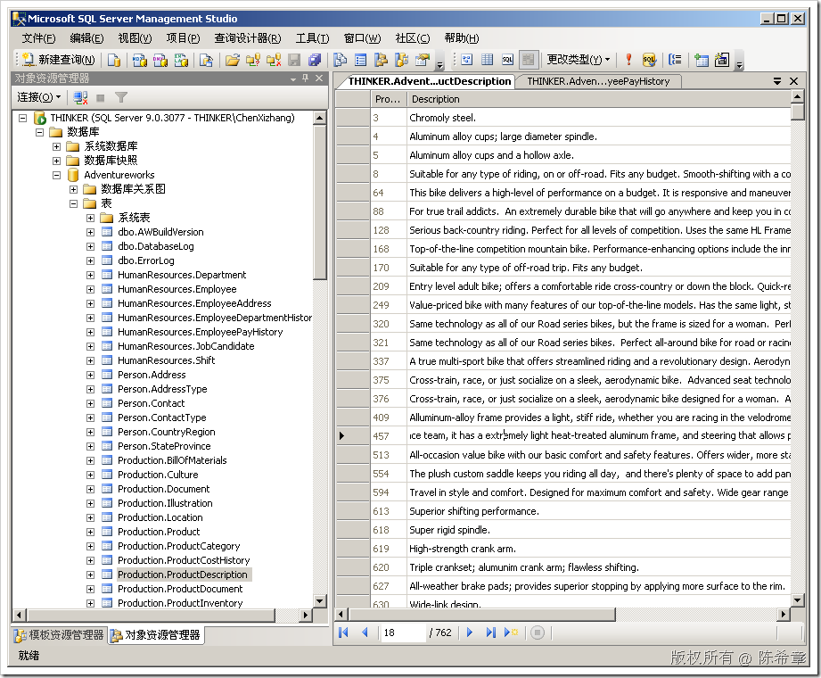
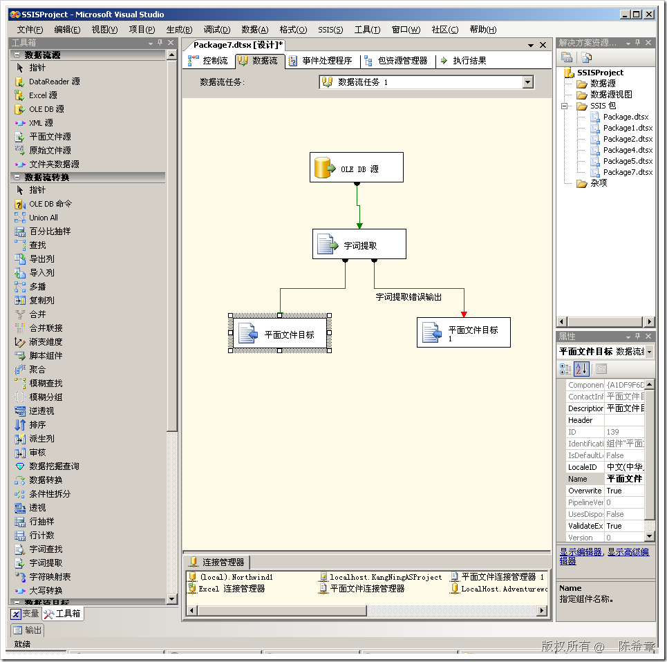
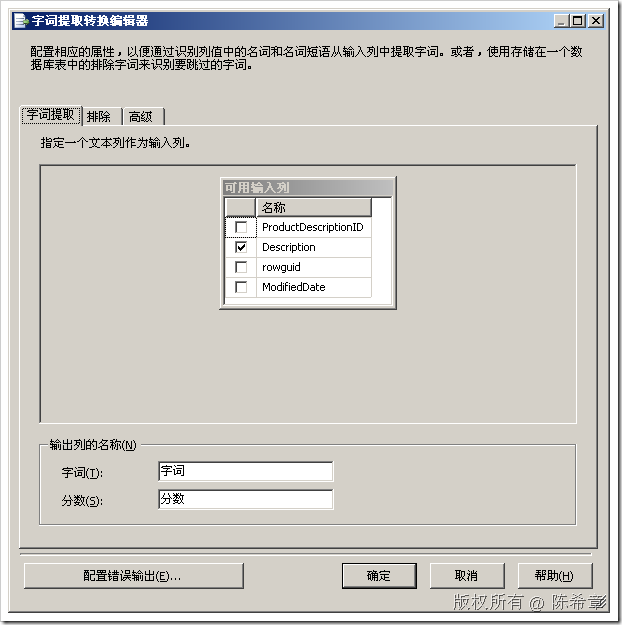
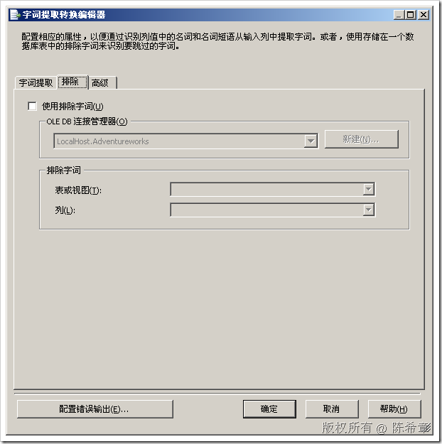
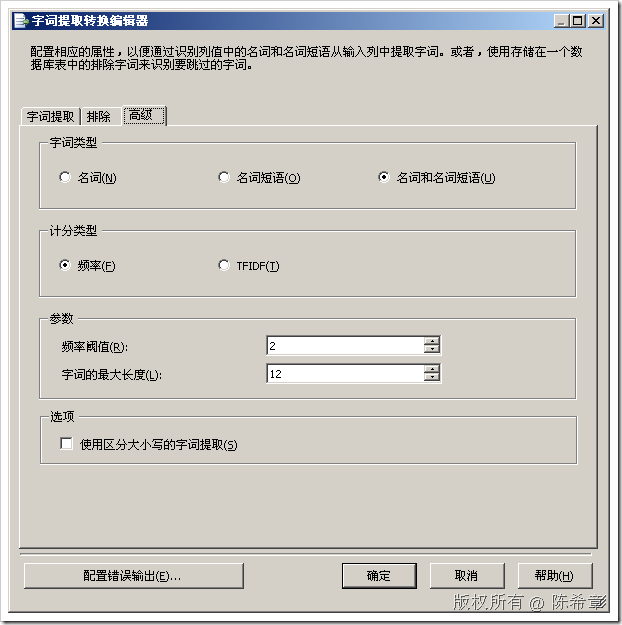
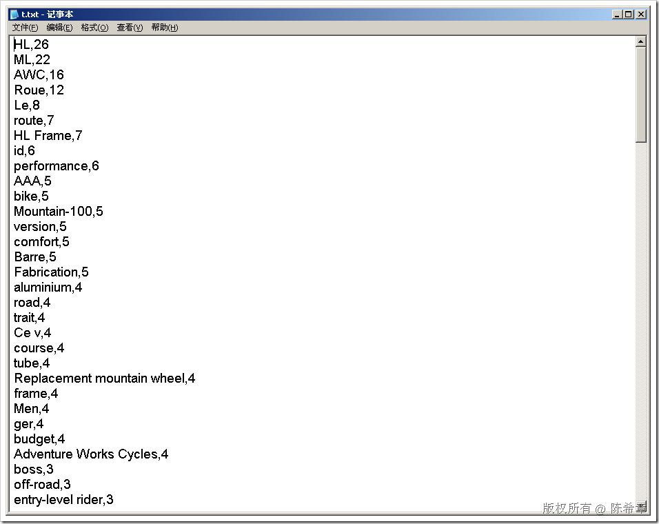

# SSIS中的字符提取组件 
> 原文发表于 2009-06-22, 地址: http://www.cnblogs.com/chenxizhang/archive/2009/06/22/1508374.html 

想想看这样一个场景：我们有一个表中，有一个字段包含了大量的文字。我们想要找到在这些文字中那些词出现的频率高，并且到底有多高？

 那么该怎么办呢？当然，你有很多其他的方法去做。我们这里介绍的是使用SSIS的字符提取组件来完成这个任务。

  

 1. 准备数据源

 为了做这个演示，我们使用了范例数据库（Adventureworks）的ProductDescription这个表。这里有一个列是对产品的描述的。

    

 2. 设计SSIS数据流任务.它大概看起来像下面这样

  

 关于字符查找这个组件的配置，大致如下

  

 【这里可以指定多个列】

  

  

  

  

 3. 运行这个数据流任务，查看结果

  

 我们看到，HL出现次数最多，为26次。这确实看起来很酷

 本文由作者：[陈希章](http://www.xizhang.com) 于 2009/6/22 16:46:28 发布在：<http://www.cnblogs.com/chenxizhang/>  
 本文版权归作者所有，可以转载，但未经作者同意必须保留此段声明，且在文章页面明显位置给出原文连接，否则保留追究法律责任的权利。   
