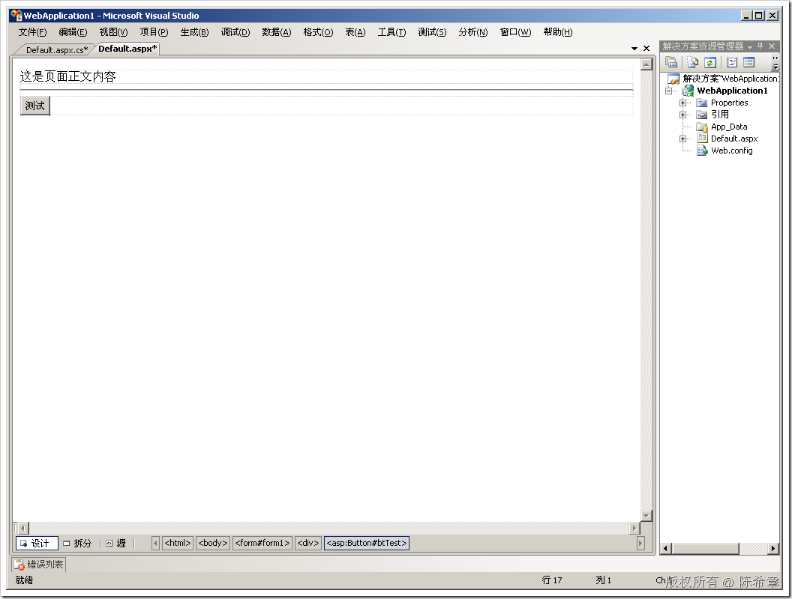
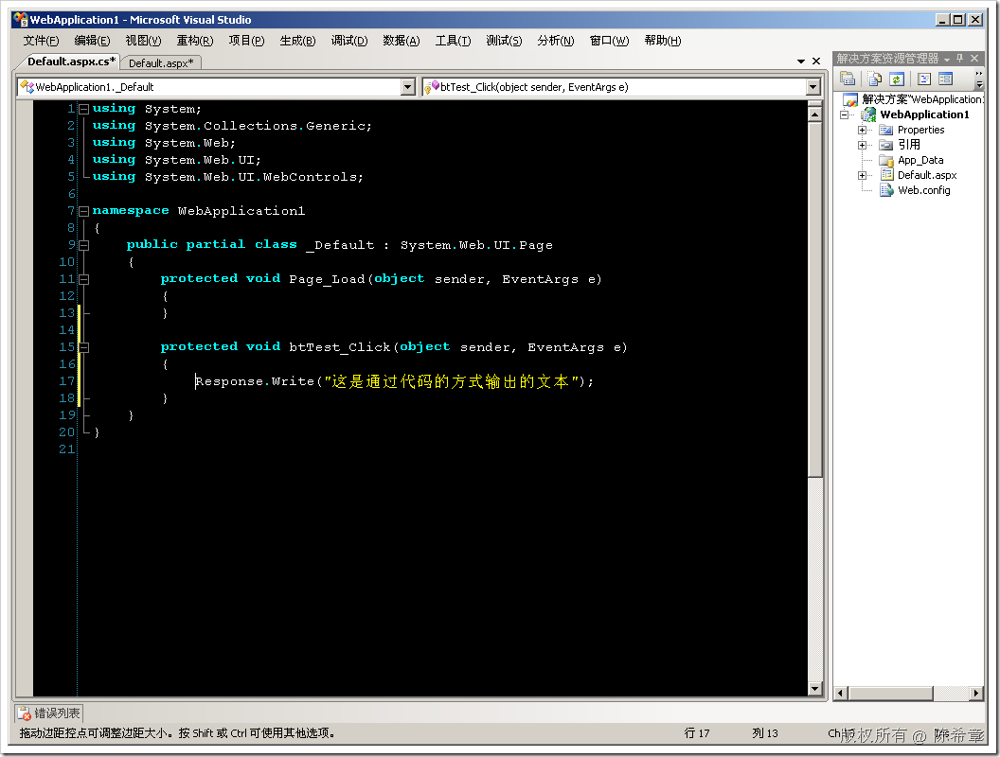
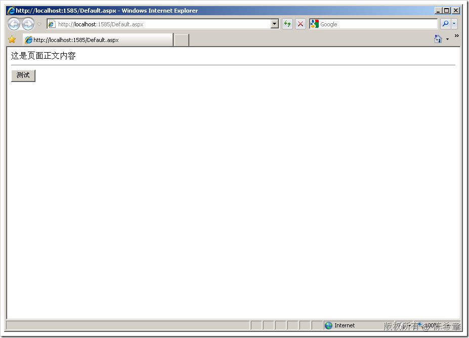
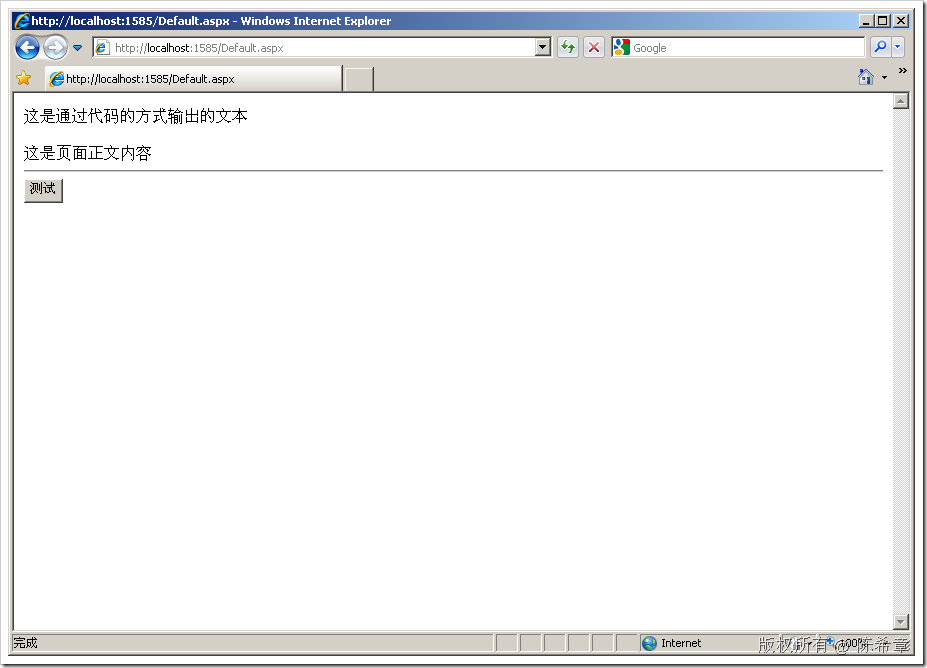
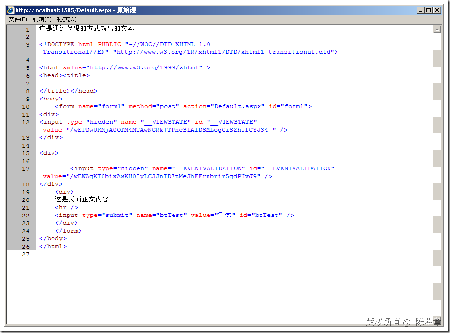
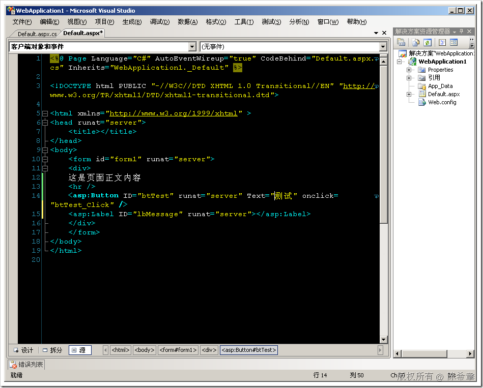
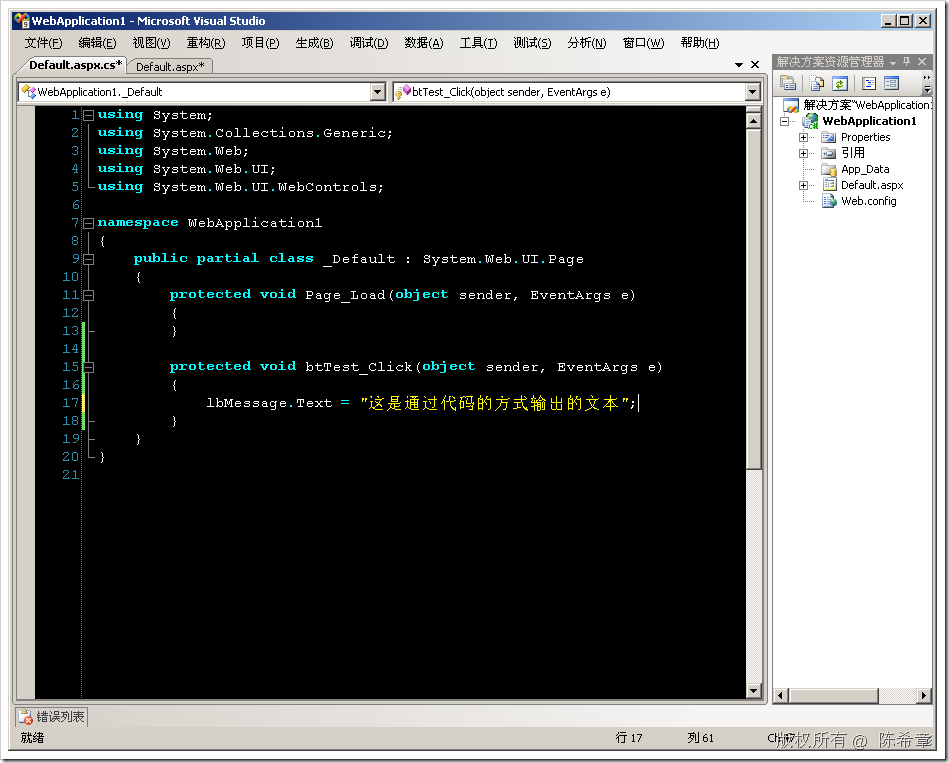
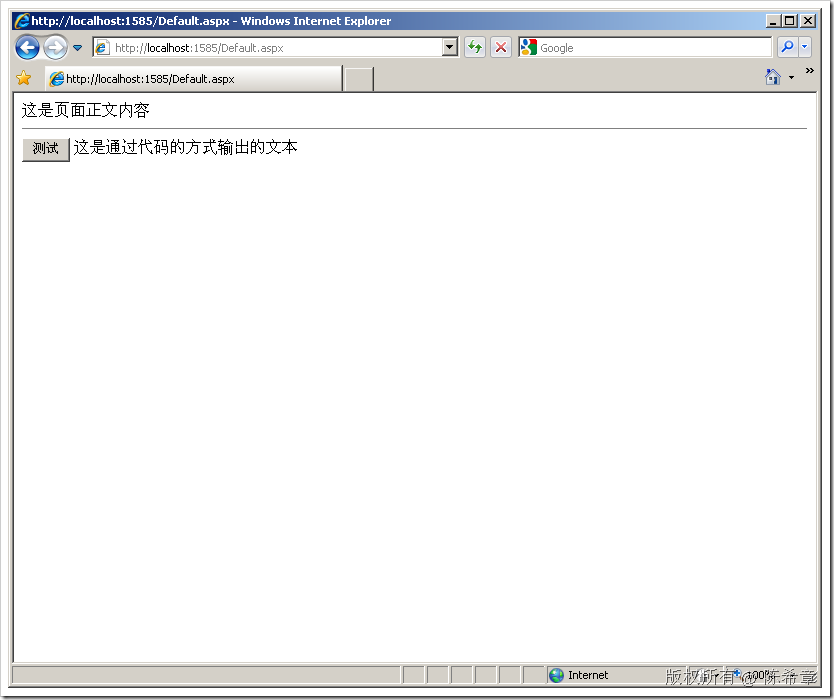
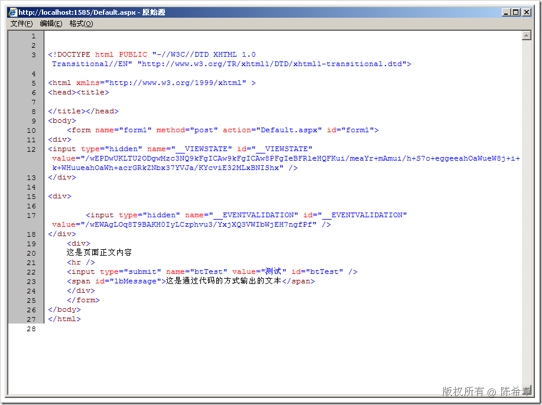

# ASP.NET : 为什么应该尽量避免直接用Response.Write输出内容 
> 原文发表于 2009-06-25, 地址: http://www.cnblogs.com/chenxizhang/archive/2009/06/25/1511238.html 

这是一个很小的问题，很多初学者，或者说之前从ASP开发经验转移过来的朋友，都比较习惯用Response.Write去输出一些内容到页面上。这种做法在有的时候，看起来也无伤大雅。

 但我要提醒的是，你必须确保你是知道这个功能可能在很多时候是不合适的。

  

  

 页面和代码都很简单。我们来看一下效果

  

 点击“测试”按钮之后

  

 文本确实输出来了，但其实你要知道，这段文本输出的位置永远在页面的顶部，而且它不会被放置在body标签里面。这很不好

  

 你可以看到，页面顶部这一句文本很奇怪地，它既不在body里面，甚至都不在html标签里面。这对于一个格式良好的网页来说是不允许的。

  

 那么如何改进这一点呢？

 一般，我们可以在页面上放置一个控件（例如一个Label），在按钮的代码中，去修改该Label的值，这样就好很多

  

  

  

         

  

 当然，话说回来，在某些时候，是必须用Response.Write的，例如我们之前讨论过的ashx。

 但是，对于aspx，或者ascx这些有界面的服务器编程模型，应该避免用Response.Write

 本文由作者：[陈希章](http://www.xizhang.com) 于 2009/6/25 21:05:42 发布在：<http://www.cnblogs.com/chenxizhang/>  
 本文版权归作者所有，可以转载，但未经作者同意必须保留此段声明，且在文章页面明显位置给出原文连接，否则保留追究法律责任的权利。   
 更多博客文章，以及作者对于博客引用方面的完整声明以及合作方面的政策，请参考以下站点：[陈希章的博客中心](http://www.xizhang.com/blog.htm) 