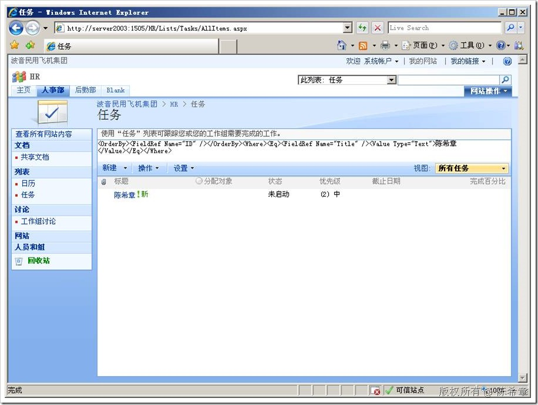

# MOSS : 如何动态修改列表视图定义 
> 原文发表于 2009-06-26, 地址: http://www.cnblogs.com/chenxizhang/archive/2009/06/26/1511874.html 

今天被人问到：在MOSS中，有一个列表，我们希望根据用的特征动态切换内容显示。这个筛选条件很复杂，我们没有办法直接使用视图的筛选来实现。应该怎麽办呢？ 我的解决方案如下：   第一步：webpart的部分 using System; using System.Runtime.InteropServices; using System.Web.UI; using System.Web.UI.WebControls.WebParts; using System.Xml.Serialization; using Microsoft.SharePoint; using Microsoft.SharePoint.WebControls; using Microsoft.SharePoint.WebPartPages; using System.Web; namespace SPViewPart {     [Guid("3179933a-c04a-432d-a6f6-4e9e41cac3f2")]     public class SPViewPart : System.Web.UI.WebControls.WebParts.WebPart     {         public SPViewPart()         {             this.ExportMode = WebPartExportMode.All;         }         protected override void Render(HtmlTextWriter writer)         {             // TODO: add custom rendering code here.             SPWeb web = SPContext.Current.Web;             SPList list = web.Lists["任务"];             SPView view = list.Views["所有任务"];             writer.Write(HttpUtility.HtmlEncode(view.Query));//这里只是为了调试，显示出来这个内容，完全可以不显示的         }         protected override void OnInit(EventArgs e)         {             SPWeb web = SPContext.Current.Web;             web.AllowUnsafeUpdates = true;             SPList list = web.Lists["任务"];             SPView view = list.Views["所有任务"]; **string query = "<OrderBy><FieldRef Name=\"ID\" /></OrderBy><Where><Eq><FieldRef Name=\"Title\" /><Value Type=\"Text\">****王磊</Value></Eq></Where>";//****我这里是直接写死的，你可以动态构造这一串东西**             view.Query = query;             view.Update();             list.Update();         }     } } 第二步：来看网站。现在只有王磊的记录  然后，我去修改代码，改成“陈希章”             string query = "<OrderBy><FieldRef Name=\"ID\" /></OrderBy><Where><Eq><FieldRef Name=\"Title\" /><Value Type=\"Text\">陈希章</Value></Eq></Where>"; 再部署，即看到它已经改掉了  以上只是一个范例，实际上我也觉得这种修改视图定义的方法是简单粗暴的。但目前也没有更好的办法。

 我觉得如果List上面可以有接口让我们扩展的话，那就更好了

 本文由作者：[陈希章](http://www.xizhang.com) 于 2009/6/26 18:13:56 发布在：<http://www.cnblogs.com/chenxizhang/>  
 本文版权归作者所有，可以转载，但未经作者同意必须保留此段声明，且在文章页面明显位置给出原文连接，否则保留追究法律责任的权利。   
 更多博客文章，以及作者对于博客引用方面的完整声明以及合作方面的政策，请参考以下站点：[陈希章的博客中心](http://www.xizhang.com/blog.htm) 

