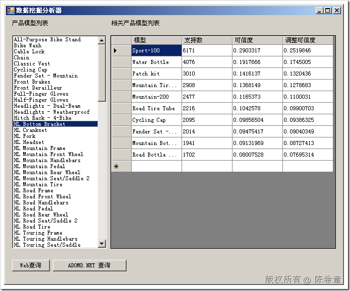

# SSAS ： 数据挖掘分析器 
> 原文发表于 2009-06-26, 地址: http://www.cnblogs.com/chenxizhang/archive/2009/06/26/1511917.html 

大家都知道，数据挖掘看起来很美，但要真正用起来却不是那么容易。同时，它的客户端集成方面还不是那么方便。可能主要由于他的结果太复杂。

 这是我正在开发的一个产品的一个小的部分,可以针对数据挖掘模型进行分析.所用到技术其实主要就是XMLA，DMX和SOAP,以及客户端的XML解析.

 以下截图只是其中一个界面.用户可以点击左边的模型列表,然后查询挖掘模型,将相关的产品找出来.

  

 【注意】因为是做为产品开发，所以一些实现细节可能不会公布。

 除了数据挖掘分析器（会提供常见算法的支持，以及C/S和B/S的实现），相关在进行中的工具开发包括：SSAS管理器，主要是更加方便的授权以及管理等方面的一些功能，以及协调SSAS和SSRS的一些管理方面的工作。

 本文由作者：[陈希章](http://www.xizhang.com) 于 2009/6/26 19:34:50 发布在：<http://www.cnblogs.com/chenxizhang/>  
 本文版权归作者所有，可以转载，但未经作者同意必须保留此段声明，且在文章页面明显位置给出原文连接，否则保留追究法律责任的权利。   
 更多博客文章，以及作者对于博客引用方面的完整声明以及合作方面的政策，请参考以下站点：[陈希章的博客中心](http://www.xizhang.com/blog.htm) 