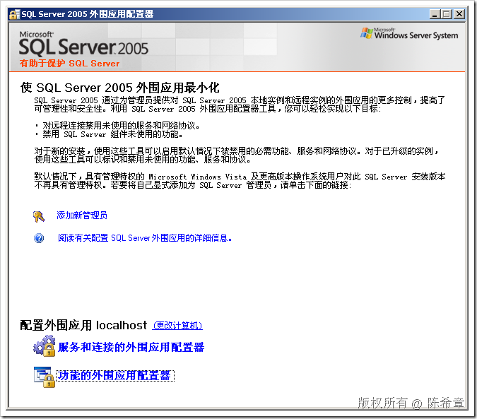
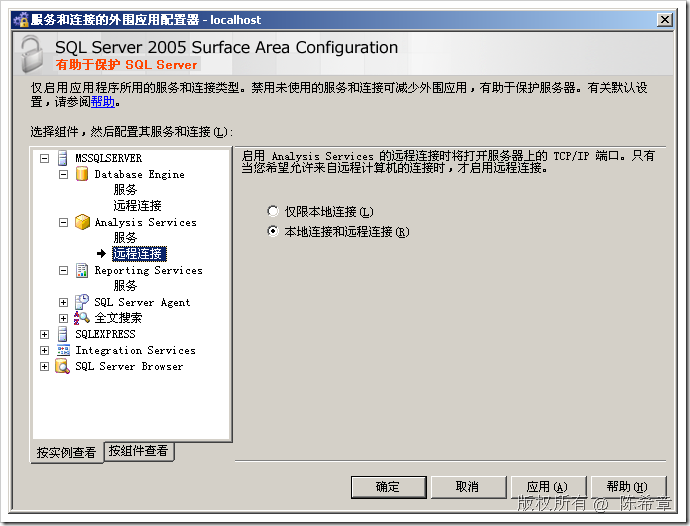
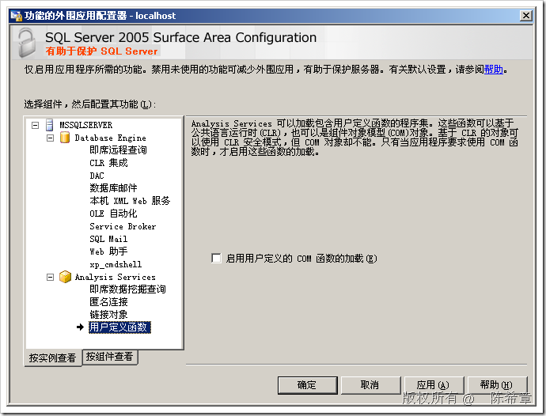

# SSAS : 外围应用配置器 
> 原文发表于 2009-06-27, 地址: http://www.cnblogs.com/chenxizhang/archive/2009/06/27/1512112.html 

SQL Server 2005开始提供了一个新的工具:外围应用配置器,旨在提供更好的安全性保护(我们称为默认安全). 它可以管理两部分的功能

 1. 服务与连接：主要与服务的启动，停止，以及是否允许远程连接有关系

 2. 功能：主要与一些比较有安全隐患的功能有关系

  

  

  

   【注意】值得一提的是，这个工具在SQL Server 2008中被废除了，它的功能被合并到所谓的“方面管理”里面去了。这个问题我很早之前有些过一篇文章专门讨论到。

 本文由作者：[陈希章](http://www.xizhang.com) 于 2009/6/27 9:15:16 发布在：<http://www.cnblogs.com/chenxizhang/>  
 本文版权归作者所有，可以转载，但未经作者同意必须保留此段声明，且在文章页面明显位置给出原文连接，否则保留追究法律责任的权利。   
 更多博客文章，以及作者对于博客引用方面的完整声明以及合作方面的政策，请参考以下站点：[陈希章的博客中心](http://www.xizhang.com/blog.htm) 