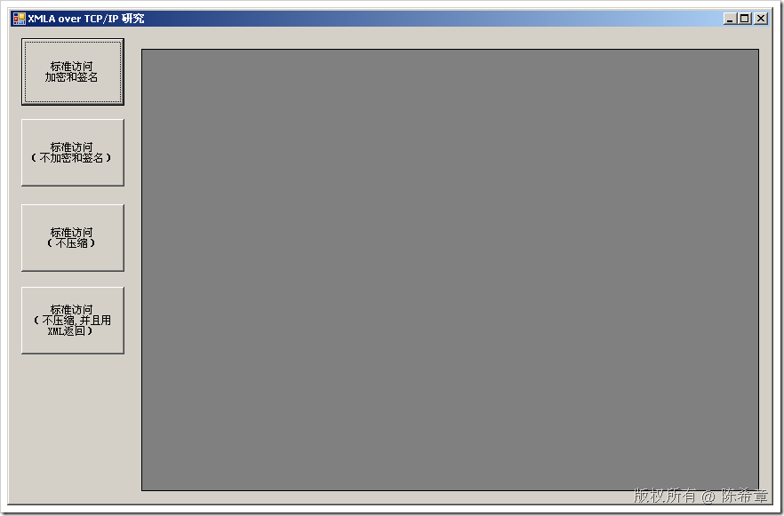
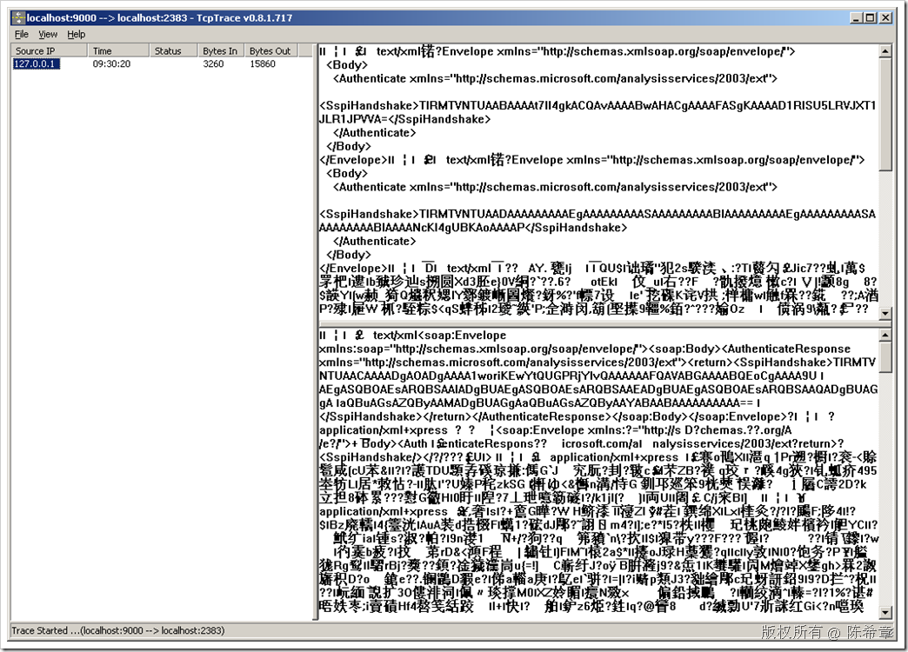
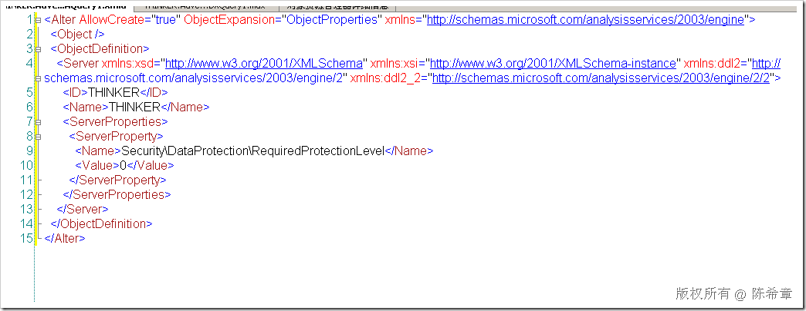
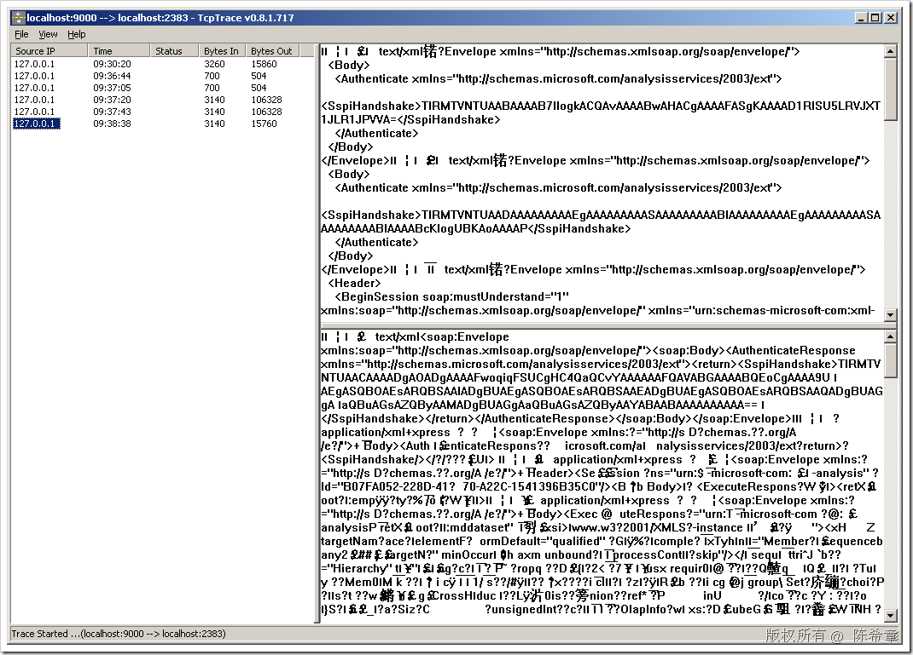
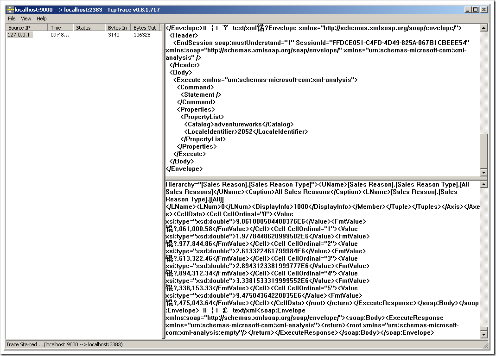
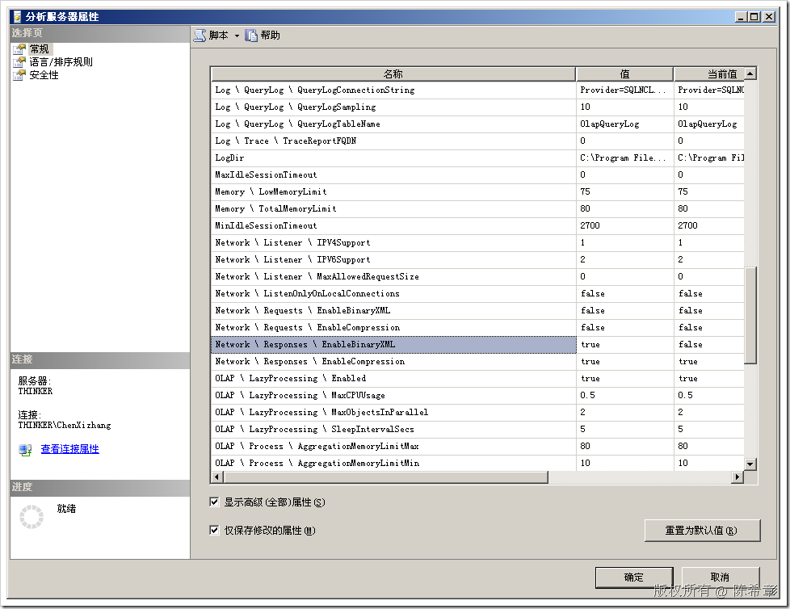
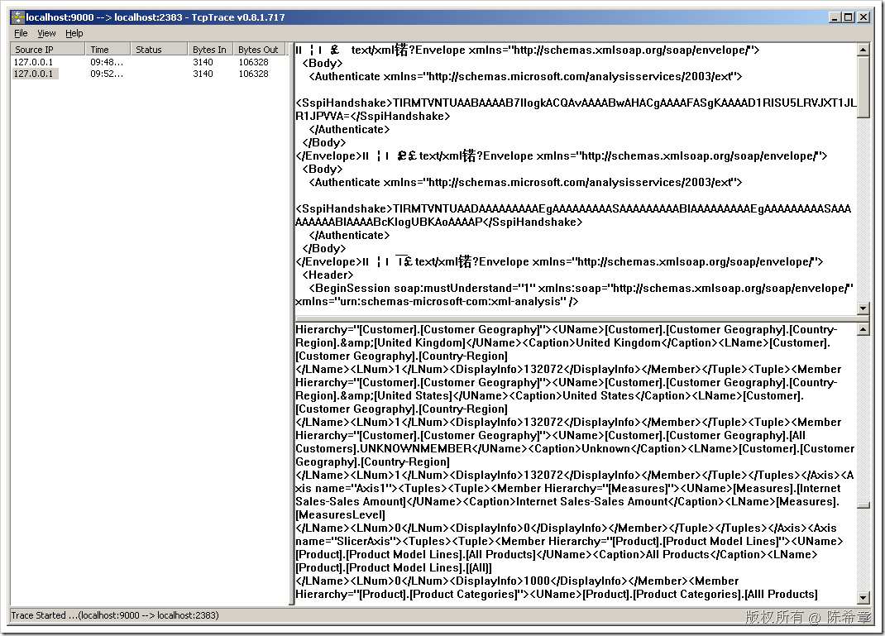

# SSAS : XMLA over TCP/IP的实现 
> 原文发表于 2009-06-27, 地址: http://www.cnblogs.com/chenxizhang/archive/2009/06/27/1512118.html 

之前提到微软的SSAS首席科学家Mosha Pasumansky曾经写过一篇专门的文章介绍了XMLA over TCP/IP这个协议在SSAS上面的实现。

 [http://www.mosha.com/msolap/articles/as2005\_protocol.htm](http://www.mosha.com/msolap/articles/as2005_protocol.htm "http://www.mosha.com/msolap/articles/as2005_protocol.htm")

 我从来都觉得，学习东西一定要转换为自己的知识才行。所以我的总结几点如下

 1. 该协议是微软的专利技术，并没有公开具体的接口。

 2. 相对来说，而XMLA over http则是公开的标准，该公开标准直接基于HTTP和SOAP，很好懂，但传递的包体积较大，而且默认都是不加密的，安全性有限。当然，你可以通过Https的方式来提高安全性，但https本身又超级慢。

 3. 但XMLA over TCP/IP并不神秘，微软自己的工具都是基于这个协议访问SSAS的，例如SSMS这个工具。同时，如果我们通过OLEDB for Analysis，或者ADOMD.NET去编程的话，也是自动使用XMLA over TCP/IP的。

 但总是有朋友对此感到好奇，例如我自己也比较好奇。那么，就让我带你来揭开它的盖子，让你看看，如果使用了xmla over TCP/IP,数据是怎么传递的。

 #### **它首先是二进制的内容，然后，它是压缩过的内容，最后，它是加密的内容**

 下面我就让你看一下他们的不同。我自己做了一个工具来测试他们

  

 1. 正常情况下（二进制，压缩，加密）

  

 这个截图中，首先他们都是看不懂的东西。（好吧，你可能能看懂一点点啦，但大部分看不懂），因为是二进制编码过的，而且加密过。并且注意看它的响应字节体积：15860byte，约为15KB。因为它是压缩过的。

  

 2. 取消加密（首先必须在服务器设置以下属性）

  

 然后，通过在连接字符串中指定：Protection Level=CONNECT;告诉SSAS说，我们不需要加密数据，但连接要加密（因为这里面有身份验证的信息）

 【注意】这里是Protection Level=CONNECT，而不是ProtectionLevel=CONNECT。MSDN中文档是有问题的

  

 我们看到，体积稍微小了一点，因为没有加密了。内容基本也稍微好看一点了。但仍然看不懂。因为压缩过了，而且是二进制

  

 3. 取消加密和压缩

 设置："Protection Level=CONNECT;Transport Compression=none"

  

 此时，你发现那个体积达到了106328，也就是接近100KB。这是因为我们现在没有压缩了。此时，仍然有一些是二进制字符

  

 4. 转换为XML格式

 设置：Protection Level=CONNECT;Transport Compression=none;Protocol Format=XML

 服务端设置：

  

  

 【注意】我发现，第四种情况和第三种情况很多时候都是一样的。

  

 所以，最后我要说的是，XMLA over TCP/IP并不神秘，它就是微软的一个内部协议。你可以这么理解。其实我们自己写一个比较重要的系统的时候，也会有内部协议的。

 本文由作者：[陈希章](http://www.xizhang.com) 于 2009/6/27 9:54:43 发布在：<http://www.cnblogs.com/chenxizhang/>  
 本文版权归作者所有，可以转载，但未经作者同意必须保留此段声明，且在文章页面明显位置给出原文连接，否则保留追究法律责任的权利。   
 更多博客文章，以及作者对于博客引用方面的完整声明以及合作方面的政策，请参考以下站点：[陈希章的博客中心](http://www.xizhang.com/blog.htm) 