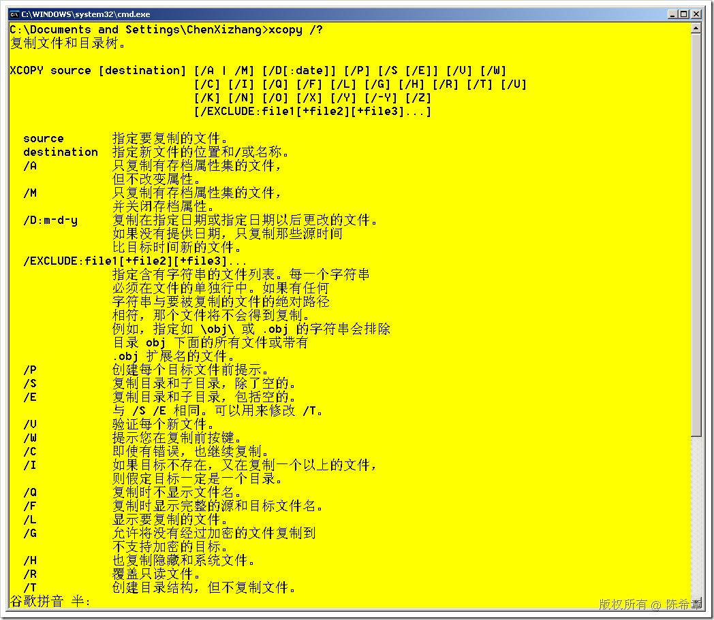

# XCOPY命令默认忽略隐藏文件 
> 原文发表于 2009-06-27, 地址: http://www.cnblogs.com/chenxizhang/archive/2009/06/27/1512134.html 

今天在处理一个批处理的时候，总是发现一些诡异的现象，我是用xcopy命令复制一个目录下所有的文件，但总是发现有的文件过去了，其他一些文件又没有过去。最后检查发现是因为部分文件是隐藏文件的原因

 为了解决该问题，加一个H参数就可以了

 

 本文由作者：[陈希章](http://www.xizhang.com) 于 2009/6/27 10:41:17 发布在：<http://www.cnblogs.com/chenxizhang/>  
 本文版权归作者所有，可以转载，但未经作者同意必须保留此段声明，且在文章页面明显位置给出原文连接，否则保留追究法律责任的权利。   
 更多博客文章，以及作者对于博客引用方面的完整声明以及合作方面的政策，请参考以下站点：[陈希章的博客中心](http://www.xizhang.com/blog.htm) 