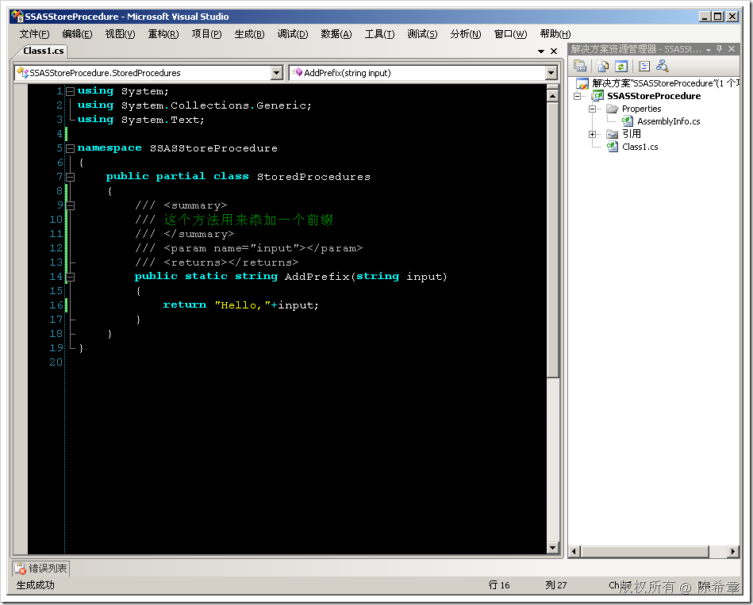
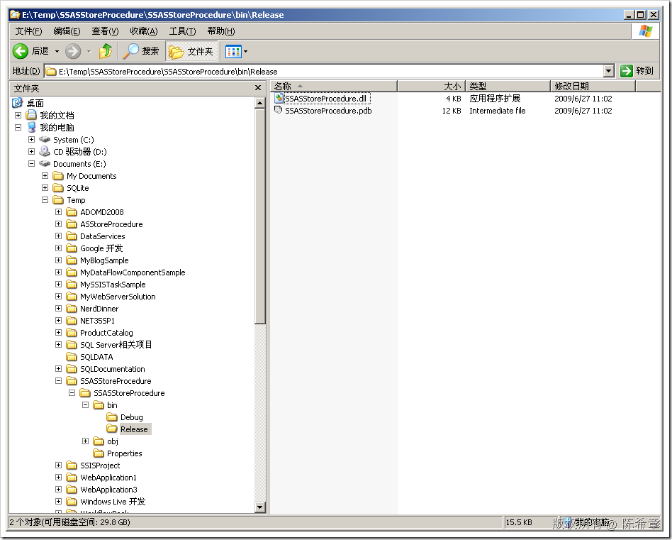
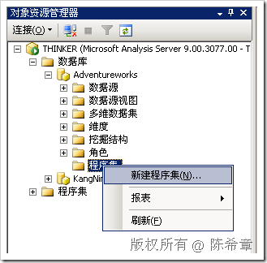
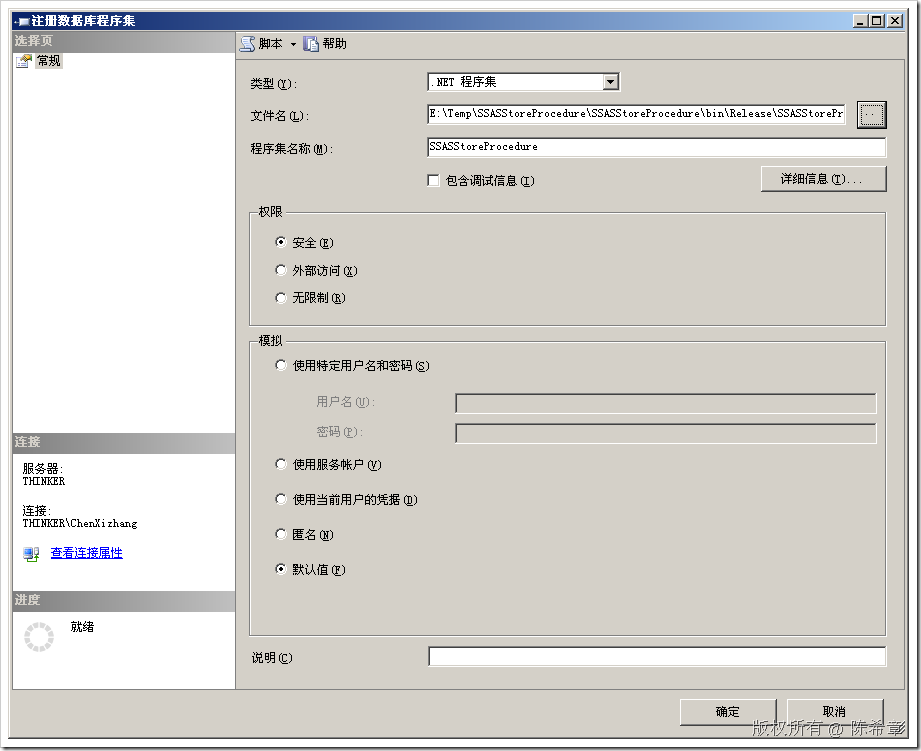
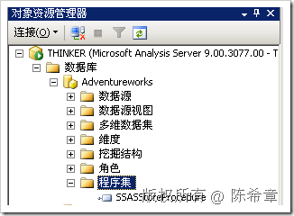
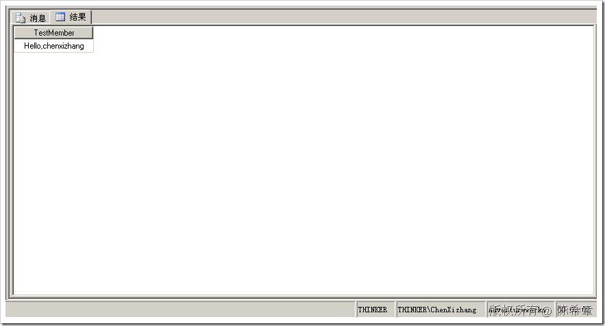

# SSAS :  使用.NET为SSAS编写自定义程序集 
> 原文发表于 2009-06-27, 地址: http://www.cnblogs.com/chenxizhang/archive/2009/06/27/1512163.html 

从SQL Server 2005开始，SQL Server平台提供了一个很强大的功能：CLR集成。就是说，现在我们可以使用.NET语言（例如C#或者VB.NET)编写一些对象，然后部署到SQL Server中去，达到扩展SQL Server的目的。

 在SQL Server关系数据库引擎中，我们可以编写下面五种对象

 * 存储过程
* 函数（标量的，或者是表值函数)
* 触发器
* 聚合
* 自定义类型

 在SQL Server Analysis service中，我们编写的对象比较有限，只有一种：存储过程。

 当然，SSAS里面的编程也更加简洁一些。下面我就演示一个简单的例子

 1. 创建一个类库项目。我们直接使用标准的Class Library即可，无需添加任何其他的引用。（当然，如果你的存储过程会用到一些特殊功能，则除外）

  

 请注意看，这里唯一的要求是：方法必须是静态的（static)

 我们这个存储过程（或者称为方法更合适）接受一个参数，返回值也是一个字符串。

  

 2. 编译，生成该项目，得到一个dll

  

 3. 将该程序集,添加到SSAS

  

 【注意】如果你的程序集想在整个服务器级别共享，则可以选择到服务器节点下面的那个“程序集”节点，然后点击右键，“新建程序集”

  

 点击"确定"即可

  

  

 4. 测试该程序集。

 WITH MEMBER [Employee].[Employee Name].[TestMember]  
AS  
**SSASStoreProcedure.AddPrefix('chenxizhang') --这里引用的语法是：namespace.methodName, 不需要写classname** SELECT TestMember ON 0  
FROM [Analysis Services Tutorial]     这个查询的结果如下

  

 到这里为止，我们就完成了一个很简单的存储过程，而且完成了部署

 当然，确实很简单。我们下面再来看看如何实现更加复杂的存储过程

 本文由作者：[陈希章](http://www.xizhang.com) 于 2009/6/27 11:23:21 发布在：<http://www.cnblogs.com/chenxizhang/>  
 本文版权归作者所有，可以转载，但未经作者同意必须保留此段声明，且在文章页面明显位置给出原文连接，否则保留追究法律责任的权利。   
 更多博客文章，以及作者对于博客引用方面的完整声明以及合作方面的政策，请参考以下站点：[陈希章的博客中心](http://www.xizhang.com/blog.htm) 

