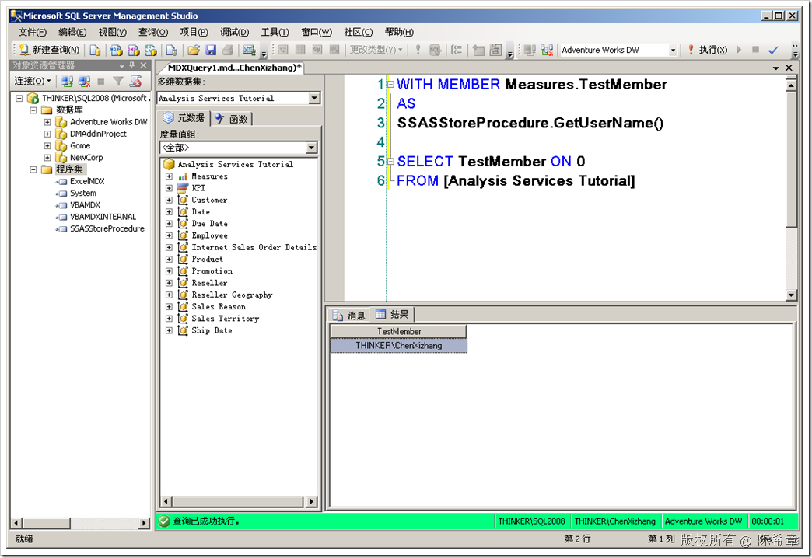

# SSAS : 在SSAS 2008的自定义存储过程中取得当前用户名 
> 原文发表于 2009-06-27, 地址: http://www.cnblogs.com/chenxizhang/archive/2009/06/27/1512255.html 

之前我说到过了，在SSAS 2005中，自定义存储过程没有办法直接读取到用户名。关于这一点，在SSAS 2008中得到了改进。如下图所示

  

 能够做到这一点是因为Microsoft.AnalysisServices.AdomdServer这个程序集中，Context对象多了一个CurrentConnection属性。这个属性代表了当前的连接。 public static string GetUserName()  
  {  
      return Context.CurrentConnection.User.Name;  
  }   除此之外，还有一个Server对象，有兴趣的朋友可以参考一下帮助文档  本文由作者：[陈希章](http://www.xizhang.com) 于 2009/6/27 14:53:20 发布在：<http://www.cnblogs.com/chenxizhang/>  
 本文版权归作者所有，可以转载，但未经作者同意必须保留此段声明，且在文章页面明显位置给出原文连接，否则保留追究法律责任的权利。   
 更多博客文章，以及作者对于博客引用方面的完整声明以及合作方面的政策，请参考以下站点：[陈希章的博客中心](http://www.xizhang.com/blog.htm) 

