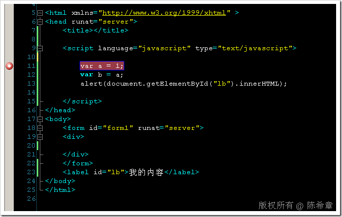
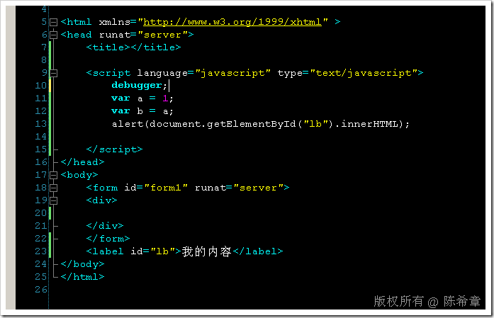
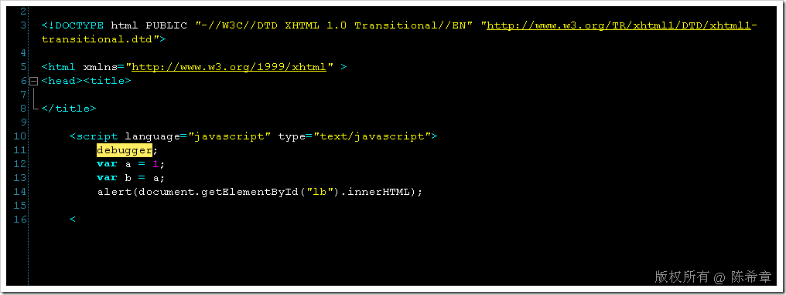
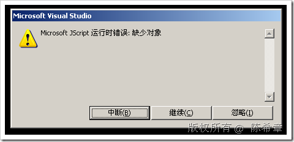
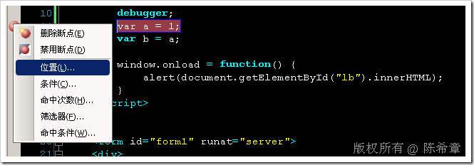
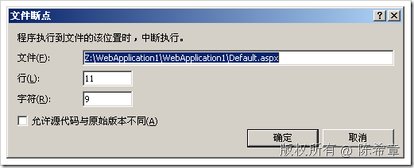
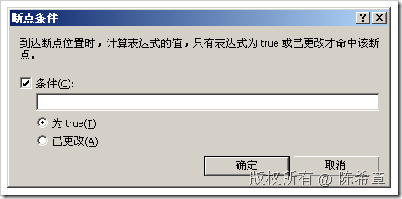
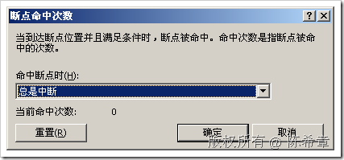
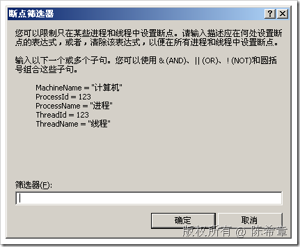
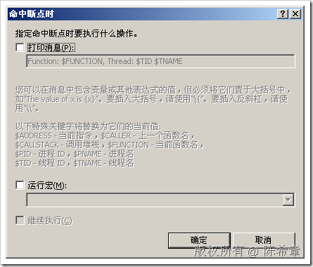

# .NET : VS 2005中如何调试javascript 
> 原文发表于 2009-06-29, 地址: http://www.cnblogs.com/chenxizhang/archive/2009/06/29/1512940.html 

我们都知道在VS2008中，可以直接在页面的javascript块中设置断点对它们进行调试。例如下面这样

  而这个特性在VS2005或者更早的版本是没有的。但是可以通过下面的方式来实现类似的效果

  

 请注意，debugger关键字。这是一个特殊的语句，只有在javascript里面才有效。启动调试之后，可以看到如下的效果

  

 然后，就可以按F11进行调试了。

 但是，不管你采用哪种方式，其实上面的代码都是有问题的，你可以看到，我们的脚本将尝试去访问一个id为lb的元素。而其实这个时候页面还没有出来。这是很多javascript的初学者朋友比较容易犯的错误。究其原因，是因为页面的render是有先后顺序的

  

 要解决这个问题当然很简单，就是将操作元素的代码封装到函数里面去，例如window.load之后再做。如下

 <%@ Page Language="C#" AutoEventWireup="true" CodeBehind="Default.aspx.cs" Inherits="WebApplication1.\_Default" %> <!DOCTYPE html PUBLIC "-//W3C//DTD XHTML 1.0 Transitional//EN" "<http://www.w3.org/TR/xhtml1/DTD/xhtml1-transitional.dtd">> <html xmlns="<http://www.w3.org/1999/xhtml"> >  
<head runat="server">  
    <title></title>  
      
</head>  
<body>  
    <form id="form1" runat="server">  
    
  
    
  
    </form>  
    <label id="lb">我的内容</label>  
</body>  
</html> 虽然，可以通过这样的方法实现在VS2005中的javascript调试。但是其实它与设置断点还是有差别的

 1.毕竟要多写一些语句。

 2.无法实现复杂性的debug选项

  

      

  

  

    

  

   

 值得一说的是，我们还可以在C#代码中，根据情况决定是否启动调试器。这个是由System.Diagnostics.Debugger对象提供支持的。有兴趣的朋友可以查看MSDN的介绍

 Debugger.Break(); Debugger.Launch();

 本文由作者：[陈希章](http://www.xizhang.com) 于 2009/6/29 8:59:13 发布在：<http://www.cnblogs.com/chenxizhang/>  
 本文版权归作者所有，可以转载，但未经作者同意必须保留此段声明，且在文章页面明显位置给出原文连接，否则保留追究法律责任的权利。   
 更多博客文章，以及作者对于博客引用方面的完整声明以及合作方面的政策，请参考以下站点：[陈希章的博客中心](http://www.xizhang.com/blog.htm) 

