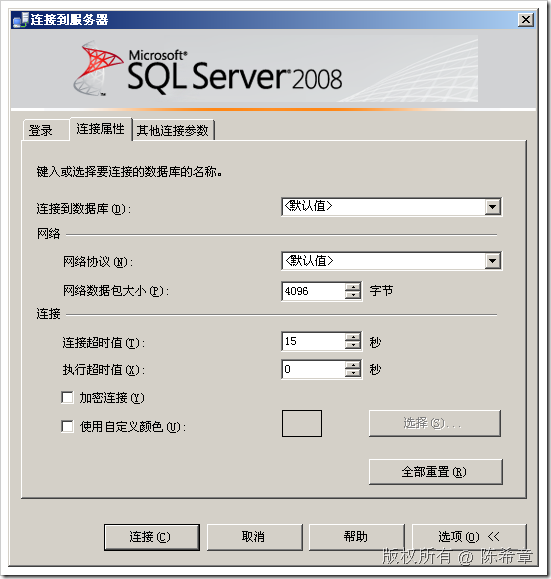

# SQL Server 探秘： 为什么在通讯时要指定Packet Size的大小 
> 原文发表于 2009-06-30, 地址: http://www.cnblogs.com/chenxizhang/archive/2009/06/30/1513646.html 

这一篇来探讨一下SQL Server网络通讯的几个参数。可能很多朋友并不知道，即便你不指定，那么SQL Server的数据从服务器发送到客户端，肯定是有一些方法的。

 SQL Server的通讯是标准的TCP Socket方式。所以有几个参数其实跟标准的Socket编程是一致的

 一般情况下，TCP Socket编程都需要指定网络数据包大小，以及超时时间。如下图所示

  

 如果我们通过自定义程序来访问，可以在ConnectionString中指定Pocket Size来达到同样的目的。

 这种行为是与TCP Socket编程有关，下面看看有关的参考例子

 static string Receive(TcpClient client)  
{  
    byte[] data = new byte[256];//读取的时候，肯定也是需要有一个缓冲区的，那么这个大小其实就是常说的Packet Size  
    //如果一个内容超过了这个大小，则可以分批发送过来，然后客户端要判断是否结束了，然后拼接起来     //NetworkStream stream = client.GetStream();  
    //stream.Read(data, 0, data.Length);//读取下一个256个字节的内容     SocketAsyncEventArgs args = new SocketAsyncEventArgs();  
    args.SetBuffer(data, 0, data.Length);  
    client.Client.ReceiveAsync(args);     //client.Client.Receive(data);     return Encoding.UTF8.GetString(data); } TCP Client的通讯，是基于流（NetworkStream)的。从一个典型的查询来说，是这样工作的

 1. 客户端向流中写入一个连接请求(Connection)，一般都要指定服务器的地址

 2. 服务器端通过端口（默认为1433）监听到这个请求

 3. 客户端和服务器建立一个连接

 4. 客户端此时向服务器发送一个操作请求(Command)

 5. 服务器接收到操作请求，执行有关的任务，获得数据（如果需要的话）

 6. 服务器将数据，分包写入到它与客户端所共有的那个NetworkStream

 7. 很显然，因为流的连续性的，如果客户端和服务器双方不明确每个包的尺寸，那么就可能导致读取出现问题

 8. 只有双方在尺寸方面的认识是保持一致的，所以服务器不断写入数据（二进制字节），客户端不断读取数据，这样就完成了一个操作。

  

 同样的道理也适用于其他几个选项：连接超时时间，操作超时时间等等

 本文由作者：[陈希章](http://www.xizhang.com) 于 2009/6/30 8:49:24 发布在：<http://www.cnblogs.com/chenxizhang/>  
 本文版权归作者所有，可以转载，但未经作者同意必须保留此段声明，且在文章页面明显位置给出原文连接，否则保留追究法律责任的权利。   
 更多博客文章，以及作者对于博客引用方面的完整声明以及合作方面的政策，请参考以下站点：[陈希章的博客中心](http://www.xizhang.com/blog.htm) 

