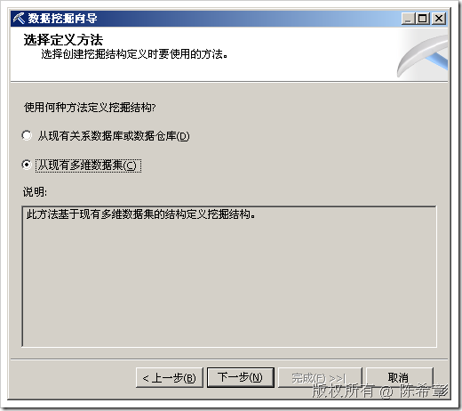
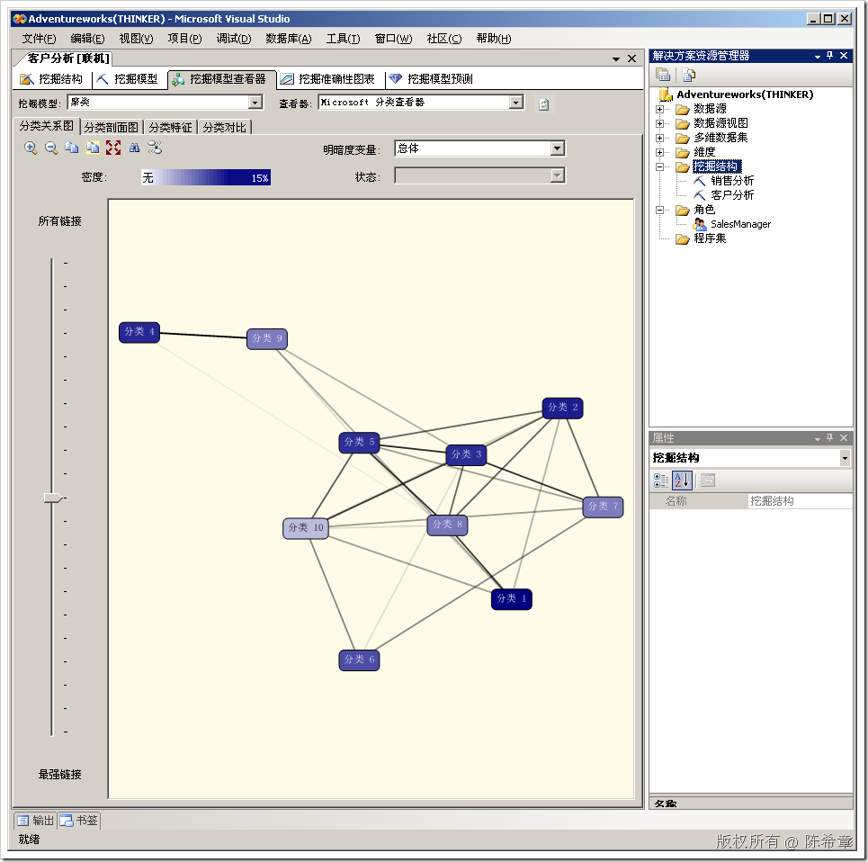

# SSAS : 从现有多维数据集创建挖掘结构 
> 原文发表于 2009-06-30, 地址: http://www.cnblogs.com/chenxizhang/archive/2009/06/30/1514274.html 

在SSAS中，我们可以利用9种内置算法进行数据挖掘的操作和分析。不少朋友估计也对数据挖掘有了一些初步认识了。我今天要介绍的是，数据挖掘除了可以读取关系数据库作为数据源之外，还可以读取多维数据集作为数据源。例如下面

  

 我做了一个简单的例子如下

 

 本文由作者：[陈希章](http://www.xizhang.com) 于 2009/6/30 21:55:19 发布在：<http://www.cnblogs.com/chenxizhang/>  
 本文版权归作者所有，可以转载，但未经作者同意必须保留此段声明，且在文章页面明显位置给出原文连接，否则保留追究法律责任的权利。   
 更多博客文章，以及作者对于博客引用方面的完整声明以及合作方面的政策，请参考以下站点：[陈希章的博客中心](http://www.xizhang.com/blog.htm) 