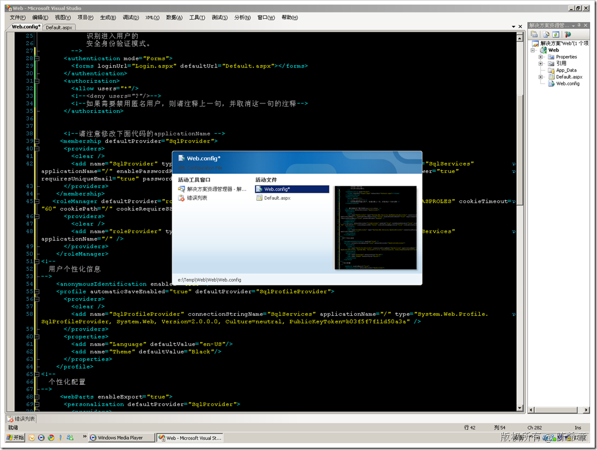

# .NET ：在Visual Studio的不同Tab之间切换 
> 原文发表于 2009-07-02, 地址: http://www.cnblogs.com/chenxizhang/archive/2009/07/02/1515154.html 

我们经常使用Visual Studio，有时候会在里面开了好多个选项卡页面，要进行切换的时候可能比较麻烦。刚才不小心按了一个键，发现有这样一个切换的方法

 按住CTRL+TAB,会出现一个对话框，而且可以预览的。不错

 

 本文由作者：[陈希章](http://www.xizhang.com) 于 2009/7/2 8:33:48 发布在：<http://www.cnblogs.com/chenxizhang/>  
 本文版权归作者所有，可以转载，但未经作者同意必须保留此段声明，且在文章页面明显位置给出原文连接，否则保留追究法律责任的权利。   
 更多博客文章，以及作者对于博客引用方面的完整声明以及合作方面的政策，请参考以下站点：[陈希章的博客中心](http://www.xizhang.com/blog.htm) 