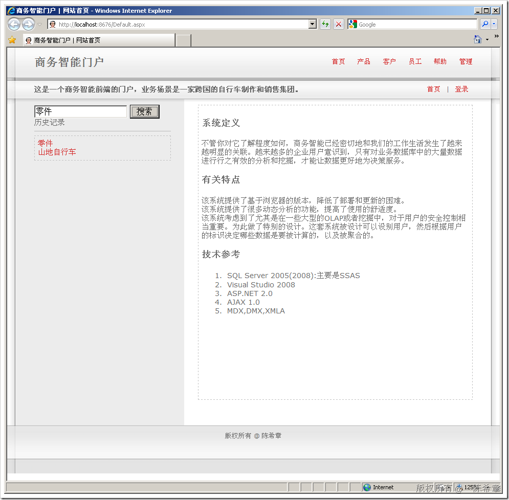
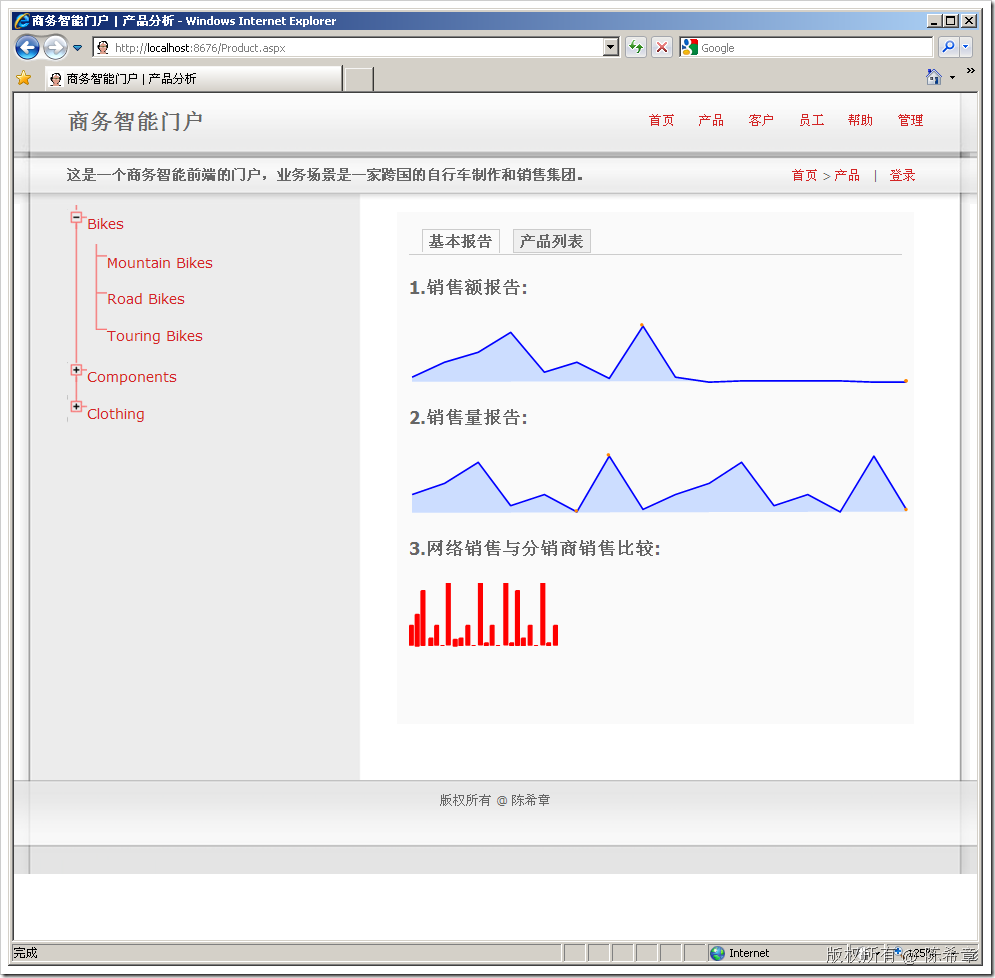
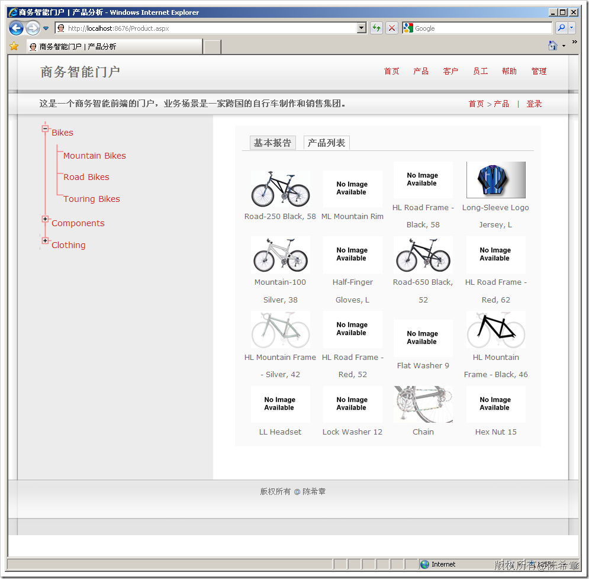
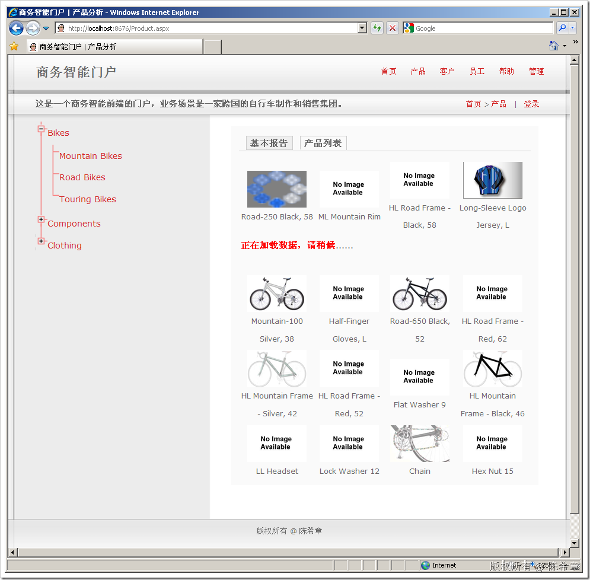
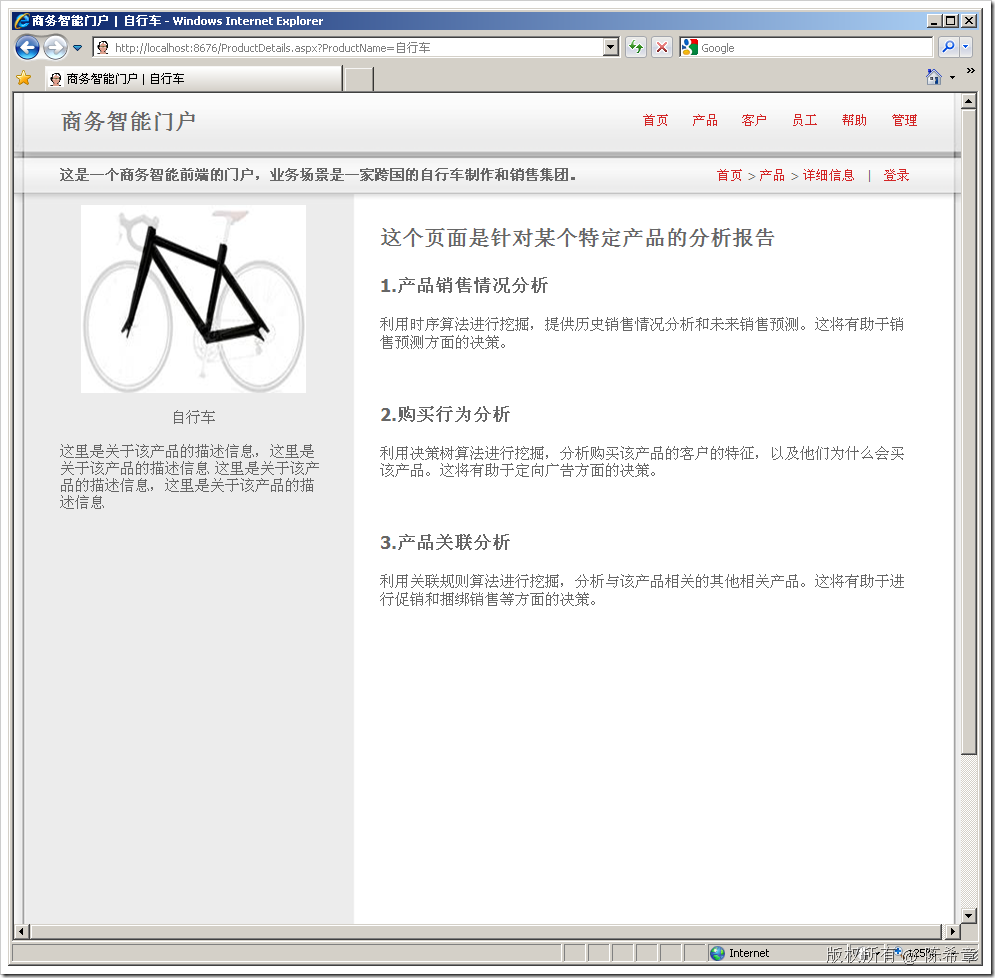

# SSAS : 商务智能门户（预览） 
> 原文发表于 2009-07-02, 地址: http://www.cnblogs.com/chenxizhang/archive/2009/07/02/1515799.html 

最近在结合之前的一些项目积累，着手开发一套在线分析系统。作为演示目的，我还使用了官方提供的数据库，以及里面的数据。大致的几个截图如下。

 【注意】该系统的代码及有关细节可能不会公开。而且目前在不断修改中，所以以下的截图仅供参考

  

  

  

  

    

 本文由作者：[陈希章](http://www.xizhang.com) 于 2009/7/2 19:52:22 发布在：<http://www.cnblogs.com/chenxizhang/>  
 本文版权归作者所有，可以转载，但未经作者同意必须保留此段声明，且在文章页面明显位置给出原文连接，否则保留追究法律责任的权利。   
 更多博客文章，以及作者对于博客引用方面的完整声明以及合作方面的政策，请参考以下站点：[陈希章的博客中心](http://www.xizhang.com/blog.htm) 