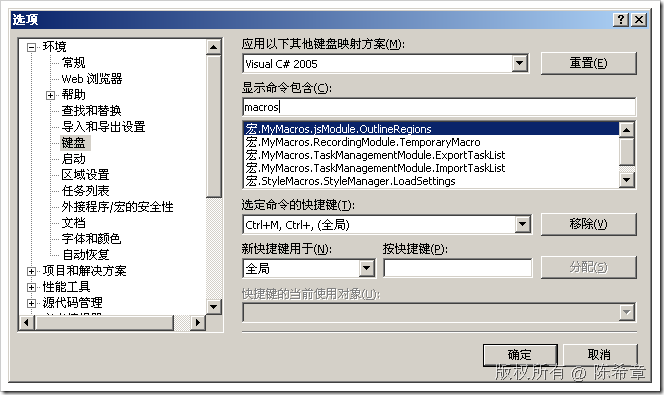

# Using #region Directive With JavaScript Files in Visual Studio 【转载】 
> 原文发表于 2009-07-02, 地址: http://www.cnblogs.com/chenxizhang/archive/2009/07/02/1515803.html 


本文转载自：<http://blog.devarchive.net/2008/04/using-region-directive-with-javascript.html>

 这是一个不错的小创意，可以针对大量的javascript脚本实现#region管理的效果. 创意无限啊，赞一个

  

 1.首先编写以下的宏


```
Option Strict Off
Option Explicit Off

Imports System
Imports EnvDTE
Imports EnvDTE80
Imports System.Diagnostics
Imports System.Collections

Public Module JsMacros

    Sub OutlineRegions()
        Dim selection As EnvDTE.TextSelection = DTE.ActiveDocument.Selection

        Const REGION\_START As String = "//#region"
        Const REGION\_END As String = "//#endregion"

        selection.SelectAll()
        Dim text As String = selection.Text
        selection.StartOfDocument(True)

        Dim startIndex As Integer
        Dim endIndex As Integer
        Dim lastIndex As Integer = 0
        Dim startRegions As Stack = New Stack()

        Do
            startIndex = text.IndexOf(REGION\_START, lastIndex)
            endIndex = text.IndexOf(REGION\_END, lastIndex)

            If startIndex = -1 AndAlso endIndex = -1 Then
                Exit Do
            End If

            If startIndex <> -1 AndAlso startIndex < endIndex Then
                startRegions.Push(startIndex)
                lastIndex = startIndex + 1
            Else
                ' Outline region ...
                selection.MoveToLineAndOffset(CalcLineNumber(text, CInt(startRegions.Pop())), 1)
                selection.MoveToLineAndOffset(CalcLineNumber(text, endIndex) + 1, 1, True)
                **selection.OutlineSection()**

                lastIndex = endIndex + 1
            End If
        Loop

        selection.StartOfDocument()
    End Sub

    Private Function CalcLineNumber(ByVal text As String, ByVal index As Integer)
        Dim lineNumber As Integer = 1
        Dim i As Integer = 0

        While i < index
            If text.Chars(i) = vbCr Then
                lineNumber += 1
                i += 1
            End If

            i += 1
        End While

        Return lineNumber
    End Function

End Module
```

```
2. 然后指派一个快捷键给它
```

```
[](http://images.cnblogs.com/cnblogs_com/chenxizhang/WindowsLiveWriter/UsingregionDirectiveWithJavaScriptFilesi_8839/image_6.png) 
```

```
这里的快捷键是无所谓的，但一定要两个键
```

```
 
```

3. 然后假设我们有这样的页面


[](http://images.cnblogs.com/cnblogs_com/chenxizhang/WindowsLiveWriter/UsingregionDirectiveWithJavaScriptFilesi_8839/image_4.png) 


此时，如果按下CTRL+M+,


[](http://images.cnblogs.com/cnblogs_com/chenxizhang/WindowsLiveWriter/UsingregionDirectiveWithJavaScriptFilesi_8839/image_8.png)


 


的确是挺不错的


本文由作者：[陈希章](http://www.xizhang.com) 于 2009/7/2 19:55:50 
发布在：<http://www.cnblogs.com/chenxizhang/>  

本文版权归作者所有，可以转载，但未经作者同意必须保留此段声明，且在文章页面明显位置给出原文连接，否则保留追究法律责任的权利。   

更多博客文章，以及作者对于博客引用方面的完整声明以及合作方面的政策，请参考以下站点：[陈希章的博客中心](http://www.xizhang.com/blog.htm)
