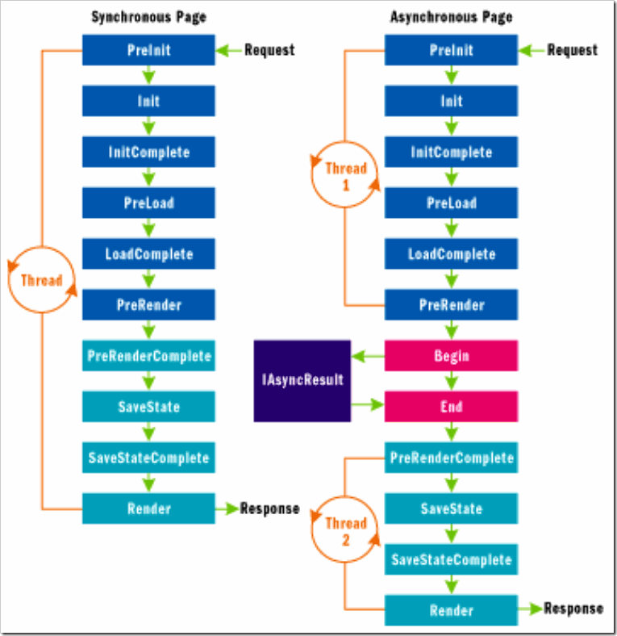

# 如何在ASP.NET页面中使用异步任务(PageAsyncTask) 
> 原文发表于 2009-07-12, 地址: http://www.cnblogs.com/chenxizhang/archive/2009/07/12/1522069.html 

 在页面加载期间，可能有些操作是要比较耗用时间的（例如调用外部资源，要长时间等待其返回），正常情况下，这个操作将一直占用线程。而大家知道，ASP.NET在服务端线程池中的线程数是有限的，如果一直占用的话，就会导致其他操作需要等待。

 在ASP.NET 2.0中，提供了一种异步页的技术。微软有一个专门的文档介绍这个技术

 看看下面这个图，很重要

 

 【注意】ASP.NET的异步机制与windows From的异步机制有一个根本区别，就是因为Response不可以分布发送到客户端的，所以，这个异步的效果对客户端来说可能是效果不明显的。也就说客户还是一样等待所有的操作完成之后才能看到页面。但是，使用了异步技术后，服务器端的线程能得到更好的利用，从另外一个层面是提高性能。

  

 下面我用一个简单的例子来演示如何使用该技术

 1. 页面需要启用async支持

 <%@ Page Language="C#" AutoEventWireup="true" CodeBehind="Default.aspx.cs" Inherits="WebApplication2.\_Default" **Async="true"** %> <!DOCTYPE html PUBLIC "-//W3C//DTD XHTML 1.0 Transitional//EN" "<http://www.w3.org/TR/xhtml1/DTD/xhtml1-transitional.dtd">> <html xmlns="<http://www.w3.org/1999/xhtml"> >  
<head runat="server">  
    <title></title>  
    <link rel="Stylesheet" href="default.css" />  
</head>  
<body>  
    <form id="form1" runat="server">  
    <div  id="mydiv" runat="server">  
    
  
    </form>  
</body>  
</html>  

 2.通过一个独立的类型（class）定义长时间执行任务的操作

 using System;  
using System.Collections.Generic;  
using System.Web; using System.Threading; namespace WebApplication2  
{  
    public class LongTimeTask  
    {  
        public string Result = string.Empty;  
        public HelloWorldHandler handler;         public delegate string HelloWorldHandler();  
        public string HelloWorld()  
        {  
            Thread.Sleep(5000);  
            return "Hello,world";  
        }         public IAsyncResult **OnBegin**(object sender, EventArgs e,  
    AsyncCallback cb, object extraData)  
        {  
            handler = new HelloWorldHandler(this.HelloWorld);  
            return handler.BeginInvoke(cb, extraData);         }         public void **OnEnd**(IAsyncResult ar)  
        {  
            Result = handler.EndInvoke(ar);  
        }         public void **OnTimeout**(IAsyncResult ar)  
        {  
            Result = "超时了";  
        }  
    }  
}  

 3. 在页面的Page\_Load事件中，注册异步任务

 LongTimeTask task;  
protected void Page\_Load(object sender, EventArgs e)  
{     task= new LongTimeTask();  
    PageAsyncTask asynctask = new PageAsyncTask(task.OnBegin, task.OnEnd, task.OnTimeout, null);  
**RegisterAsyncTask(asynctask);** }  

  4. 在页面的OnPreRenderComplete的方法里面接收异步任务的结果

 protected override void OnPreRenderComplete(EventArgs e)  
{  
    mydiv.InnerHtml = task.Result;  
}  

  

 【注意】值得一说的是，如果是调用Web Service，也可能会需要比较长时间，但因为Web Service的异步调用有内部的支持。不需要我们像上面这样复杂。

 例如，有下面这样一个服务

 using System;  
using System.Collections.Generic;  
using System.Web;  
using System.Web.Services;  
using System.Threading; namespace WebApplication2  
{  
    /// 
  
    /// demoService 的摘要说明  
    /// 
  
    [WebService(Namespace = "<http://tempuri.org/")]>  
    [WebServiceBinding(ConformsTo = WsiProfiles.BasicProfile1\_1)]  
    [System.ComponentModel.ToolboxItem(false)]  
    public class demoService : System.Web.Services.WebService  
    {         [WebMethod]  
        public string HelloWorld()  
        {  
            Thread.Sleep(5000);     
            return "Hello World";  
        }  
    }  
} 添加对其引用之后，我们在页面代码中大致是这样的

 using System;  
using System.Collections.Generic;  
using System.Web;  
using System.Web.UI;  
using System.Web.UI.WebControls; using System.Linq; using System.Threading; namespace WebApplication2  
{  
    public partial class \_Default : System.Web.UI.Page  
    {  
        protected void Page\_Load(object sender, EventArgs e)  
        {             localhost.demoService proxy = new localhost.demoService();  
            proxy.HelloWorldCompleted += new WebApplication2.localhost.HelloWorldCompletedEventHandler(proxy\_HelloWorldCompleted);//绑定一个完成事件  
            proxy.HelloWorldAsync();//开始异步调用         }         void proxy\_HelloWorldCompleted(object sender, WebApplication2.localhost.HelloWorldCompletedEventArgs e)  
        {  
            mydiv.InnerHtml = e.Result;  
        }     }  
} 可以看到，这种方式简单多了。

 其他内置支持异步的场景还有IO操作。这里就不一一描述了

 本文由作者：[陈希章](http://www.xizhang.com) 于 2009/7/12 19:55:32 发布在：<http://www.cnblogs.com/chenxizhang/>  
 本文版权归作者所有，可以转载，但未经作者同意必须保留此段声明，且在文章页面明显位置给出原文连接，否则保留追究法律责任的权利。   
 更多博客文章，以及作者对于博客引用方面的完整声明以及合作方面的政策，请参考以下站点：[陈希章的博客中心](http://www.xizhang.com/blog.htm) 

