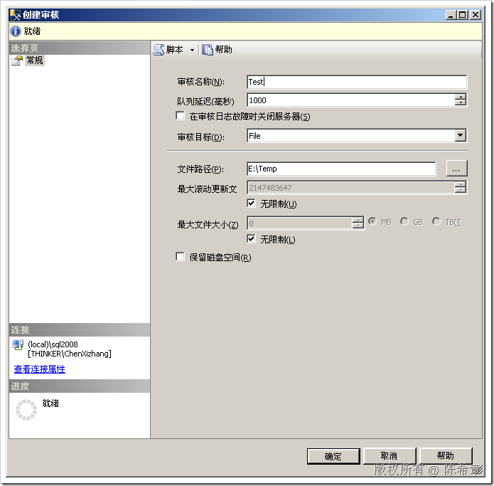
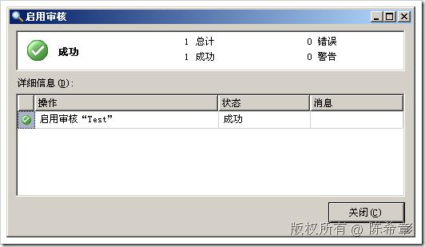
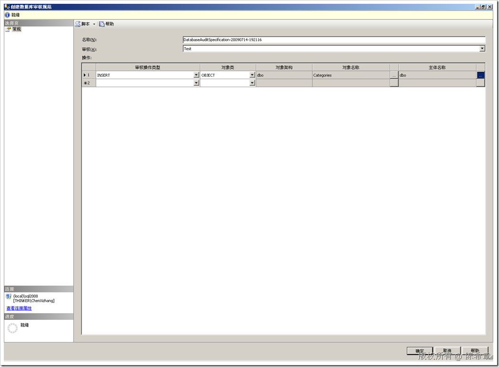

# SQL Server: 在SQL Server 2008中为一批对象添加审核 
> 原文发表于 2009-07-14, 地址: http://www.cnblogs.com/chenxizhang/archive/2009/07/14/1523616.html 

今天被问到这样一个问题，SQL Server 2008的审核窗口中，好像每次只能设置针对一个对象（例如表，视图等），能不能对一批对象进行审核呢？

 首先，稍微回顾一下审核功能

  

  

  

  

 下面是我的回复：

 ==========================================================================

 关于SQL 2008中针对多个对象进行审核的功能。如果通过那个图形化界面进行设置，确实每次只能设置一个对象，即便你选择了多个，也是只有第一个。 这个问题可以这么理解：微软并不推荐大量的表不分青红皂白地进行审核的，地球人都知道，审核会影响性能。所以，微软限制了每次设置审核的数目，借此提醒管理员思考到底是否真的要这么做。 但是，如果真的要对大量的对象进行审核，是否就一定没有办法了呢？答案是：不是 我给你写了一个脚本，演示了如何针对某个架构（Schema）进行审核，也就是说只要是属于该schema的，就都被包含在审核中。 Schema是SQL Server 2005开始增加的一个新的概念，在大型数据库中，会有大量Schema. 希望对你有帮助   --第一步：创建服务器审核 USE[master] GO CREATESERVERAUDIT[Test] TOFILE (FILEPATH=N'E:\Temp\' ,MAXSIZE= **0** MB ,MAX\_ROLLOVER\_FILES= **2147483647** ,RESERVE\_DISK\_SPACE=OFF ) WITH (QUEUE\_DELAY= **1000** ,ON\_FAILURE=CONTINUE ,AUDIT\_GUID='a511e0ac-50b5-4c75-9cd9-f2bbd06b269f' ) GO --将其启动 ALTERSERVERAUDIT[Test]WITH (STATE=ON) --第二步：创建书库审核规范 USENorthwind GO --这里是针对架构进行审核，即所有dbo架构下面的对象（表，视图等等）都被审核 CREATEDATABASEAUDITSPECIFICATION[demo] FORSERVERAUDIT[Test] **ADD (INSERT ON SCHEMA::[dbo] BY [dbo])** WITH (STATE=ON) GO --第三步：测试(下面分别针对两个表进行插入，但它们都属于dbo架构） INSERTINTONorthwind..demoVALUES(1); INSERTINTONorthwind..demo2VALUES(1); --第四步:清理测试 USE[Northwind] GO IFEXISTS (SELECT*FROMsys.database\_audit\_specificationsWHEREname=N'demo') BEGIN ALTERDATABASEAUDITSPECIFICATION[demo]WITH(STATE=OFF) DROPDATABASEAUDITSPECIFICATION[demo] END GO DROPTABLEdemo; DROPTABLEdemo2; USE[master] GO IFEXISTS (SELECT*FROMsys.server\_auditsWHEREname=N'Test') BEGIN ALTERSERVERAUDIT[Test]WITH (STATE=OFF) DROPSERVERAUDIT[Test] END GO   从这个例子也可以再一次说明这样一个问题：如果仅仅会使用图形化界面，那么其实很难做好SQL Server的管理或者开发。大家还是要多学习一些脚本的命令。  本文由作者：[陈希章](http://www.xizhang.com) 于 2009/7/14 19:23:30 发布在：<http://www.cnblogs.com/chenxizhang/>  
 本文版权归作者所有，可以转载，但未经作者同意必须保留此段声明，且在文章页面明显位置给出原文连接，否则保留追究法律责任的权利。   
 更多博客文章，以及作者对于博客引用方面的完整声明以及合作方面的政策，请参考以下站点：[陈希章的博客中心](http://www.xizhang.com/blog.htm) 

