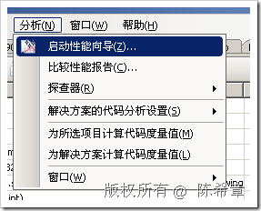
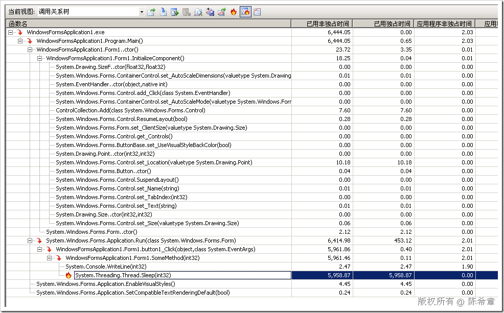

# VSTS : 在性能调优中找到瓶颈所在 
> 原文发表于 2009-07-16, 地址: http://www.cnblogs.com/chenxizhang/archive/2009/07/16/1524895.html 

VSTS 2008 的开发人员版（Develop Edition)中有一个很不错的功能，可以对代码执行速度进行分析，而且可以通过一个所谓的hotpathing的方式，定位到性能瓶颈所在的方法，下面是一个截图

  

 

 本文由作者：[陈希章](http://www.xizhang.com) 于 2009/7/16 15:06:54 发布在：<http://www.cnblogs.com/chenxizhang/>  
 本文版权归作者所有，可以转载，但未经作者同意必须保留此段声明，且在文章页面明显位置给出原文连接，否则保留追究法律责任的权利。   
 更多博客文章，以及作者对于博客引用方面的完整声明以及合作方面的政策，请参考以下站点：[陈希章的博客中心](http://www.xizhang.com/blog.htm) 