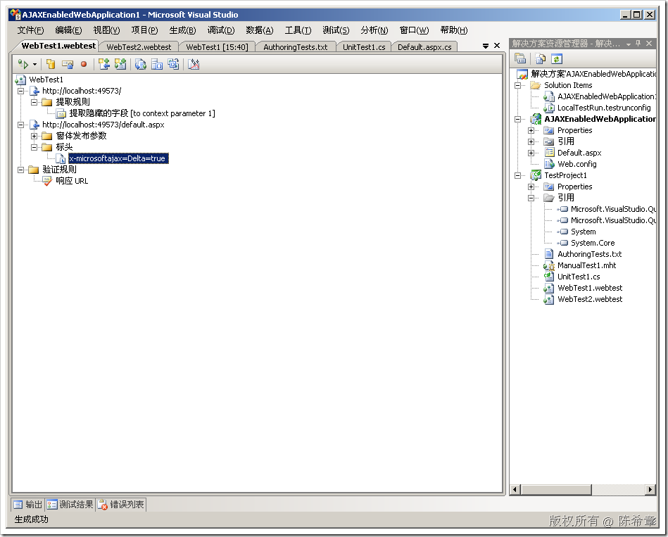
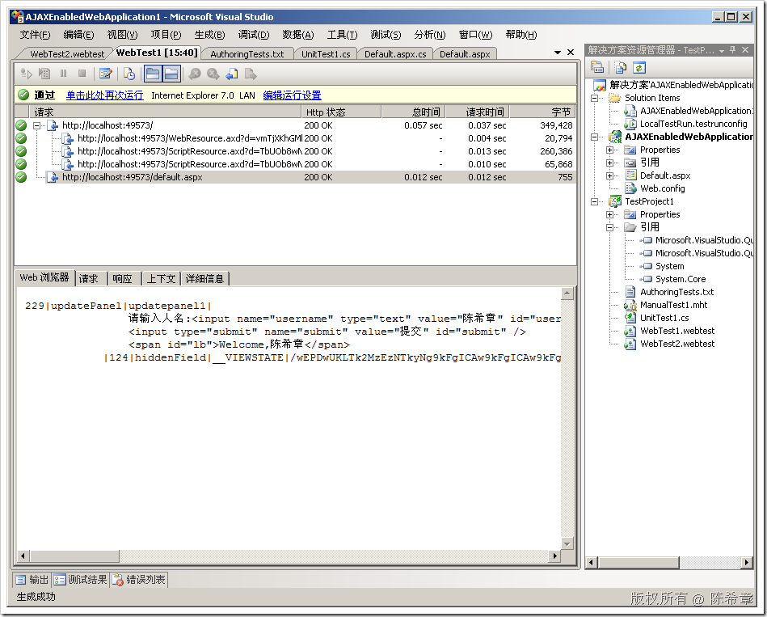
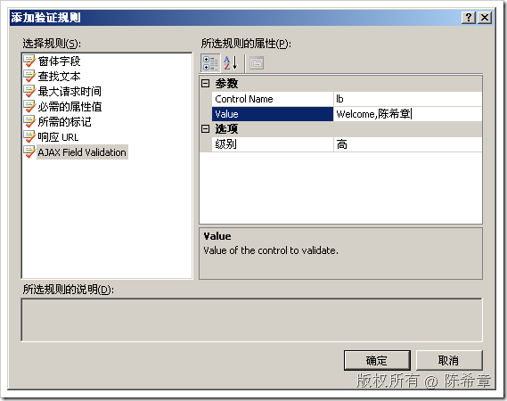
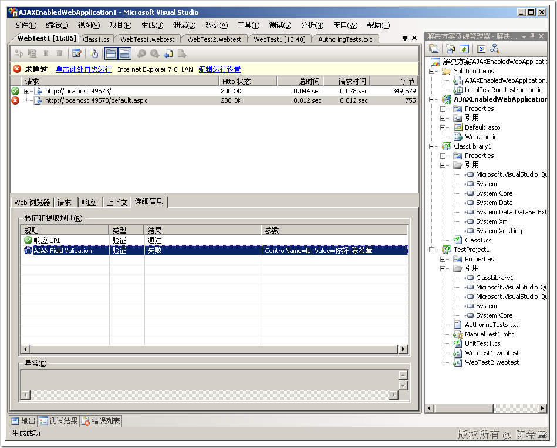

# Testing AJAX Applications with VSTS 2008 
> 原文发表于 2009-07-16, 地址: http://www.cnblogs.com/chenxizhang/archive/2009/07/16/1524958.html 


在下面这篇文章中，Jeff Levinson介绍了如何在VSTS 2008中对AJAX应用程序进行测试。

 <http://visualstudiomagazine.com/articles/2007/10/18/testing-ajax-applications-with-vsts-2008.aspx>

 我觉得奥妙在于下面这里（一个特殊的标头 request的Header）

 [](http://images.cnblogs.com/cnblogs_com/chenxizhang/WindowsLiveWriter/TestingAJAXApplicationswithVSTS2008_E329/image_4.png) 

 AJAX测试步骤中，返回的结果是比较奇怪的，如下面这样

 [](http://images.cnblogs.com/cnblogs_com/chenxizhang/WindowsLiveWriter/TestingAJAXApplicationswithVSTS2008_E329/image_2.png) 

  Jeff还介绍了如何编写一个自定义的验证规则，来AJAX操作确认返回的结果是否符合期望值


```
using System;
using System.Collections.Generic;
using System.Linq;
using System.Text;
using Microsoft.VisualStudio.TestTools.WebTesting;
using System.ComponentModel;
using System.Text.RegularExpressions;

namespace AjaxValidation
{
    [DisplayName("AJAX Field Validation")]
    public class AjaxValidationRule: ValidationRule
    {
        private string \_control = "";
	private string \_value = "";

        [Description("Control To Validate"), DisplayName("Control Name")]
        public string ControlName
        {
            get { return \_control; }
            set { \_control = value; }
        }
        

        [Description("Value of the control to validate."), DisplayName("Value")]
        public string Value
        {
            get { return \_value; }
            set { \_value = value; }
        }

        public override void Validate(object sender, ValidationEventArgs e)
        {
            Regex r = new Regex("(?<field>id=\"" + \_control + "\".*>)(?<value>.*)<");
            MatchCollection m = r.Matches(e.Response.BodyString);
            for (int i = 0; i < m.Count; i++)
            {
                if (m[i].Groups["value"] != null)
                {
                    string foundValue = m[i].Groups["value"].Captures[0].Value;
                     e.IsValid = (foundValue == \_value);
                    break;
                }
            }
        }
    }
}
```

```
 
```

```
或者
```

```
using System;
using System.Collections.Generic;
using System.Linq;
using System.Text;
using Microsoft.VisualStudio.TestTools.WebTesting;
using System.ComponentModel;
using System.Text.RegularExpressions;

namespace AjaxValidation
{
    [DisplayName("AJAX Field Validation")]
    public class AjaxValidationRule: ValidationRule
    {
        private string \_control = "";

        [Description("Control To Validate"), DisplayName("Control Name")]
        public string ControlName
        {
            get { return \_control; }
            set { \_control = value; }
        }
        private string \_value = "";

        [Description("Value of the control to validate."), DisplayName("Value")]
        public string Value
        {
            get { return \_value; }
            set { \_value = value; }
        }

        public override void Validate(object sender, ValidationEventArgs e)
        {
            Regex r = new Regex("id=\"" + \_control + "\".*>" + \_value + "<");
            MatchCollection m = r.Matches(e.Response.BodyString);
            e.IsValid = (m.Count > 0);
        }
    }
}
```

```
将以上代码单独用一个ClassLibrary封装起来，并在TestProject中添加对其的引用，然后就可以设置下面的验证规则了
```

```
[](http://images.cnblogs.com/cnblogs_com/chenxizhang/WindowsLiveWriter/TestingAJAXApplicationswithVSTS2008_E329/image_8.png) 
```

```
下面是演示了如果返回的字符串不满足要求的话测试会报告错误
```


[](http://images.cnblogs.com/cnblogs_com/chenxizhang/WindowsLiveWriter/TestingAJAXApplicationswithVSTS2008_E329/image_10.png) 


看起来很不错对吧？


**但是要注意一个情况：对于纯客户端操作，例如自己写javascript对某些元素进行操作，就不可能被记录到了。因为此时并不会发生请求（不管是POST还是GET)**


**上面演示的操作为什么能捕捉到，是因为虽然是AJAX,但仍然发生了对服务器的请求。其实是一个XMLHttpRequest的异步请求。**


 


本文由作者：[陈希章](http://www.xizhang.com) 于 2009/7/16 16:09:14 
发布在：<http://www.cnblogs.com/chenxizhang/>  

本文版权归作者所有，可以转载，但未经作者同意必须保留此段声明，且在文章页面明显位置给出原文连接，否则保留追究法律责任的权利。   

更多博客文章，以及作者对于博客引用方面的完整声明以及合作方面的政策，请参考以下站点：[陈希章的博客中心](http://www.xizhang.com/blog.htm)
