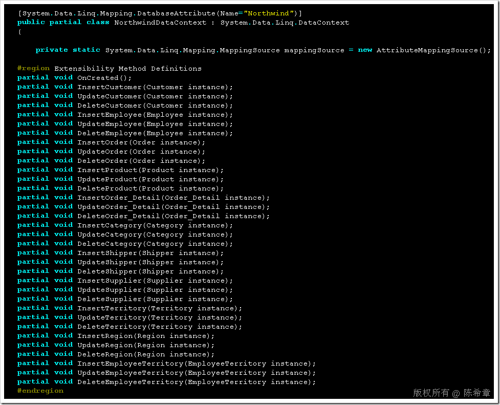

# LINQ : 如何为LINQ TO SQL实现自定义业务逻辑 
> 原文发表于 2009-07-16, 地址: http://www.cnblogs.com/chenxizhang/archive/2009/07/16/1525181.html 

LINQ TO SQL很好很强大，它几乎包含了我们能够想到的所有与数据库有关的操作，甚至也包含了一些我们可能都没有想到的。

 但不管怎样，也许我们需要在LINQ TO SQL的操作中添加一个自定义业务逻辑，例如在插入某个实体的时候编写日志等等。如何实现这样的功能呢？

 其实这一点，LINQ TO SQL在设计的时候也考虑到了。我们可以打开那个dtml文件的designer.cs文件，我们发现有些隐藏的代码

  

 首先，我们看到NorthwindDataContext这个类型是一个局部类型（Partial Class），而且上述定义的一些方法也是局部方法(Partial Method)

 局部方法是C# 3.0的新增特性。它使用在如下场景：

 **某个方法可有可无。通过partial 关键字声明的目的是，可以让其他地方代码可以调用它。但如果该方法最终没有被实现，那么包括方法声明以及调用代码都会被删除掉。**

 这个特性与虚方法，抽象方法都不同。

  

 假设我们需要在InsertCustomer的时候添加一些业务逻辑，那么该怎么做呢？

 using System;  
using System.Collections.Generic;  
using System.Linq;  
using System.Text; namespace Model  
{  
    public partial class NorthwindDataContext  
    {  
        partial void InsertCustomer(Customer instance)  
        {  
           //这里可以实现自己的保存逻辑，根据传入的一个Customer的实例             this.ExecuteCommand("Insert Into.....");  
            //还可以写日志，等等  
        }  
    }  
}  

 【注意】一旦我们这样做了，那么插入Customer的逻辑就全部由我们来负责了。你需要确保这里面的代码是完整的 

  

 protected void addcustomer\_Click(object sender, EventArgs e)  
{  
    Model.NorthwindDataContext db = new Model.NorthwindDataContext(connectionString);  
    Model.Customer c = new Model.Customer()  
    {  
        CustomerID = "AAAAAS",  
        CompanyName = "Xizhang"  
    };     db.Customers.InsertOnSubmit(c);  
    db.SubmitChanges(); }

**在db.SubmitChanges方法被调用后，会自动调用我们写的那个InsertCustomer方法** 本文由作者：[陈希章](http://www.xizhang.com) 于 2009/7/16 22:32:03 发布在：<http://www.cnblogs.com/chenxizhang/>  
 本文版权归作者所有，可以转载，但未经作者同意必须保留此段声明，且在文章页面明显位置给出原文连接，否则保留追究法律责任的权利。   
 更多博客文章，以及作者对于博客引用方面的完整声明以及合作方面的政策，请参考以下站点：[陈希章的博客中心](http://www.xizhang.com/blog.htm) 

