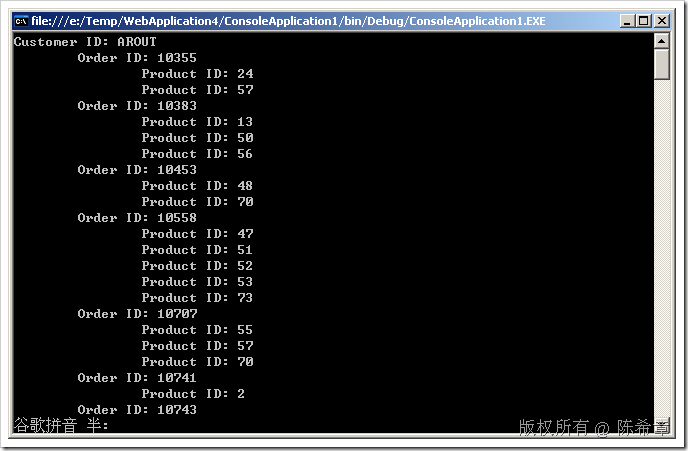
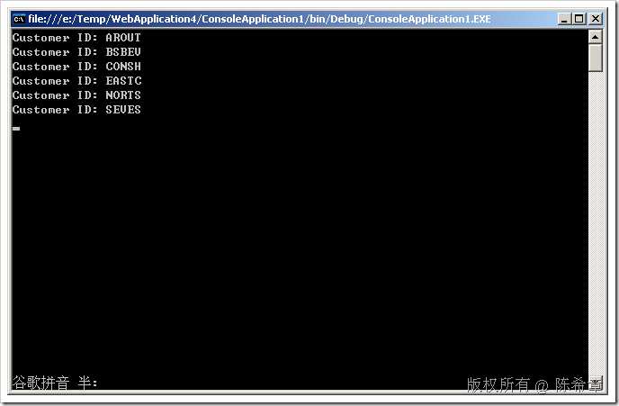

# LINQ : 谈谈LINQ TO SQL中的直接加载和延迟加载 
> 原文发表于 2009-07-17, 地址: http://www.cnblogs.com/chenxizhang/archive/2009/07/17/1525256.html 

在LINQ TO SQL中，有两种主要的加载模式：直接加载和延迟加载. 这是有一个选项来控制的；DeferredLoadingEnabled。这是DataContext的一个属性，默认为true

 那么，什么叫延迟加载？简单的说就是按需加载，也就是只有在需要的时候才加载。这样当然是有些好处的。

 但是，关键是说，如果某部分数据我们确定就是要加载的，那么如果再去延迟加载可能就不合适了，此时就应该选用直接加载。

 来看这么一个例子

 static void Main(string[] args)  
{  
    NorthwindDataContext db = new NorthwindDataContext();     var custQuery =  
        from cust in db.Customers  
        where cust.City == "London"  
        select cust;     foreach (Customer custObj in custQuery)  
    {  
        Console.WriteLine("Customer ID: {0}", custObj.CustomerID);  
        foreach (Order ord in custObj.Orders)  
        {  
            Console.WriteLine("\tOrder ID: {0}", ord.OrderID);  
            foreach (OrderDetail detail in ord.OrderDetails)  
            {  
                Console.WriteLine("\t\tProduct ID: {0}", detail.ProductID);  
            }  
        }  
    }     Console.Read();  
} 以上是查询了一个客户列表，但是在读取的时候，我们不光要读客户列表，还要读取它相关的订单及明细。 需要注意的是，我们没有对db的加载模式做设置，此时将使用延迟加载的模式。 这个代码没有问题，执行之后的结果如下  我们来观察一下数据库里面发生了什么样的情况？下面是我们监控到的服务器活动。 exec sp\_reset\_connection   
go

 --检索London的客户列表  
**exec sp\_executesql N'SELECT [t0].[CustomerID], [t0].[CompanyName], [t0].[ContactName], [t0].[ContactTitle], [t0].[Address], [t0].[City], [t0].[Region], [t0].[PostalCode], [t0].[Country], [t0].[Phone], [t0].[Fax], [t0].[LastEditDate], [t0].[CreationDate]  
FROM [dbo].[Customers] AS [t0]  
WHERE [t0].[City] = @p0',N'@p0 nvarchar(6)',@p0=N'London'  
go**

 --为每个客户检索订单列表  
**exec sp\_executesql N'SELECT [t0].[OrderID], [t0].[CustomerID], [t0].[EmployeeID], [t0].[OrderDate], [t0].[RequiredDate], [t0].[ShippedDate], [t0].[ShipVia], [t0].[Freight], [t0].[ShipName], [t0].[ShipAddress], [t0].[ShipCity], [t0].[ShipRegion], [t0].[ShipPostalCode], [t0].[ShipCountry]  
FROM [dbo].[Orders] AS [t0]  
WHERE [t0].[CustomerID] = @p0',N'@p0 nvarchar(5)',@p0=N'AROUT'**go  
exec sp\_reset\_connection   
go

 **--每一个OrderDetails的查询都会发起一个连接，单独执行**  
**exec sp\_executesql N'SELECT [t0].[OrderID], [t0].[ProductID], [t0].[UnitPrice], [t0].[Quantity], [t0].[Discount]  
FROM [dbo].[Order Details] AS [t0]  
WHERE [t0].[OrderID] = @p0',N'@p0 int',@p0=10355**go  
exec sp\_reset\_connection   
go  
exec sp\_executesql N'SELECT [t0].[OrderID], [t0].[ProductID], [t0].[UnitPrice], [t0].[Quantity], [t0].[Discount]  
FROM [dbo].[Order Details] AS [t0]  
WHERE [t0].[OrderID] = @p0',N'@p0 int',@p0=10383  
go  
exec sp\_reset\_connection   
go  
exec sp\_executesql N'SELECT [t0].[OrderID], [t0].[ProductID], [t0].[UnitPrice], [t0].[Quantity], [t0].[Discount]  
FROM [dbo].[Order Details] AS [t0]  
WHERE [t0].[OrderID] = @p0',N'@p0 int',@p0=10453  
go  
exec sp\_reset\_connection   
go  
exec sp\_executesql N'SELECT [t0].[OrderID], [t0].[ProductID], [t0].[UnitPrice], [t0].[Quantity], [t0].[Discount]  
FROM [dbo].[Order Details] AS [t0]  
WHERE [t0].[OrderID] = @p0',N'@p0 int',@p0=10558  
go  
exec sp\_reset\_connection   
go  
exec sp\_executesql N'SELECT [t0].[OrderID], [t0].[ProductID], [t0].[UnitPrice], [t0].[Quantity], [t0].[Discount]  
FROM [dbo].[Order Details] AS [t0]  
WHERE [t0].[OrderID] = @p0',N'@p0 int',@p0=10707  
go  
exec sp\_reset\_connection   
go  
exec sp\_executesql N'SELECT [t0].[OrderID], [t0].[ProductID], [t0].[UnitPrice], [t0].[Quantity], [t0].[Discount]  
FROM [dbo].[Order Details] AS [t0]  
WHERE [t0].[OrderID] = @p0',N'@p0 int',@p0=10741  
go  
exec sp\_reset\_connection   
go  
exec sp\_executesql N'SELECT [t0].[OrderID], [t0].[ProductID], [t0].[UnitPrice], [t0].[Quantity], [t0].[Discount]  
FROM [dbo].[Order Details] AS [t0]  
WHERE [t0].[OrderID] = @p0',N'@p0 int',@p0=10743  
go  
exec sp\_reset\_connection   
go  
exec sp\_executesql N'SELECT [t0].[OrderID], [t0].[ProductID], [t0].[UnitPrice], [t0].[Quantity], [t0].[Discount]  
FROM [dbo].[Order Details] AS [t0]  
WHERE [t0].[OrderID] = @p0',N'@p0 int',@p0=10768  
go  
exec sp\_reset\_connection   
go  
exec sp\_executesql N'SELECT [t0].[OrderID], [t0].[ProductID], [t0].[UnitPrice], [t0].[Quantity], [t0].[Discount]  
FROM [dbo].[Order Details] AS [t0]  
WHERE [t0].[OrderID] = @p0',N'@p0 int',@p0=10793  
go  
exec sp\_reset\_connection   
go  
exec sp\_executesql N'SELECT [t0].[OrderID], [t0].[ProductID], [t0].[UnitPrice], [t0].[Quantity], [t0].[Discount]  
FROM [dbo].[Order Details] AS [t0]  
WHERE [t0].[OrderID] = @p0',N'@p0 int',@p0=10864  
go  
exec sp\_reset\_connection   
go  
exec sp\_executesql N'SELECT [t0].[OrderID], [t0].[ProductID], [t0].[UnitPrice], [t0].[Quantity], [t0].[Discount]  
FROM [dbo].[Order Details] AS [t0]  
WHERE [t0].[OrderID] = @p0',N'@p0 int',@p0=10920  
go  
exec sp\_reset\_connection   
go  
exec sp\_executesql N'SELECT [t0].[OrderID], [t0].[ProductID], [t0].[UnitPrice], [t0].[Quantity], [t0].[Discount]  
FROM [dbo].[Order Details] AS [t0]  
WHERE [t0].[OrderID] = @p0',N'@p0 int',@p0=10953  
go  
exec sp\_reset\_connection   
go  
exec sp\_executesql N'SELECT [t0].[OrderID], [t0].[ProductID], [t0].[UnitPrice], [t0].[Quantity], [t0].[Discount]  
FROM [dbo].[Order Details] AS [t0]  
WHERE [t0].[OrderID] = @p0',N'@p0 int',@p0=11016  
go  
exec sp\_reset\_connection   
go  
exec sp\_executesql N'SELECT [t0].[OrderID], [t0].[CustomerID], [t0].[EmployeeID], [t0].[OrderDate], [t0].[RequiredDate], [t0].[ShippedDate], [t0].[ShipVia], [t0].[Freight], [t0].[ShipName], [t0].[ShipAddress], [t0].[ShipCity], [t0].[ShipRegion], [t0].[ShipPostalCode], [t0].[ShipCountry]  
FROM [dbo].[Orders] AS [t0]  
WHERE [t0].[CustomerID] = @p0',N'@p0 nvarchar(5)',@p0=N'BSBEV'  
go  
exec sp\_reset\_connection   
go  
exec sp\_executesql N'SELECT [t0].[OrderID], [t0].[ProductID], [t0].[UnitPrice], [t0].[Quantity], [t0].[Discount]  
FROM [dbo].[Order Details] AS [t0]  
WHERE [t0].[OrderID] = @p0',N'@p0 int',@p0=10289  
go  
exec sp\_reset\_connection   
go  
exec sp\_executesql N'SELECT [t0].[OrderID], [t0].[ProductID], [t0].[UnitPrice], [t0].[Quantity], [t0].[Discount]  
FROM [dbo].[Order Details] AS [t0]  
WHERE [t0].[OrderID] = @p0',N'@p0 int',@p0=10471  
go  
exec sp\_reset\_connection   
go  
exec sp\_executesql N'SELECT [t0].[OrderID], [t0].[ProductID], [t0].[UnitPrice], [t0].[Quantity], [t0].[Discount]  
FROM [dbo].[Order Details] AS [t0]  
WHERE [t0].[OrderID] = @p0',N'@p0 int',@p0=10484  
go  
exec sp\_reset\_connection   
go  
exec sp\_executesql N'SELECT [t0].[OrderID], [t0].[ProductID], [t0].[UnitPrice], [t0].[Quantity], [t0].[Discount]  
FROM [dbo].[Order Details] AS [t0]  
WHERE [t0].[OrderID] = @p0',N'@p0 int',@p0=10538  
go  
exec sp\_reset\_connection   
go  
exec sp\_executesql N'SELECT [t0].[OrderID], [t0].[ProductID], [t0].[UnitPrice], [t0].[Quantity], [t0].[Discount]  
FROM [dbo].[Order Details] AS [t0]  
WHERE [t0].[OrderID] = @p0',N'@p0 int',@p0=10539  
go  
exec sp\_reset\_connection   
go  
exec sp\_executesql N'SELECT [t0].[OrderID], [t0].[ProductID], [t0].[UnitPrice], [t0].[Quantity], [t0].[Discount]  
FROM [dbo].[Order Details] AS [t0]  
WHERE [t0].[OrderID] = @p0',N'@p0 int',@p0=10578  
go  
exec sp\_reset\_connection   
go  
exec sp\_executesql N'SELECT [t0].[OrderID], [t0].[ProductID], [t0].[UnitPrice], [t0].[Quantity], [t0].[Discount]  
FROM [dbo].[Order Details] AS [t0]  
WHERE [t0].[OrderID] = @p0',N'@p0 int',@p0=10599  
go  
exec sp\_reset\_connection   
go  
exec sp\_executesql N'SELECT [t0].[OrderID], [t0].[ProductID], [t0].[UnitPrice], [t0].[Quantity], [t0].[Discount]  
FROM [dbo].[Order Details] AS [t0]  
WHERE [t0].[OrderID] = @p0',N'@p0 int',@p0=10943  
go  
exec sp\_reset\_connection   
go  
exec sp\_executesql N'SELECT [t0].[OrderID], [t0].[ProductID], [t0].[UnitPrice], [t0].[Quantity], [t0].[Discount]  
FROM [dbo].[Order Details] AS [t0]  
WHERE [t0].[OrderID] = @p0',N'@p0 int',@p0=10947  
go  
exec sp\_reset\_connection   
go  
exec sp\_executesql N'SELECT [t0].[OrderID], [t0].[ProductID], [t0].[UnitPrice], [t0].[Quantity], [t0].[Discount]  
FROM [dbo].[Order Details] AS [t0]  
WHERE [t0].[OrderID] = @p0',N'@p0 int',@p0=11023  
go  
exec sp\_reset\_connection   
go  
exec sp\_executesql N'SELECT [t0].[OrderID], [t0].[CustomerID], [t0].[EmployeeID], [t0].[OrderDate], [t0].[RequiredDate], [t0].[ShippedDate], [t0].[ShipVia], [t0].[Freight], [t0].[ShipName], [t0].[ShipAddress], [t0].[ShipCity], [t0].[ShipRegion], [t0].[ShipPostalCode], [t0].[ShipCountry]  
FROM [dbo].[Orders] AS [t0]  
WHERE [t0].[CustomerID] = @p0',N'@p0 nvarchar(5)',@p0=N'CONSH'  
go  
exec sp\_reset\_connection   
go  
exec sp\_executesql N'SELECT [t0].[OrderID], [t0].[ProductID], [t0].[UnitPrice], [t0].[Quantity], [t0].[Discount]  
FROM [dbo].[Order Details] AS [t0]  
WHERE [t0].[OrderID] = @p0',N'@p0 int',@p0=10435  
go  
exec sp\_reset\_connection   
go  
exec sp\_executesql N'SELECT [t0].[OrderID], [t0].[ProductID], [t0].[UnitPrice], [t0].[Quantity], [t0].[Discount]  
FROM [dbo].[Order Details] AS [t0]  
WHERE [t0].[OrderID] = @p0',N'@p0 int',@p0=10462  
go  
exec sp\_reset\_connection   
go  
exec sp\_executesql N'SELECT [t0].[OrderID], [t0].[ProductID], [t0].[UnitPrice], [t0].[Quantity], [t0].[Discount]  
FROM [dbo].[Order Details] AS [t0]  
WHERE [t0].[OrderID] = @p0',N'@p0 int',@p0=10848  
go  
exec sp\_reset\_connection   
go  
exec sp\_executesql N'SELECT [t0].[OrderID], [t0].[CustomerID], [t0].[EmployeeID], [t0].[OrderDate], [t0].[RequiredDate], [t0].[ShippedDate], [t0].[ShipVia], [t0].[Freight], [t0].[ShipName], [t0].[ShipAddress], [t0].[ShipCity], [t0].[ShipRegion], [t0].[ShipPostalCode], [t0].[ShipCountry]  
FROM [dbo].[Orders] AS [t0]  
WHERE [t0].[CustomerID] = @p0',N'@p0 nvarchar(5)',@p0=N'EASTC'  
go  
exec sp\_reset\_connection   
go  
exec sp\_executesql N'SELECT [t0].[OrderID], [t0].[ProductID], [t0].[UnitPrice], [t0].[Quantity], [t0].[Discount]  
FROM [dbo].[Order Details] AS [t0]  
WHERE [t0].[OrderID] = @p0',N'@p0 int',@p0=10364  
go  
exec sp\_reset\_connection   
go  
exec sp\_executesql N'SELECT [t0].[OrderID], [t0].[ProductID], [t0].[UnitPrice], [t0].[Quantity], [t0].[Discount]  
FROM [dbo].[Order Details] AS [t0]  
WHERE [t0].[OrderID] = @p0',N'@p0 int',@p0=10400  
go  
exec sp\_reset\_connection   
go  
exec sp\_executesql N'SELECT [t0].[OrderID], [t0].[ProductID], [t0].[UnitPrice], [t0].[Quantity], [t0].[Discount]  
FROM [dbo].[Order Details] AS [t0]  
WHERE [t0].[OrderID] = @p0',N'@p0 int',@p0=10532  
go  
exec sp\_reset\_connection   
go  
exec sp\_executesql N'SELECT [t0].[OrderID], [t0].[ProductID], [t0].[UnitPrice], [t0].[Quantity], [t0].[Discount]  
FROM [dbo].[Order Details] AS [t0]  
WHERE [t0].[OrderID] = @p0',N'@p0 int',@p0=10726  
go  
exec sp\_reset\_connection   
go  
exec sp\_executesql N'SELECT [t0].[OrderID], [t0].[ProductID], [t0].[UnitPrice], [t0].[Quantity], [t0].[Discount]  
FROM [dbo].[Order Details] AS [t0]  
WHERE [t0].[OrderID] = @p0',N'@p0 int',@p0=10987  
go  
exec sp\_reset\_connection   
go  
exec sp\_executesql N'SELECT [t0].[OrderID], [t0].[ProductID], [t0].[UnitPrice], [t0].[Quantity], [t0].[Discount]  
FROM [dbo].[Order Details] AS [t0]  
WHERE [t0].[OrderID] = @p0',N'@p0 int',@p0=11024  
go  
exec sp\_reset\_connection   
go  
exec sp\_executesql N'SELECT [t0].[OrderID], [t0].[ProductID], [t0].[UnitPrice], [t0].[Quantity], [t0].[Discount]  
FROM [dbo].[Order Details] AS [t0]  
WHERE [t0].[OrderID] = @p0',N'@p0 int',@p0=11047  
go  
exec sp\_reset\_connection   
go  
exec sp\_executesql N'SELECT [t0].[OrderID], [t0].[ProductID], [t0].[UnitPrice], [t0].[Quantity], [t0].[Discount]  
FROM [dbo].[Order Details] AS [t0]  
WHERE [t0].[OrderID] = @p0',N'@p0 int',@p0=11056  
go  
exec sp\_reset\_connection   
go  
exec sp\_executesql N'SELECT [t0].[OrderID], [t0].[CustomerID], [t0].[EmployeeID], [t0].[OrderDate], [t0].[RequiredDate], [t0].[ShippedDate], [t0].[ShipVia], [t0].[Freight], [t0].[ShipName], [t0].[ShipAddress], [t0].[ShipCity], [t0].[ShipRegion], [t0].[ShipPostalCode], [t0].[ShipCountry]  
FROM [dbo].[Orders] AS [t0]  
WHERE [t0].[CustomerID] = @p0',N'@p0 nvarchar(5)',@p0=N'NORTS'  
go  
exec sp\_reset\_connection   
go  
exec sp\_executesql N'SELECT [t0].[OrderID], [t0].[ProductID], [t0].[UnitPrice], [t0].[Quantity], [t0].[Discount]  
FROM [dbo].[Order Details] AS [t0]  
WHERE [t0].[OrderID] = @p0',N'@p0 int',@p0=10517  
go  
exec sp\_reset\_connection   
go  
exec sp\_executesql N'SELECT [t0].[OrderID], [t0].[ProductID], [t0].[UnitPrice], [t0].[Quantity], [t0].[Discount]  
FROM [dbo].[Order Details] AS [t0]  
WHERE [t0].[OrderID] = @p0',N'@p0 int',@p0=10752  
go  
exec sp\_reset\_connection   
go  
exec sp\_executesql N'SELECT [t0].[OrderID], [t0].[ProductID], [t0].[UnitPrice], [t0].[Quantity], [t0].[Discount]  
FROM [dbo].[Order Details] AS [t0]  
WHERE [t0].[OrderID] = @p0',N'@p0 int',@p0=11057  
go  
exec sp\_reset\_connection   
go  
exec sp\_executesql N'SELECT [t0].[OrderID], [t0].[CustomerID], [t0].[EmployeeID], [t0].[OrderDate], [t0].[RequiredDate], [t0].[ShippedDate], [t0].[ShipVia], [t0].[Freight], [t0].[ShipName], [t0].[ShipAddress], [t0].[ShipCity], [t0].[ShipRegion], [t0].[ShipPostalCode], [t0].[ShipCountry]  
FROM [dbo].[Orders] AS [t0]  
WHERE [t0].[CustomerID] = @p0',N'@p0 nvarchar(5)',@p0=N'SEVES'  
go  
exec sp\_reset\_connection   
go  
exec sp\_executesql N'SELECT [t0].[OrderID], [t0].[ProductID], [t0].[UnitPrice], [t0].[Quantity], [t0].[Discount]  
FROM [dbo].[Order Details] AS [t0]  
WHERE [t0].[OrderID] = @p0',N'@p0 int',@p0=10359  
go  
exec sp\_reset\_connection   
go  
exec sp\_executesql N'SELECT [t0].[OrderID], [t0].[ProductID], [t0].[UnitPrice], [t0].[Quantity], [t0].[Discount]  
FROM [dbo].[Order Details] AS [t0]  
WHERE [t0].[OrderID] = @p0',N'@p0 int',@p0=10377  
go  
exec sp\_reset\_connection   
go  
exec sp\_executesql N'SELECT [t0].[OrderID], [t0].[ProductID], [t0].[UnitPrice], [t0].[Quantity], [t0].[Discount]  
FROM [dbo].[Order Details] AS [t0]  
WHERE [t0].[OrderID] = @p0',N'@p0 int',@p0=10388  
go  
exec sp\_reset\_connection   
go  
exec sp\_executesql N'SELECT [t0].[OrderID], [t0].[ProductID], [t0].[UnitPrice], [t0].[Quantity], [t0].[Discount]  
FROM [dbo].[Order Details] AS [t0]  
WHERE [t0].[OrderID] = @p0',N'@p0 int',@p0=10472  
go  
exec sp\_reset\_connection   
go  
exec sp\_executesql N'SELECT [t0].[OrderID], [t0].[ProductID], [t0].[UnitPrice], [t0].[Quantity], [t0].[Discount]  
FROM [dbo].[Order Details] AS [t0]  
WHERE [t0].[OrderID] = @p0',N'@p0 int',@p0=10523  
go  
exec sp\_reset\_connection   
go  
exec sp\_executesql N'SELECT [t0].[OrderID], [t0].[ProductID], [t0].[UnitPrice], [t0].[Quantity], [t0].[Discount]  
FROM [dbo].[Order Details] AS [t0]  
WHERE [t0].[OrderID] = @p0',N'@p0 int',@p0=10547  
go  
exec sp\_reset\_connection   
go  
exec sp\_executesql N'SELECT [t0].[OrderID], [t0].[ProductID], [t0].[UnitPrice], [t0].[Quantity], [t0].[Discount]  
FROM [dbo].[Order Details] AS [t0]  
WHERE [t0].[OrderID] = @p0',N'@p0 int',@p0=10800  
go  
exec sp\_reset\_connection   
go  
exec sp\_executesql N'SELECT [t0].[OrderID], [t0].[ProductID], [t0].[UnitPrice], [t0].[Quantity], [t0].[Discount]  
FROM [dbo].[Order Details] AS [t0]  
WHERE [t0].[OrderID] = @p0',N'@p0 int',@p0=10804  
go  
exec sp\_reset\_connection   
go  
exec sp\_executesql N'SELECT [t0].[OrderID], [t0].[ProductID], [t0].[UnitPrice], [t0].[Quantity], [t0].[Discount]  
FROM [dbo].[Order Details] AS [t0]  
WHERE [t0].[OrderID] = @p0',N'@p0 int',@p0=10869  
go

 从上面不难看出，如果按照默认的延迟加载的话，则对于一些子实体的检索可能导致了过多的服务器查询。这可能会带来性能方面的隐患。那么，如何设置为直接加载呢？

 static void Main(string[] args)  
{  
    NorthwindDataContext db = new NorthwindDataContext();  
**DataLoadOptions ds = new DataLoadOptions();  
    ds.LoadWith<Customer>(c => c.Orders);  
    ds.LoadWith<Order>(o => o.OrderDetails);  
    db.LoadOptions = ds;**     var custQuery =  
        from cust in db.Customers  
        where cust.City == "London"  
        select cust;     foreach (Customer custObj in custQuery)  
    {  
        Console.WriteLine("Customer ID: {0}", custObj.CustomerID);  
        foreach (Order ord in custObj.Orders)  
        {  
            Console.WriteLine("\tOrder ID: {0}", ord.OrderID);  
            foreach (OrderDetail detail in ord.OrderDetails)  
            {  
                Console.WriteLine("\t\tProduct ID: {0}", detail.ProductID);  
            }  
        }  
    }     Console.Read();  
}   以上代码执行之后的结果和刚才一样，但是服务器端的活动明显减少了 exec sp\_reset\_connection   
go

 --检索London的客户  
**exec sp\_executesql N'SELECT [t0].[CustomerID], [t0].[CompanyName], [t0].[ContactName], [t0].[ContactTitle], [t0].[Address], [t0].[City], [t0].[Region], [t0].[PostalCode], [t0].[Country], [t0].[Phone], [t0].[Fax], [t0].[LastEditDate], [t0].[CreationDate]  
FROM [dbo].[Customers] AS [t0]  
WHERE [t0].[City] = @p0',N'@p0 nvarchar(6)',@p0=N'London'**  
go

 --现在每个客户的订单和明细只检索一次  
**exec sp\_executesql N'SELECT [t0].[OrderID], [t0].[CustomerID], [t0].[EmployeeID], [t0].[OrderDate], [t0].[RequiredDate], [t0].[ShippedDate], [t0].[ShipVia], [t0].[Freight], [t0].[ShipName], [t0].[ShipAddress], [t0].[ShipCity], [t0].[ShipRegion], [t0].[ShipPostalCode], [t0].[ShipCountry], [t1].[OrderID] AS [OrderID2], [t1].[ProductID], [t1].[UnitPrice], [t1].[Quantity], [t1].[Discount], (  
    SELECT COUNT(*)  
    FROM [dbo].[Order Details] AS [t2]  
    WHERE [t2].[OrderID] = [t0].[OrderID]  
    ) AS [value]  
FROM [dbo].[Orders] AS [t0]  
LEFT OUTER JOIN [dbo].[Order Details] AS [t1] ON [t1].[OrderID] = [t0].[OrderID]  
WHERE [t0].[CustomerID] = @x1  
ORDER BY [t0].[OrderID], [t1].[ProductID]',N'@x1 nchar(5)',@x1=N'AROUT'**go  
exec sp\_reset\_connection   
go  
exec sp\_executesql N'SELECT [t0].[OrderID], [t0].[CustomerID], [t0].[EmployeeID], [t0].[OrderDate], [t0].[RequiredDate], [t0].[ShippedDate], [t0].[ShipVia], [t0].[Freight], [t0].[ShipName], [t0].[ShipAddress], [t0].[ShipCity], [t0].[ShipRegion], [t0].[ShipPostalCode], [t0].[ShipCountry], [t1].[OrderID] AS [OrderID2], [t1].[ProductID], [t1].[UnitPrice], [t1].[Quantity], [t1].[Discount], (  
    SELECT COUNT(*)  
    FROM [dbo].[Order Details] AS [t2]  
    WHERE [t2].[OrderID] = [t0].[OrderID]  
    ) AS [value]  
FROM [dbo].[Orders] AS [t0]  
LEFT OUTER JOIN [dbo].[Order Details] AS [t1] ON [t1].[OrderID] = [t0].[OrderID]  
WHERE [t0].[CustomerID] = @x1  
ORDER BY [t0].[OrderID], [t1].[ProductID]',N'@x1 nchar(5)',@x1=N'BSBEV'  
go  
exec sp\_reset\_connection   
go  
exec sp\_executesql N'SELECT [t0].[OrderID], [t0].[CustomerID], [t0].[EmployeeID], [t0].[OrderDate], [t0].[RequiredDate], [t0].[ShippedDate], [t0].[ShipVia], [t0].[Freight], [t0].[ShipName], [t0].[ShipAddress], [t0].[ShipCity], [t0].[ShipRegion], [t0].[ShipPostalCode], [t0].[ShipCountry], [t1].[OrderID] AS [OrderID2], [t1].[ProductID], [t1].[UnitPrice], [t1].[Quantity], [t1].[Discount], (  
    SELECT COUNT(*)  
    FROM [dbo].[Order Details] AS [t2]  
    WHERE [t2].[OrderID] = [t0].[OrderID]  
    ) AS [value]  
FROM [dbo].[Orders] AS [t0]  
LEFT OUTER JOIN [dbo].[Order Details] AS [t1] ON [t1].[OrderID] = [t0].[OrderID]  
WHERE [t0].[CustomerID] = @x1  
ORDER BY [t0].[OrderID], [t1].[ProductID]',N'@x1 nchar(5)',@x1=N'CONSH'  
go  
exec sp\_reset\_connection   
go  
exec sp\_executesql N'SELECT [t0].[OrderID], [t0].[CustomerID], [t0].[EmployeeID], [t0].[OrderDate], [t0].[RequiredDate], [t0].[ShippedDate], [t0].[ShipVia], [t0].[Freight], [t0].[ShipName], [t0].[ShipAddress], [t0].[ShipCity], [t0].[ShipRegion], [t0].[ShipPostalCode], [t0].[ShipCountry], [t1].[OrderID] AS [OrderID2], [t1].[ProductID], [t1].[UnitPrice], [t1].[Quantity], [t1].[Discount], (  
    SELECT COUNT(*)  
    FROM [dbo].[Order Details] AS [t2]  
    WHERE [t2].[OrderID] = [t0].[OrderID]  
    ) AS [value]  
FROM [dbo].[Orders] AS [t0]  
LEFT OUTER JOIN [dbo].[Order Details] AS [t1] ON [t1].[OrderID] = [t0].[OrderID]  
WHERE [t0].[CustomerID] = @x1  
ORDER BY [t0].[OrderID], [t1].[ProductID]',N'@x1 nchar(5)',@x1=N'EASTC'  
go  
exec sp\_reset\_connection   
go  
exec sp\_executesql N'SELECT [t0].[OrderID], [t0].[CustomerID], [t0].[EmployeeID], [t0].[OrderDate], [t0].[RequiredDate], [t0].[ShippedDate], [t0].[ShipVia], [t0].[Freight], [t0].[ShipName], [t0].[ShipAddress], [t0].[ShipCity], [t0].[ShipRegion], [t0].[ShipPostalCode], [t0].[ShipCountry], [t1].[OrderID] AS [OrderID2], [t1].[ProductID], [t1].[UnitPrice], [t1].[Quantity], [t1].[Discount], (  
    SELECT COUNT(*)  
    FROM [dbo].[Order Details] AS [t2]  
    WHERE [t2].[OrderID] = [t0].[OrderID]  
    ) AS [value]  
FROM [dbo].[Orders] AS [t0]  
LEFT OUTER JOIN [dbo].[Order Details] AS [t1] ON [t1].[OrderID] = [t0].[OrderID]  
WHERE [t0].[CustomerID] = @x1  
ORDER BY [t0].[OrderID], [t1].[ProductID]',N'@x1 nchar(5)',@x1=N'NORTS'  
go  
exec sp\_reset\_connection   
go  
exec sp\_executesql N'SELECT [t0].[OrderID], [t0].[CustomerID], [t0].[EmployeeID], [t0].[OrderDate], [t0].[RequiredDate], [t0].[ShippedDate], [t0].[ShipVia], [t0].[Freight], [t0].[ShipName], [t0].[ShipAddress], [t0].[ShipCity], [t0].[ShipRegion], [t0].[ShipPostalCode], [t0].[ShipCountry], [t1].[OrderID] AS [OrderID2], [t1].[ProductID], [t1].[UnitPrice], [t1].[Quantity], [t1].[Discount], (  
    SELECT COUNT(*)  
    FROM [dbo].[Order Details] AS [t2]  
    WHERE [t2].[OrderID] = [t0].[OrderID]  
    ) AS [value]  
FROM [dbo].[Orders] AS [t0]  
LEFT OUTER JOIN [dbo].[Order Details] AS [t1] ON [t1].[OrderID] = [t0].[OrderID]  
WHERE [t0].[CustomerID] = @x1  
ORDER BY [t0].[OrderID], [t1].[ProductID]',N'@x1 nchar(5)',@x1=N'SEVES'  
go

  

 最后，我们来思考一个问题：假设我既不做延迟加载，也不做直接加载，那么会怎么样呢？

 结果可能让你意外：它不会检索订单和明细。如下图所示

 

 本文由作者：[陈希章](http://www.xizhang.com) 于 2009/7/17 7:00:39 发布在：<http://www.cnblogs.com/chenxizhang/>  
 本文版权归作者所有，可以转载，但未经作者同意必须保留此段声明，且在文章页面明显位置给出原文连接，否则保留追究法律责任的权利。   
 更多博客文章，以及作者对于博客引用方面的完整声明以及合作方面的政策，请参考以下站点：[陈希章的博客中心](http://www.xizhang.com/blog.htm) 

