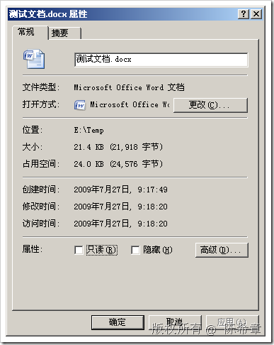
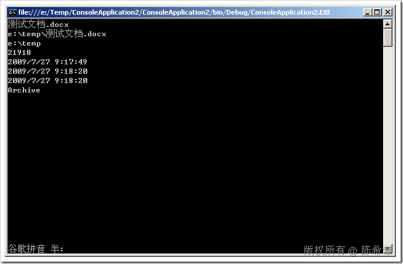
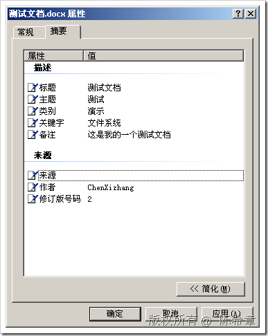
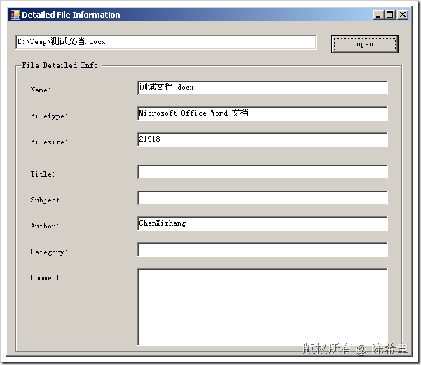

# .NET : 如何获取磁盘文件的摘要信息 
> 原文发表于 2009-07-27, 地址: http://www.cnblogs.com/chenxizhang/archive/2009/07/27/1531720.html 

在日常的开发工作中，我们经常需要操作各种各样的文件。其中有一个很重要的任务就是要能够读取特定文件的信息，并据此做出一些相应的设计。

 在.NET Framework中的System.IO命名空间下，提供了FileInfo这个类型。该类型可以很方便地创建和使用。但它包含的信息只是下图所示的常规信息。

  

 例如

 static void Main(string[] args)  
{  
    string file = @"e:\temp\测试文档.docx";  
    FileInfo info = new FileInfo(file);  
    Console.WriteLine(info.Name);  
    Console.WriteLine(info.FullName);  
    Console.WriteLine(info.DirectoryName);  
    Console.WriteLine(info.Length);  
    Console.WriteLine(info.CreationTime);  
    Console.WriteLine(info.LastAccessTime);  
    Console.WriteLine(info.LastWriteTime);  
    Console.WriteLine(info.Attributes);     Console.Read();  
}

  假设我们想读取到文件的摘要信息，如下

  

 不要小看这个任务，你如果在FileInfo这个类型中去找，就会发现你根本找不到任何属性或者方法。

 那么该如何做呢？答案是，需要用到一个shell32.dll的com链接库。

   
下面这个链接讲解了如何实现该功能。

 <http://www.codeproject.com/KB/files/detailedfileinfo.aspx>

  

 但貌似也不是很全，待后续考证

 本文由作者：[陈希章](http://www.xizhang.com) 于 2009/7/27 9:28:50 发布在：<http://www.cnblogs.com/chenxizhang/>  
 本文版权归作者所有，可以转载，但未经作者同意必须保留此段声明，且在文章页面明显位置给出原文连接，否则保留追究法律责任的权利。   
 更多博客文章，以及作者对于博客引用方面的完整声明以及合作方面的政策，请参考以下站点：[陈希章的博客中心](http://www.xizhang.com/blog.htm) 

