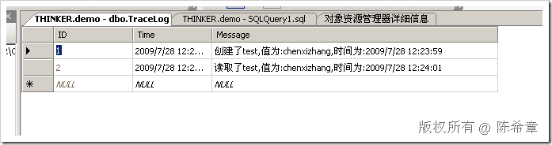

# .NET : 自定义TraceListener 
> 原文发表于 2009-07-28, 地址: http://www.cnblogs.com/chenxizhang/archive/2009/07/28/1532885.html 

上一篇我们讲到了使用Trace的功能对代码进行跟踪。我记得很多朋友多问过我，有没有办法将这个跟踪的消息写入到一个数据库中去呢？

 答案是可以的，但是并不常用。因为如果跟踪依赖数据库的话，首先写这个消息所需要的资源比较多，而且也容易出故障，例如你不能保证数据库的一直可用性。

 不管怎样，我还是演示一下如何自定义，并且如何使用的过程

 1. 创建一个demo数据库，里面建立一个表格

 USE [demo]  
GO  
/****** 对象:  Table [dbo].[TraceLog]    脚本日期: 07/28/2009 12:26:24 ******/  
SET ANSI\_NULLS ON  
GO  
SET QUOTED\_IDENTIFIER ON  
GO  
SET ANSI\_PADDING ON  
GO  
CREATE TABLE [dbo].[TraceLog](  
    [ID] [int] IDENTITY(1,1) NOT NULL,  
    [Time] [datetime] NULL CONSTRAINT [DF\_TraceLog\_Time]  DEFAULT (getdate()),  
    [Message] [varchar](256) NULL,  
 CONSTRAINT [PK\_TraceLog] PRIMARY KEY CLUSTERED   
(  
    [ID] ASC  
)WITH (PAD\_INDEX  = OFF, STATISTICS\_NORECOMPUTE  = OFF, IGNORE\_DUP\_KEY = OFF, ALLOW\_ROW\_LOCKS  = ON, ALLOW\_PAGE\_LOCKS  = ON) ON [PRIMARY]  
) ON [PRIMARY] GO  
SET ANSI\_PADDING OFF  

 2. 创建一个自定义的类型，让它继承TraceListener

 using System.Diagnostics;  
using System.Data.SqlClient; namespace WebApplication2  
{     public class MyDBTraceListener : TraceListener  
    {  
        public override void Write(string message)  
        {  
            using (SqlConnection conn = new SqlConnection(\_connectionString))  
            {  
                using (SqlCommand cmd = conn.CreateCommand())  
                {  
                    cmd.CommandText = "INSERT INTO TraceLog(Message) VALUES(@message)";  
                    cmd.Parameters.Add(  
                        new SqlParameter(  
                            "@message", message));                     conn.Open();  
                    cmd.ExecuteNonQuery();  
                    conn.Close();  
                }  
            }  
        }         public override void WriteLine(string message)  
        {  
            Write(message);  
        }  
        private string \_connectionString;  
        public MyDBTraceListener(string connectionstring)  
            : base()  
        {  
            \_connectionString = connectionstring;  
        }     }  
} 3. 在web.config文件中添加该监听器的注册     <system.diagnostics>  
        <trace autoflush="true">  
            <listeners>  
                <add name="default" type="System.Diagnostics.TextWriterTraceListener" initializeData="Log.txt"></add>  
        <add name="db" type="WebApplication2.MyDBTraceListener,WebApplication2" initializeData="server=(local);database=demo;integrated security=true;"></add>  
            </listeners>  
        </trace>  
    </system.diagnostics>  

 4. 运行程序进行测试

 

 本文由作者：[陈希章](http://www.xizhang.com) 于 2009/7/28 12:28:55 发布在：<http://www.cnblogs.com/chenxizhang/>  
 本文版权归作者所有，可以转载，但未经作者同意必须保留此段声明，且在文章页面明显位置给出原文连接，否则保留追究法律责任的权利。   
 更多博客文章，以及作者对于博客引用方面的完整声明以及合作方面的政策，请参考以下站点：[陈希章的博客中心](http://www.xizhang.com/blog.htm) 

