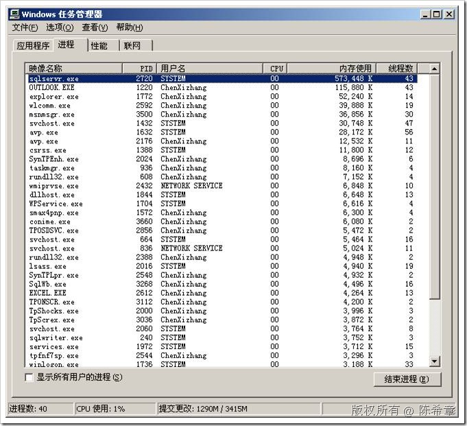
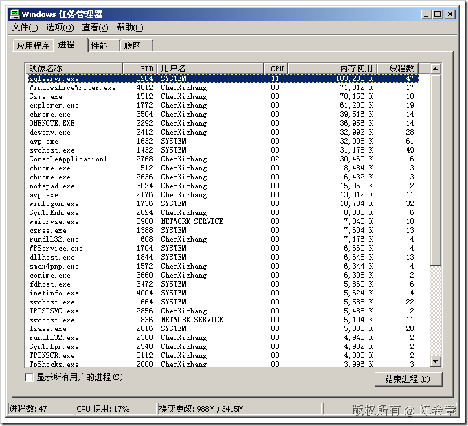
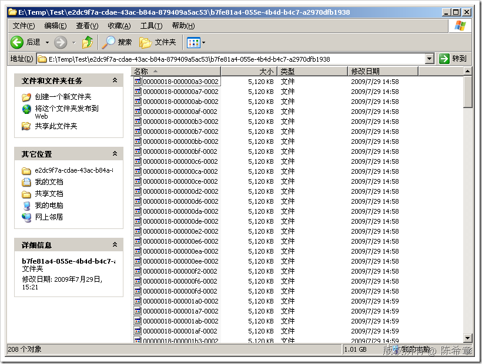
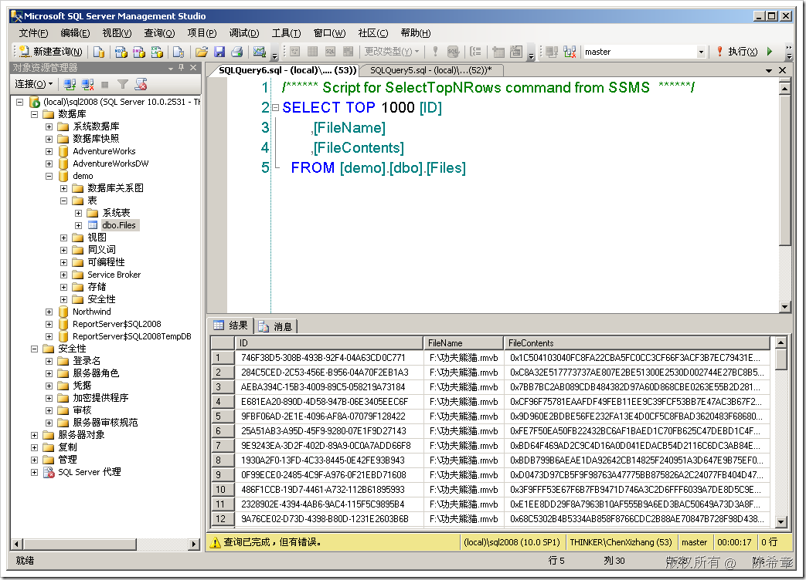

# SQL Server : 升级到SQL Server 2008，也许只需要一个理由 
> 原文发表于 2009-07-29, 地址: http://www.cnblogs.com/chenxizhang/archive/2009/07/29/1534152.html 

这个理由就是：**你如果经常需要在SQL Server中存取大量的二进制内容**。

 话说，我本来对此也没有太大的感性认识，全因为近日在写一个文件备份工具而起。我在下面这篇文章中大致提到了一些相关的背景

 <http://www.cnblogs.com/chenxizhang/archive/2009/07/28/1532722.html>

 代码那样写没有任何问题，也能正常工作。但是有一个致命的麻烦就是：SQL Server对于内存的处理。例如，我插入的那个“功夫熊猫.rmvb”,大约 519MB，执行一次之后，SQL Server所占的内存就到了将近600MB，然后再执行一次，又往上涨了600MB。这也太恐怖了。

 而且更让人绝望的是，这个内存居然无法释放。就永远停在那里。

 

 以前不怎么发现这个问题，是因为我们大多都是提交一些常规数据，即便有一些图片啦，都比较小。

 为了限制这个内存的疯涨，我还特别设置了“最大服务器内存”的值，但仍然无效。可能它是觉得我内存既然有那么多，干啥不用呢？这也有点强盗逻辑了吧

 [![clip_image002[5]](./images/1534152-clip_image002%5B5%5D_thumb.jpg "clip_image002[5]")](http://images.cnblogs.com/cnblogs_com/chenxizhang/WindowsLiveWriter/SQLServerSQLServer2008_DAFF/clip_image002%5B5%5D.jpg)

 服务器各种指令都尝试过了，仍然无解。

 下午用SQL Server 2008试了一下，也是如此。

 但是，如果在SQL Server 2008中，使用FileStream的功能来做，就没有这个问题了。那个内存占用很小的

  

 为了做这个测试，我准备了一个数据库

 USE [master] GO /****** Object: Database [demo] Script Date: 07/27/2009 10:04:05 ******/ CREATE DATABASE [demo] ON PRIMARY ( NAME = N'demo', FILENAME = N'C:\Program Files\Microsoft SQL Server\MSSQL10.SQL2008\MSSQL\DATA\demo.mdf' , SIZE = 3072KB , MAXSIZE = UNLIMITED, FILEGROWTH = 1024KB ), FILEGROUP [Test] CONTAINS FILESTREAM DEFAULT ( NAME = N'Test', FILENAME = N'E:\Temp\Test' ) LOG ON ( NAME = N'demo\_log', FILENAME = N'C:\Program Files\Microsoft SQL Server\MSSQL10.SQL2008\MSSQL\DATA\demo\_log.ldf' , SIZE = 1024KB , MAXSIZE = 2048GB , FILEGROWTH = 10%) GO ALTER DATABASE [demo] SET COMPATIBILITY\_LEVEL = 100 GO EXEC sys.sp\_db\_vardecimal\_storage\_format N'demo', N'ON' GO USE [demo] GO /****** Object: Table [dbo].[Files] Script Date: 07/27/2009 10:04:06 ******/   CREATE TABLE [dbo].[Files]( [ID] [uniqueidentifier] ROWGUIDCOL NOT NULL, [FileName] [varchar](256) NULL, [FileContents] [varbinary](max) FILESTREAM NULL, CONSTRAINT [PK\_Files] PRIMARY KEY CLUSTERED ( [ID] ASC )WITH (PAD\_INDEX = OFF, STATISTICS\_NORECOMPUTE = OFF, IGNORE\_DUP\_KEY = OFF, ALLOW\_ROW\_LOCKS = ON, ALLOW\_PAGE\_LOCKS = ON) ON [PRIMARY] FILESTREAM\_ON [Test] ) ON [PRIMARY] FILESTREAM\_ON [Test] GO SET ANSI\_PADDING OFF GO /****** Object: Default [DF\_Files\_ID] Script Date: 07/27/2009 10:04:06 ******/ ALTER TABLE [dbo].[Files] ADD CONSTRAINT [DF\_Files\_ID] DEFAULT (newid()) FOR [ID] GO     利用SQL Server 2008的FileStream功能，同样是这个“功夫熊猫.rmvb”，大小为519MB，整个数据提交过程耗时最快只要30秒。而在SQL Server 2005中，常规的方式来做，则平均需要90秒。

 另外，使用FileStream功能，真正的二进制内容是直接用文件的方式存在在一个特殊目录的，然后在表中根本就没有存放内容

  

 **【提醒】这些文件并不神奇，其实就相当于是源文件，大小也接近。而且你只要将扩展名加上，就和源文件是一模一样的了**

  

 鉴于二进制内容的复杂性，即便是说在表中没有保存那些内容，也不建议经常去SELECT * FROM 。。。

  

 通常都会报告一个错误出来，说磁盘空间不够。血的教训告诉我们，使用二进制内容的时候，还是要尽量小心。

  

 最后总结一下：针对频繁需要读写二进制文件的应用，SQL Server 2008的FileStream功能是一个不错的消息。当然，至于SQL Server 本身的varbinary(max)存储为什么会有那样的问题，实在也是有些费解的。我觉得从设计角度来说，应该不至于此的。该问题还在考证。

 本文由作者：[陈希章](http://www.xizhang.com) 于 2009/7/29 15:34:23 发布在：<http://www.cnblogs.com/chenxizhang/>  
 本文版权归作者所有，可以转载，但未经作者同意必须保留此段声明，且在文章页面明显位置给出原文连接，否则保留追究法律责任的权利。   
 更多博客文章，以及作者对于博客引用方面的完整声明以及合作方面的政策，请参考以下站点：[陈希章的博客中心](http://www.xizhang.com/blog.htm) 

