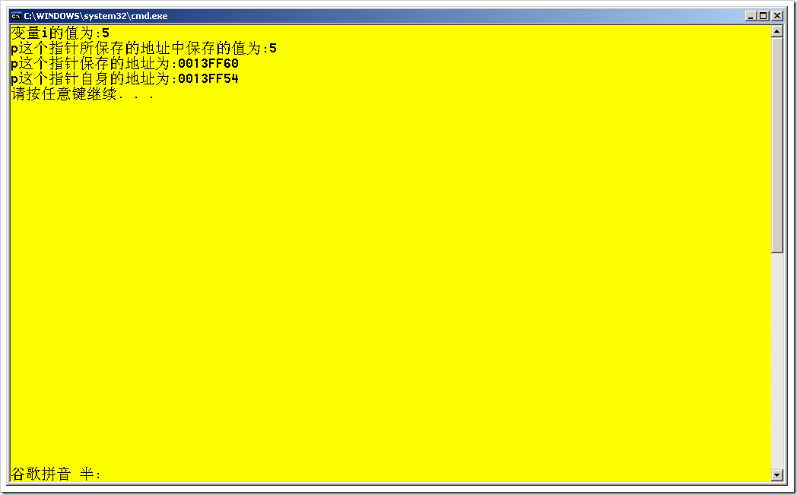

# C++ : 指针及其有关的问题 
> 原文发表于 2009-08-04, 地址: http://www.cnblogs.com/chenxizhang/archive/2009/08/04/1538057.html 

什么是指针？指针是保存了变量在内存中的地址。但是指针自己也需要有一个地址。 在C++中，通过&符号，可以取得某个变量的内存地址。使用* 可以定义一个指针变量。该变量的类型要与其引用的变量类型一致。 int main()  
{  
    int i=5;//这是一个整型变量i  
    int *p=&i;//这是通过定义了一个指针p，保存了i的内存地址  
    cout<<"变量i的值为:"<<i<<endl;//输出i的值  
    cout<<"p这个指针所保存的地址中保存的值为:"<<*p<<endl;//输出p这个地址保存的值，其实就是i的值  
    cout<<"p这个指针保存的地址为:"<<p<<endl;//输出p保存的地址，也就是i变量在内存中的地址  
    cout<<"p这个指针自身的地址为:"<<&p<<endl;//输出p这个指针的内存地址     return 0; } 下面是运行后的结果  本文由作者：[陈希章](http://www.xizhang.com) 于 2009/8/4 6:40:43 发布在：<http://www.cnblogs.com/chenxizhang/>  
 本文版权归作者所有，可以转载，但未经作者同意必须保留此段声明，且在文章页面明显位置给出原文连接，否则保留追究法律责任的权利。   
 更多博客文章，以及作者对于博客引用方面的完整声明以及合作方面的政策，请参考以下站点：[陈希章的博客中心](http://www.xizhang.com/blog.htm) 

