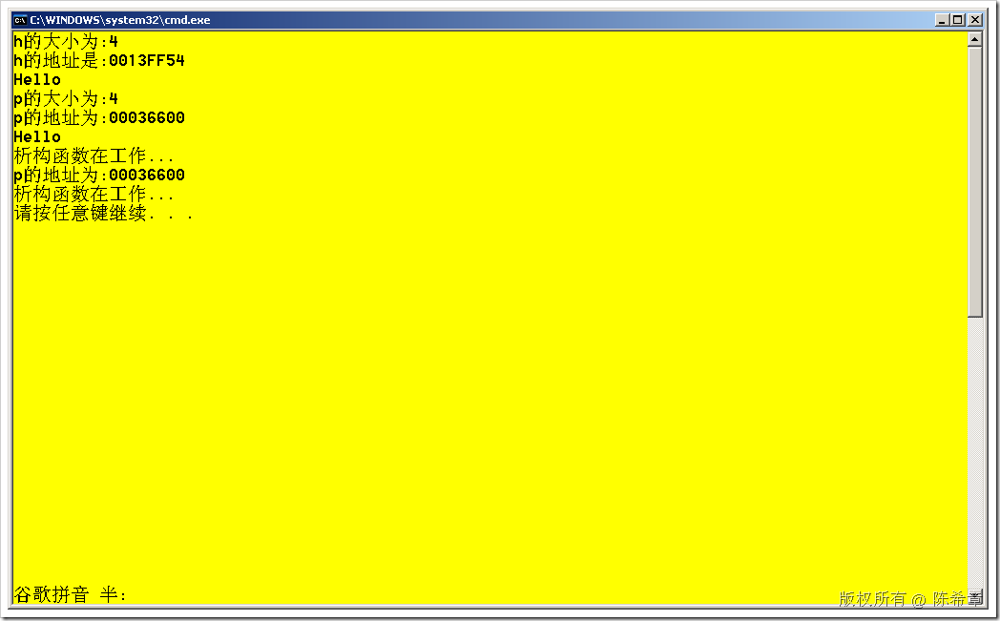
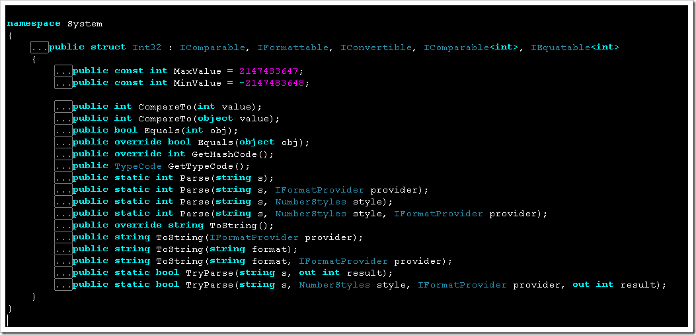

# C++ : 从栈和堆来理解C#中的值类型和引用类型 
> 原文发表于 2009-08-05, 地址: http://www.cnblogs.com/chenxizhang/archive/2009/08/05/1539650.html 

C++中并没有值类型和引用类型之说，标准变量或者自定义对象的存取默认是没有区别的。但如果深入地来看，就要了解C++中，管理数据的两大内存区域：栈和堆。

 栈(stack)是类似于一个先进后出的抽屉。它的体积是有限的，一般为2M左右。

 而堆(heap)则相对来说体积可以很大，这一般跟计算机的虚拟内存设置有关系。

 栈中存取对象的内存是自动回收的，用完即销毁了，一般方法内部的变量和参数都是通过栈来存取的（但也正因为如此，它们的生命周期很短）。但它的问题是，体积有限。

 一些大的对象，我们可能要通过堆来创建它。程序员可以控制这些对象什么时候创建，什么时候销毁。这无疑带来了灵活性，也同时带来了一些风险，事实上，相当一部分的程序的崩溃都是因为不恰当地使用了堆，以及没有及时清理在堆上申请的内存。或者反过来说，可能会清理多次（这也会导致崩溃）。

 通常来说，如果希望某个对象或者变量的生命更长一些，也可以将其作为全局变量或者静态变量。但那样又导致了它们必须等到程序结束才会释放。

 下面我用一个例子来演示一下这个问题

 #include <iostream>  
using namespace std; class human{  
public:  
    void Talk();  
    ~human(){cout<<"析构函数在工作..."<<endl;}  
private:  
    int age;  
}; void human::Talk(){  
    cout<<"Hello"<<endl;  
} int main()  
{  
    human h;//创建一个human对象,这个对象就生存在栈上，它所需的大小是根据其成员决定的  
    cout<<"h的大小为:"<<sizeof(h)<<endl;  
    cout<<"h的地址是:"<<&h<<endl;  
    h.Talk();     human *p=new human();//通过new关键字,是在堆上面创建一个对象,它所申请的空间也是内部成员决定的.这里也是4  
    cout<<"p的大小为:"<<sizeof(p)<<endl;  
    cout<<"p的地址为:"<<p<<endl;  
    p->Talk();  
    delete p;  
    //删除p这个指针指向的堆上面的内存.如果用完该对象,我们不删除,那么该内存就一直存在,并不会自动删除.这就称为内存泄漏.  
    //如果类型定义了析构函数，此时将调用它(反之，如果一个对象是在堆上创建的，那么除非调用delete语句，否则析构函数不会运行  
    cout<<"p的地址为:"<<p<<endl;//我们只是删除了该块内存上面的数据,地址还是存在的  
    //建议在删除p之后,将其置为0  
    //p=0;  
    //delete p;//但如果再次删除,又会发生崩溃,因为该内存已经没有了.  
    return 0;  
}   有两句“析构函数在工作”，第一句是p这个指针所指向的堆上面那个对象的析构，而最后那句在是h这个在栈上的对象的析构。

 有兴趣的朋友，可以将delete语句注释掉，则只会看到一个析构过程。

 我们可以做得更加复杂一些来看

 #include <iostream>  
using namespace std; class human{  
public:  
    void Talk();  
    ~human(){cout<<"析构函数在工作..."<<endl;}  
private:  
    int age;  
}; void human::Talk(){  
    cout<<"Hello"<<endl;  
} int main()  
{  
    human h;//创建一个human对象,这个对象就生存在栈上，它所需的大小是根据其成员决定的  
    cout<<"h的大小为:"<<sizeof(h)<<endl;  
    cout<<"h的地址是:"<<&h<<endl;  
    h.Talk();     human *p=new human();//通过new关键字,是在堆上面创建一个对象,它所申请的空间也是内部成员决定的.这里也是4  
    cout<<"p的大小为:"<<sizeof(p)<<endl;  
    cout<<"p的地址为:"<<p<<endl;   
    p->Talk();     **human *p2=p;//创建另外一个指针，让他也保存一样的地址。  
    cout<<"p2的大小为:"<<sizeof(p2)<<endl;  
    cout<<"p2的地址为:"<<p2<<endl;  
    p2->Talk();**    delete p;  
    //删除p这个指针指向的堆上面的内存.如果用完该对象,我们不删除,那么该内存就一直存在,并不会自动删除.这就称为内存泄漏.  
    //如果类型定义了析构函数，此时将调用它(反之，如果一个对象是在堆上创建的，那么除非调用delete语句，否则析构函数不会运行  
    cout<<"p的地址为:"<<p<<endl;//我们只是删除了该块内存上面的数据,地址还是存在的  
    //建议在删除p之后,将其置为0  
    //p=0;  
    //delete p;//但如果再次删除,又会发生崩溃,因为该内存已经没有了.  
    **//delete p2;//不光是p不能在删除，所以相同的指针都不能再删除了，否则就崩溃了**    return 0;  
}  

 知道了上述原理之后，我们就不难理解C#中的值类型和引用类型了。

 * 值类型是指基础数据类型（除了string)，结构体，枚举
* 引用类型是指类，接口，委托（其实类似指针），string，object

 值类型是生存在栈上，好处是效率高，不需要额外的回收。但它的空间是有限的，所有一般只适合基础类型（char,byte,int,short,long,bool,double,float等）。

 引用类型则生存在堆上，但在栈上有一个指针（因为在堆上的对象都是匿名的，指针此时起到了一个别名的作用，其实就是等同于引用的概念，固有引用之说）

 引用类型既然生存在堆上，那么按照C++的情况就必须我们自己去销毁它。但从上面的演示就不难看出，何时销毁它，以及会不会忘记销毁它，或者重复销毁它，都是一个很大的难题。所以在.NET Framework中，通过CLR中垃圾回收器（GC）来负责回收。一般的程序员不需要特别在意这个过程。

  

 最后有意思的是，C#中的INT，其实并不等同于C++中的INT，大家如果有兴趣的话，可以看一下，它其实是一个结构体。

 

 本文由作者：[陈希章](http://www.xizhang.com) 于 2009/8/5 15:52:58 发布在：[博客园](http://www.cnblogs.com/chenxizhang/),转载请注明出处  
 

