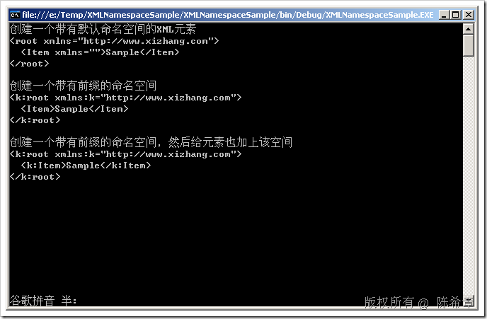
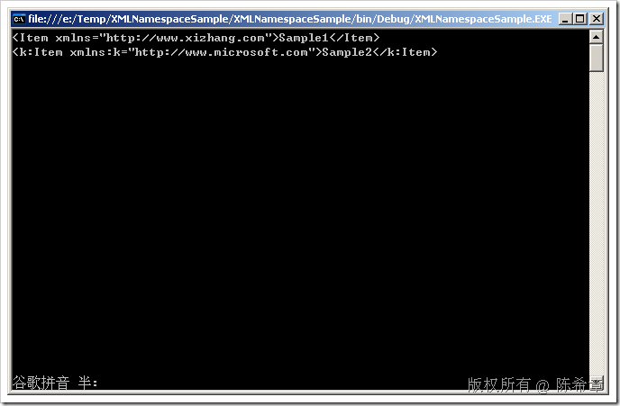

# .NET : 再谈谈XML中的命名空间问题 
> 原文发表于 2009-08-06, 地址: http://www.cnblogs.com/chenxizhang/archive/2009/08/06/1540081.html 

我之前有专门的文章讨论过在XML文件中的命名空间问题，事实上，这个命名空间的设计是XML规范中惹来争议最多的一个部分。其出发点是为了更好地标识元素，但事与愿违，它其实更多的时候是增加了麻烦。这方面的讨论很多，这里就不赘述了。

 今天我还是用简单的例子再说说如何在编程中处理命名空间的问题

 1. 如何在创建XML文档的时候加入命名空间

 ///创建一个带有默认命名空间的XML元素  
///该命名空间不带前缀  
Console.WriteLine("创建一个带有默认命名空间的XML元素");  
XNamespace xn = "<http://www.xizhang.com";>  
XElement root = new XElement(xn + "root",  
    new XElement("Item", "Sample")); Console.WriteLine(root);  
Console.WriteLine(); Console.WriteLine("创建一个带有前缀的命名空间");  
///创建一个带有前缀的命名空间  
XElement root2 = new XElement(xn + "root",  
    new XAttribute(XNamespace.Xmlns + "k", xn.NamespaceName),  
    new XElement("Item", "Sample")); Console.WriteLine(root2);  
Console.WriteLine(); Console.WriteLine("创建一个带有前缀的命名空间，然后给元素也加上该空间"); ///创建一个带有前缀的命名空间，然后给元素也加上该空间  
XElement root3 = new XElement(xn + "root",  
    new XAttribute(XNamespace.Xmlns + "k", xn.NamespaceName),  
    new XElement(xn+"Item", "Sample")); Console.WriteLine(root3);  
Console.WriteLine();    2. 如何读取带有命名空间的元素 假设我们有如下一个范例XML数据文件，我们姑且将其命名为SampleData.xml <?xml version="1.0" encoding="utf-8" ?>  
<k:root xmlns="<http://www.xizhang.com"> xmlns:k="<http://www.microsoft.com">>  
  <Item>Sample1</Item>  
  <k:Item>Sample2</k:Item>  
</k:root> 然后看看代码应该如何注意 string sampledata = "..\\..\\SampleData.xml";  
XElement root = XElement.Load(sampledata); XNamespace defaultns = "<http://www.xizhang.com";>  
XNamespace k = "<http://www.microsoft.com";> XElement item = root.Element(defaultns+"Item");//这是取得第一个元素，即便它没有前缀，也要添加一个默认的命名空间  
Console.WriteLine(item); XElement item2 = root.Element(k + "Item");  
Console.WriteLine(item2); 

 本文由作者：[陈希章](http://www.xizhang.com) 于 2009/8/6 9:45:51 发布在：[博客园](http://www.cnblogs.com/chenxizhang/),转载请注明出处  
 

